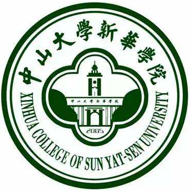
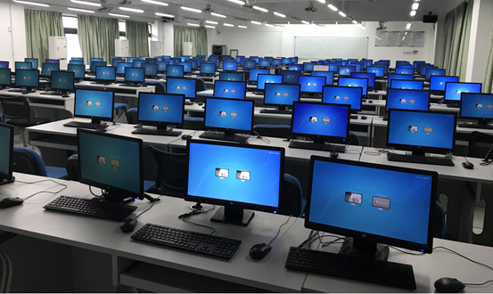

### 中山大学新华学院

#### 客户背景

中山大学新华学院是一所综合性全日制普通高等院校，是中国医学数字教育项目示范基地学校。
学院有广州、东莞2个校区，总占地面积970859.46平方米，共有专任教师877人，外聘教师342人，在校生21551人；设有16个院系、开办44个本科专业。

#### 业务挑战

学校信息科学学院的计算机教室采用传统PC，已经达到了PC报废年限。现有的计算机教室面临几个问题：1）PC达到了报废年限，硬件故障率升高，硬件维护的压力。2）机房的系统采用还原卡，通过网络同传部署系统。部署过程非常耗时。3）不同专业对于操作系统和应用软件有不同的要求。现有的计算机机房难以满足不同专业和课程的教学中灵活选择系统和应用程序的需求。
该计算机房每年还承担几次计算机等级考试的任务，同时一些教学课程中需要使用3D软件。客户对基于虚拟桌面基础设施（VDI）的云教室方案的可靠性和3D应用的支持能力存在顾虑。

#### 解决方案

结合信息科学院计算机房的业务需求和特点，朵拉云科技设计出了融合的云教室方案。整体云教室方案融合了VDI（虚拟桌面基础设施）和IDV（智能桌面虚拟化）两套方案。方案采用x86终端。通过IDV系统对x86终端进行部署和管理。允许x86终端可以部署多套本地桌面系统和一套瘦客户机系统。在进行等级考试和3D应用时，IDV系统控制终端切换到本地模式，运行本地操作系统，适用于考试和3D应用。在平时的教学中，IDV系统控制终端切换到瘦客户机系统，接入桌面云，允许学生自由选择多个不同的教学模板，满足不同课程教学的需求。
在VDI系统方面，应用了业界首创的去中心化、全分布式桌面云管理系统，超越传统的1+1备份模式。可以实现M+N的容灾和备份。系统采用4台服务器，组成对等集群，实现3+1的容灾和备份。

#### 客户收益

云教室上线后，已经支持多次全国计算机等级考试。日常教学中，能够满足不同课程对于桌面模板的需求。能够支持3D/2D应用软件（3D Max，Adobe illustrator）的教学。机房的管理员的日常维护工作大大减轻了。由于瘦客户机功耗低，体积小，机房的学习环境也得到了改善。服务器系统采用了3+1，系统可靠性大大提升。

