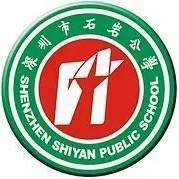
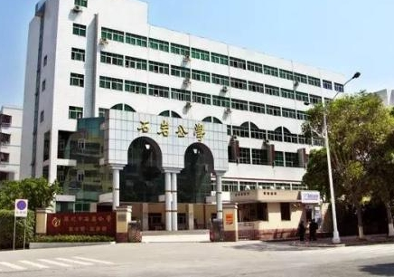

### 深圳石岩公学
### 客户背景

石岩公学是深圳市民办学校中第一家广东省一级学校，首批广东省花园式学校，全市民办学校中第一所国家级绿色学校，第一家获得深圳市办学效益奖的学校，是一所政府放心、社会认可、家长信赖、同行尊重、学生喜爱，在广东省乃至中国都具影响力的优质民办学校。

### 业务挑战

基于PC的计算机教室每台设备均需要现场维护，平均修复时间为2-4小时。随着PC的增多，维护工作量呈线性增长。

### 解决方案

采用朵拉云HyperBox云教室整体解决方案，计算机教室内部署一台服务器和50个ARM云终端，承载学生机房所有的上课桌面。利用模板克隆技术实现桌面快速部署。系统支持自动还原。

### 客户收益

满足日常教学要求。机房的管理员的日常维护工作大大减轻了。由于瘦客户机功耗低，体积小，机房的学习环境也得到了改善。
