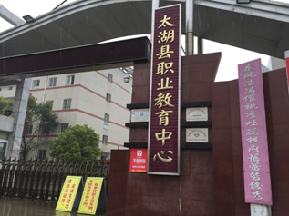
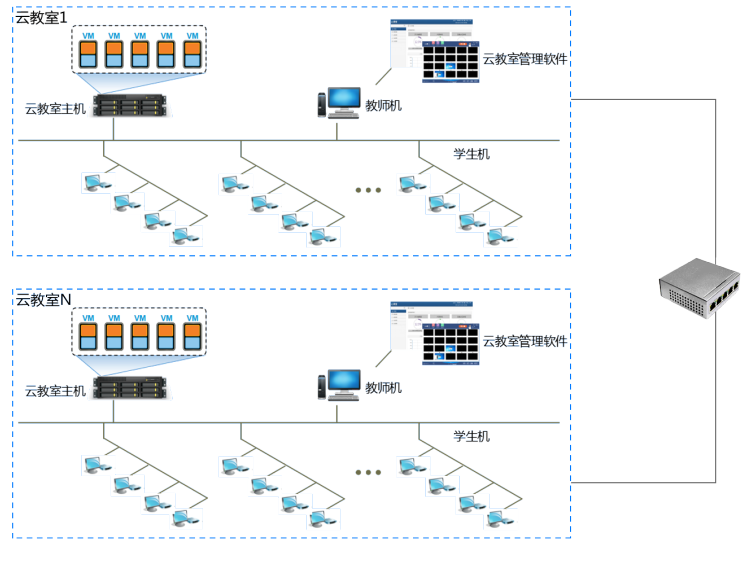
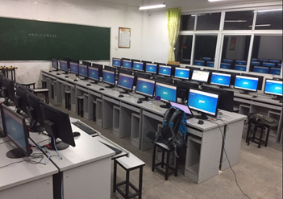

### 客户背景

太湖县职教中心于1997年秋由三所学校合并组建而成，1999年成功申办为市重点职业学校。2005年元月被教育部批准为“国家级重点中等职业学校”。

### 业务挑战

一直以来，太湖县职业教育中心机房采用功能全面的“胖客户端”PC，为学校提供教学平台。但是，在使用实际使用情况中，胖客户端 PC 暴露出来很多问题，主要有以下三个：

管理：分散部署，没有一个统一的管理平台方便管理员对PC机进行实时的监管和控制，教学软件升级等需要逐台操作，管理复杂。
维护：日常维护上管理员不能及时对损坏的PC机进行及时的维护和升级工作。
投资高：传统PC更新换代快，每年都要投入资金进行更新。

### 解决方案

针对太湖县职业教育中心对新一代电子教室提出的功能和性能要求，Deskpool云教室产品从提升教学效率、便捷运维、降低硬件使用成本及改善使用环境等方面为太湖县职业教育中心提供完整的解决方案。在云计算的时代浪潮下，将桌面云技术应用于教学，云教室应运而生。

Deskpool云教室方案将不同使用场景所需要的桌面环境固化在服务器里，相互隔离，更为精确地适应每次教学或者不同的使用场景，提升用户的使用体验。

### 客户收益

太湖县职业教育中心部署了两个电子云教室，极大的改善了整体教学环境，提升了教学效率，降低了管理维护成本。每年耗电量相比与传统PC节省80%以上，节省了电费 资金并实现了节能环保。使用云终端，电子教室室温普遍降低约4摄氏度，学生桌位不再拥挤，座位空间明显改善，空间释放约40%，还有效的消除了噪声，为师生提供一个安静的教学环境。

