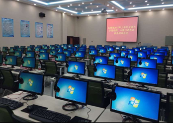
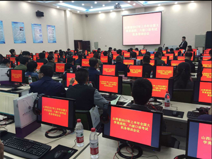

### 客户背景

山西财经大学华商学院，位于山西省太原市，是经国家教育部正式批准设立，由山西财经大学在2002年举办的一所全日制本科院校，学院紧邻山西财经大学主校区，在校学生4500余人。

### 业务挑战

学院的计算机教室需要满足多种场景的教学和考试需求。包括支持计算机等级考试，满足英语四六级口语考试需求，满足日常计算机教学，英语教学的需求。

### 解决方案

结合华商学院计算机房的业务需求和特点，朵拉云科技设计出了融合的云教室方案。整体云教室方案融合了VDI（虚拟桌面基础设施）和IDV（智能桌面虚拟化）两套方案。方案采用x86一体机。通过IDV系统对x86终端进行部署和管理。允许x86终端可以部署多套本地桌面系统和一套瘦客户机系统。在进行考试时，IDV系统控制终端切换到本地模式，运行本地操作系统；在平时的教学中，IDV系统控制终端切换到瘦客户机系统，接入桌面云，允许学生自由选择多个不同的教学模板，满足不同课程教学的需求。

在VDI系统方面，采用了超融合的架构，使用4台服务器构建一个大的资源池，支持150个桌面。实现3+1的容灾和备份。

### 客户收益

华商学院计算机房通过部署朵拉云云桌面，极大的改善了整体教学环境，提升了教学效率，降低了管理维护成本。每年耗电量相比与传统PC节省80%以上，节省了电费 资金并实现了节能环保。满足了计算机等级考试，英语四六级口语考试的业务需求。

