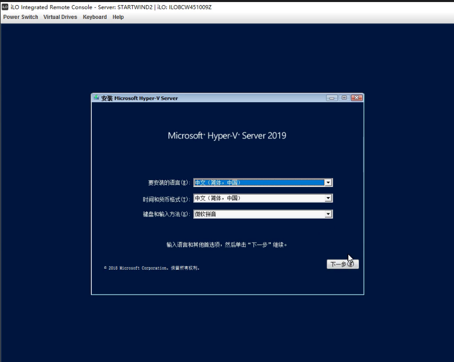
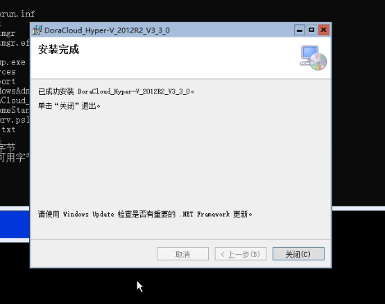
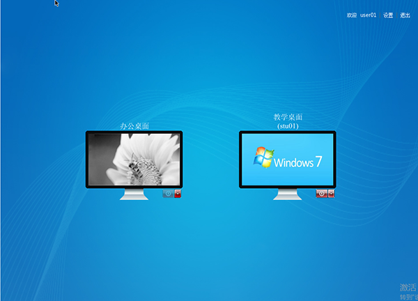

DoraCloud 是一款桌面虚拟化管理软件，支持Hyper-V、XenServer等虚拟化平台。DoraCloud采用一体化设计理念，把桌面虚拟化所需的组件打包在一个虚拟机镜像中，极大的简化了虚拟桌面部署的难度。

本文主要讲述最简单的免费虚拟化方案：Hyper-V Server + Windows Admin Center,并且在Hyper-v server中快速部署朵拉云系统。

安装前准备：

1.一台服务器，配置为 :CPU i5 以上，内存 ≥16GB，硬盘为SSD或者RAID。在BIOS中开启CPU的虚拟化支持“Intel VirtualTechnology”

2.下载所需软件（Hper-v server,windows Admin Center,chrome,DoraCloud），保存到U盘中.
  
[Hyper-v Server下载地址][Hyper-v Server]  

[谷歌下载地址][chrome] 

[windows Admin Center下载地址][windows Admin Center] 

[hyperv.ps1脚本下载地址][hyperv.ps1] 

[DoraCloud下载地址][DoraCloud] 

注意事项：

虚拟机存储池禁止存放C盘中，否则会出现无法创建虚拟机的错误提示。

### 步骤一：安装Hyper-v server

1.开机提示按F11进入Boot Menu界面。

2.进入菜单选择第三个usb启动。

3.进入安装界面，默认下一步，分盘方式选择自定义安装。

4.先分出C盘20G安装Hyper-v server系统。

5.其余划分成D盘，划分完成后格式化D盘，以防有其他文件残留。

6.最后选择分出的20G安装系统，进度条加载完，等待重新启动。

### 步骤二：执行脚本，自动安装windows Admin Center,chrome.

1.第一步：切换到E盘也就是U盘命令行输入dir,查看U盘是否放入了脚本文件。脚本包括（修改计算机名称，开启远程桌面,安装windows Admin Cennter,chrome。）

2.第二步：执行脚本输入 powershell -f hyperv.ps1 , 脚本需要执行两遍，执行第一遍会自动重启，执行第二遍等待脚本执行完毕，会自动加载到windows Admin Center，点击连接，进入管理页面。

### 步骤三：安装DoraCloud管理后台。
1.在命令行，可以看到E盘目录下有DoraCloud， 输入D + [TAB]键 就会自动补全路径，然后回车安装。

2.执行安装向导，选择“下一步”，会启动DoraCloud安装程序。

3.选择创建网卡，存储位置选择D盘。

4.进入windows Admin Center，点击【虚拟机】，然后连接DoraCloud，就能看到管理后台的IP地址，

### 步骤四：完成【系统初始化】配置。
在浏览器访问IP地址，用户名admin , 密码DoraCloud.

1.登陆DoraCloud管理系统后，系统会启动配置向导，如下图所示。 DoraCloud的配置大致包括四个步骤：系统初始化、创建模板、创建桌面池、创建群组和用户。选择【开始】，进入系统初始化配置。

2.配置虚拟化。
DoraCloud系统会自动检测到所在服务器的配置，并与之建立连接。

3.配置资源池。 包括桌面存储池、数据盘存储池、镜像存储池。其中桌面存存储池、镜像存储池最好使用SSD介质的存储，或者高速的RAID磁盘阵列。 网络资源池是 DoraCloud默认所在的网络。

4.配置集群，选择创建新的DoraCloud集群。

5.配置用户数据库，选择本地群组数据库。 如果您有AD，可以选择使用AD作为用户数据库。

### 步骤五：在远程镜像仓库下载模板
1. 在向导的第2步：创建模板时，关闭向导，然后选择【远程镜像仓库】

 
2. 在远程镜像库中，点击【刷新】，建议选择占用空间较小的 win7x86base 模板下载。下载速度最高约5MB/s。3GB的镜像需要大约10分钟下载。

3. 等待模板下载完毕，然后选择恢复模板。 

4. 模板恢复完毕后，可以在模板列表中看到被恢复的模板。

### 步骤六：创建桌面池

1. 在桌面池菜单中，新建桌面池。 填写【桌面池名称】、【模板】、【虚拟机名称前缀】、【虚拟机名称后缀】、【顺序编号】。不推荐虚拟机前缀使用中文。虚拟机后缀必须是数字。为了管理方便，建议顺序编号。

 
2. 配置桌面池创建策略，设置最大创建数目、预创建数目。
下图设置预创建3个，最大创建10个。系统会自动创建3个桌面。如果1个桌面被分配，系统会自动再创建一个，保证桌面池有3个空闲的桌面，直到总的桌面数目达到最大创建数目。
对于办公等需要保存数据的应用场景，一般创建【专用桌面池】。对于教学、培训、阅览室等场景，一般采用【公用桌面池】。
如果选择【设置为默认桌面池】，即使用户不签约该桌面池，也能从该桌面池内分配到桌面。
在采用本地用户账户时，DoraCloud桌面云系统的账号与Windows桌面的账号是独立的。为了避免用户输入两次账号，DoraCloud通过账号绑定的方式来避免用户再次输入Windows用户密码。可以设置【自动设置初始绑定账号】可以在用户首次连接桌面池，把Windows模板的默认账号作为填写在用户桌面的绑定账号中。用户如果修改了桌面Windows系统的账号，可以在DoraCloud的门户中修改绑定账号。
 

3. 配置用户数据盘，然后点击【确定】，保存桌面池。
 

4. 进入菜单【桌面计算机】，观察桌面池创建状态，状态进入【正在运行】时，桌面计算机才能分配给用户。如果长时间无法创建成功，可以观察事件列表，观察【创建虚拟桌面】任务的状态信息。
 

### 步骤七：创建用户和群组

1. 在用户管理菜单中，创建群组 group1，选择桌面池【办公】。

2. 然后批量增加用户 user01 ~ user10，密码 123456，选择所属群组 Group1。

### 步骤八：通过朵拉云瘦客户机或者DoraOS瘦客户机软件系统连接DoraCloud桌面云

 **方式1**: **旧改Doraos或者使用朵拉云DC20云终端登录云桌面.** 

这里以朵拉云DoraCloud专用终端DC20为例，连接DoraCloud系统。如果没有朵拉云JC10云终端，可以在一个x86机器上部署DoraoS系统，把机器改造成瘦客户机。DoraoS的下载和部署参考如下链接DoraoS下载和安装。

1. 安装好朵拉云瘦客户机，并将瘦客户机连接到网络

2. 打开朵拉云瘦客户机，进入设置页面,点击第一个“添加Deskpool连接”。

3. 编辑Deskpool连接，设置服务器地址和连接名称。
填写DoraCloud管理系统的IP地址，不是Windows Server的IP地址

4. 设置完成，点击红框区域的“连接”，进入DoraCloud系统。

5. 然后以 用户名user01  密码123456  登陆，即可连接桌面。

6. 选择桌面，点击即可进入系统。

**方式2**： **直接在网页登录云桌面.** 

用网页登录云桌面，USB使用会受限制，我们可以用网页登录来测试创建的云桌面是否能正常登录，并且测试桌面云的部分功能等.

1.如图所示，我们正在登录DoraCloud管理后台，点击右上角退出。

2.在后台登录界面输入之前创建的，用户名：user01 密码：123456，输入完毕点击登录.

3.登录成功以后，会自动下载RDP文件，点击图中RDP文件，连接用户桌面，进入以后输入用户名：administrator,密码：123456，
点击登录就进入云桌面了。

**方式3**： **下载DoraClient客户端登录.** 

DoraClient是DoraCloud的客户端，可以用来登录我们的云桌面。

[DoraClient下载地址][DoraClient]

1.下载完毕，打开DoraClient，提示输入服务器地址，就是DoraCloud管理后台的地址。

2.输入在管理后台创建的用户名：user01，密码：123456,点击登录就会自动下载rdp文件进入云桌面。

[DoraClient]: https://www.doracloud.cn/downloads/doraclient-cn.html

[Hyper-v Server]:https://www.cnblogs.com/oloroso/p/12294966.html
[chrome]:https://dl.doracloud.cn/tools/ChromeStandaloneSetup64.exe
[windows Admin Center]:https://dl.doracloud.cn/tools/WindowsAdminCenter2110.msi
[hyperv.ps1]:https://dl.doracloud.cn/tools/hyperv.ps1
[DoraCloud]:https://www.doracloud.cn/downloads/1-cn.html                                         
