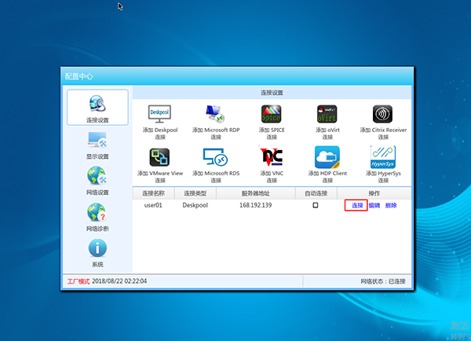

Proxmox VE是一个完整的企业虚拟化开源平台。借助内置的Web界面，您可以轻松管理虚拟机和容器，软件定义的存储和网络，高可用性集群以及单个解决方案上的多个现成工具。

DoraCloud是一套多平台、一体化、分布式的桌面虚拟化方案。基于开放架构，支持多种虚拟化平台（Hyper-V，VMware，Proxmox，XenServer），多种桌面协议（RDP，PCoIP，SPICE）。

本文介绍了基于Proxmox搭建DoraCloud桌面虚拟化系统的过程。

### 安装前准备：
1、一台服务器，配置为 :CPU i5 以上，内存 ≥8GB，硬盘为 SSD 。  
2、网络中开启了 DHCP 服务。  
3、Proxmox VE7.4 ISO镜像(本文以Proxmox VE7.4描述)  

官方下载地址： https://www.proxmox.com/en/downloads/category/iso-images-pve

中科大Mirror： http://mirrors.ustc.edu.cn/proxmox/  

清华大学Mirror： https://mirrors.tuna.tsinghua.edu.cn/proxmox/iso/


4、U盘制作工具：rufus  [rufus下载地址][rufus]

### 步骤一：安装Proxmox VE7.4
 1、Rufus制作Proxmox7.4系统U盘启动盘  


 2、服务器U盘启动安装Proxmox7.4 按照默认提示安装。

 3、安装完成后，浏览器输入https://Proxmox服务器的IP:8006 进入 Proxmox管理后台。

 4、管理页面（Proxmox服务器的IP为安装时设置的IP 本文IP 为192.168.1.169,用户可根据自己需求，自行设置ip）  

 
5、修改默认存储方式为目录存储,提升运行速度

5.1从Proxmox Web界面，删除 local-lvm


5.2第二步：通过命令删除 lvm，新建lvm，并创建文件系统

```
umount /dev/pve/data

lvremove /dev/pve/data -y

vgdisplay pve | grep Free | awk '{print "lvcreate -l " $5 " -n data pve -y"}' |bash

mkfs.ext4 /dev/pve/data
mkdir /mnt/data
mount /dev/pve/data /mnt/data

echo "/dev/pve/data /mnt/data ext4 defaults 0 0" >> /etc/fstab
```


5.3在Proxmox 将注册目录为存储

！注意添加存储选择目录存储，挂载点信息如图所示


### 步骤二：下载安装DoraCloud和Windwos虚拟机模板

#### 方式1：一键在线安装：
1、下载安装DoraCloud3.4，选择pve节点，在shell里复制执行此命令：

```
cd /var/lib/vz/dump; wget -qO- https://dl.doracloud.cn/dpinstall.pl --referer https://doracloud.cn | perl
```

 

安装完成，查看DoraCloud的ip地址，在浏览器输入ip地址。

#### 方式2：下载后离线安装

[win7x64vm]: http://www1.deskpool.com:9000/software/vzdump-qemu-114-2020_09_14-15_18_22.vma.gz
[DoraCloudvm]: https://www.doracloud.cn/downloads/2-cn.html


1、下载 DoraCloud vm的备份。

[DoraCloud VM 下载链接][DoraCloudvm]

2、拷贝备份档到 Proxmox 主机的 /var/lib/vz/dump 目录。

3、在Proxmox管理界面中，然后选择恢复。

 

4、恢复完毕后，启动 DoraCloud虚拟机。


### 步骤三：DoraCloud系统初始化

1、启动DoraCloud虚拟机,启动完成后查看DoraCloud的IP（如下图DoraCloud为192.168.1.169）

 

2、浏览器输入https://DoraCloudIP（DoraCloud IP上一步看到的IP 本文输入为https://192.168.1.169 ）

注：DoraCloud管理平台默认采用https安全访问协议，在首次访问DoraCloud URL时，需要根据不同的浏览器提示，设置对该链接的信任。  
默认的管理员登录账户为：用户名：admin 密码：deskpool    
如果产品显示为DoraCloud的版本，默认的管理员登录账户为：用户名：admin 密码：DoraCloud


                     
3、点击导航提示窗口中的开始按钮，进入系统初始化导航任务，如下图所示，提示用户系统初始化配置的主要内容，点击【继续】，开始系统初始化配置。  
 

**配置虚拟化：** 选择Proxmox 输入Proxmox 服务器IP地址和用户(root)以及密码、输入完成后点击下一步，进入配置资源池

 


**配置资源池：** 桌面存储池选择 local-lvm 网络资源池配置Proxmox虚拟网络 一般为vmbr0
如下图所示，配置完成后点击下一步进入集群配置。  
  

**配置集群：** 选择创建一个新的DoraCloud集群。点击下一步进入配置用户数据库  
 
 
**配置用户数据库：** 选择本地用户数据库，点击下一步。  
  

**设定固定IP：** 选择"是" 点击完成按钮  
  

### 步骤四：在远程镜像仓库下载模板
  完成系统初始化设置后退出  
  

1、 点击模板，选择远程镜像仓库
 
2、 切换到如图所示的地址，并且点击刷新
  
3、 选择如图所示win7x64base模板进行下载，下载完成以后恢复模板    
  
### 步骤五：创建桌面池

桌面池是DoraCloud自动化管理桌面的基本模型，是指基于相同模板创建的，规格相同，类型相同、维护策略相同的桌面虚拟机集合。
模板创建成功后， DoraCloud导航接着提示用户开始创建桌面池，如下图所示。点击继续进入配置桌面池页面。  

 
**基本信息：** 输入桌面池的名称，为桌面池选择模板和网络资源 并输入输入虚拟机的命名前缀和后缀。如下图 点击下一步进入配置桌面池策略。   

<font color="red">重点强调，需要设置绑定账号。 从模板库下载的模板内置的账号为 administrator  123456 </font>


 
**配置桌面池策略：** 输入桌面池最大桌面虚拟机数和预创建桌面虚拟机参数，选择桌面类型。点击下一步进入配置存储。  


**配置存储：** 设置是否启用用户数据盘，配置用户数据盘名称和容量。用户数据盘的存储池在系统初始化阶段指定。  


### 步骤六：创建用户
 创建桌面池后， DoraCloud导航会直接引导用户进入账户管理页面。  
 1、创建群组（用户->群组点击新增） 填写群组名称 并选择桌面池  


2、批量创建用户（可以单独创建）  
 

### 步骤七：建议使用朵拉云瘦客户机（JC10 JC30）登陆DoraCloud系统，连接桌面。  
 **方式1**: **旧改Doraos或者使用朵拉云JC10云终端登录云桌面.** 

这里以朵拉云DoraCloud专用终端JC10为例，连接DoraCloud系统。如果没有朵拉云JC10云终端，可以在一个x86机器上部署DoraoS系统，把机器改造成瘦客户机。DoraoS的下载和部署参考如下链接DoraoS下载和安装。

1. 安装好朵拉云瘦客户机，并将瘦客户机连接到网络

2. 打开朵拉云瘦客户机，进入设置页面，点击第一个“添加Deskpool连接”。


3. 编辑Deskpool连接，设置服务器地址和连接名称。
填写DoraCloud管理系统的IP地址，不是Windows Server的IP地址


4. 设置完成，点击红框区域的“连接”，进入DoraCloud系统。



5. 然后以 用户名user01  密码123456  登陆，即可连接桌面。


6. 选择桌面，点击即可进入系统。


**方式2**： **直接在网页登录云桌面.** 


用网页登录云桌面，USB使用会受限制，我们可以用网页登录来测试创建的云桌面是否能正常登录，并且测试桌面云的部分功能等.

1.如图所示，我们正在登录DoraCloud管理后台，点击右上角退出。


2.在后台登录界面输入之前创建的，用户名：user01 密码：123456，输入完毕点击登录.


3.登录成功以后，会自动下载RDP文件，点击图中RDP文件，连接用户桌面，进入以后输入用户名：administrator,密码：123456，
点击登录就进入云桌面了。


**方式3**： **下载DoraClient客户端登录.** 

DoraClient是DoraCloud的客户端，可以用来登录我们的云桌面。

[DoraClient下载地址][DoraClient]

1.下载完毕，打开DoraClient，提示输入服务器地址，就是DoraCloud管理后台的地址。


2.输入在管理后台创建的用户名：user01，密码：123456,点击登录就会自动下载rdp文件进入云桌面。


[rufus]:https://rufus.ie/zh/
[DoraOS]:https://www.doracloud.cn/downloads/3-cn.html
[DoraClient]: https://www.doracloud.cn/downloads/doraclient-cn.html

