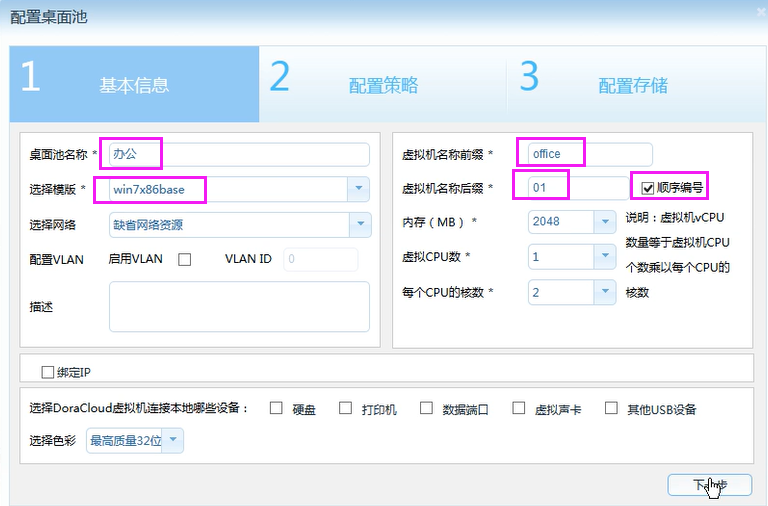
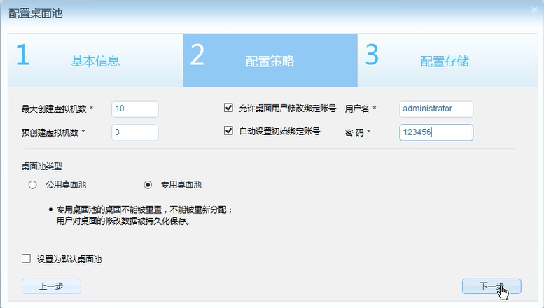
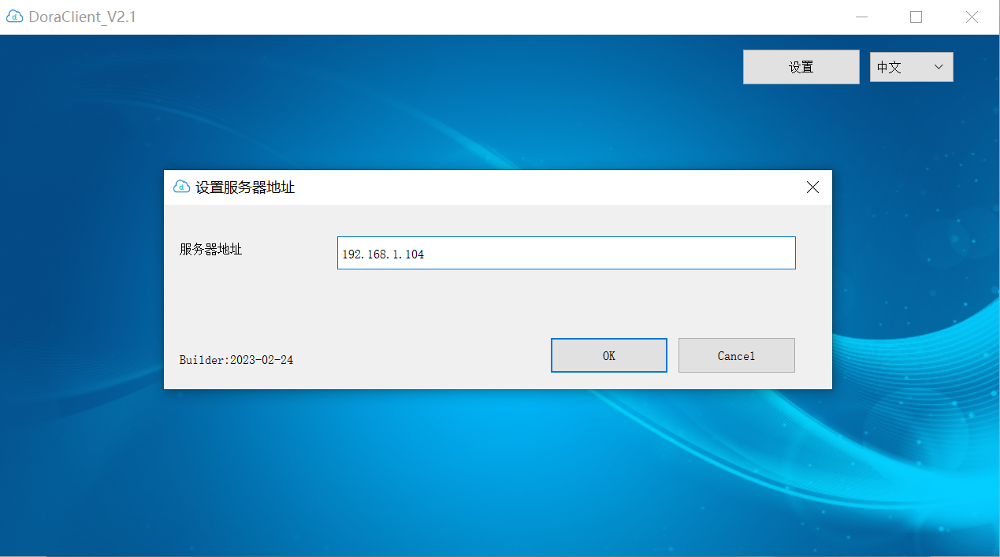

DoraCloud是一款多平台的桌面虚拟化管理软件，支持Hyper-V、VMware、Proxmox、XenServer等多种虚拟化平台。DoraCloud在虚拟化平台上具有极大的灵活性，允许您的组织自由选择合适的IT基础设施来构建桌面云；也允许您的组织重用现有的IT设施基础，而不是抛弃现有的IT基础设施。

DoraCloud采用一体化设计理念，把桌面虚拟化所需的组件打包在一个虚拟机镜像中，极大的简化了虚拟桌面部署的难度。无论是单服务器的桌面云系统，还是数十个节点的桌面云集群，都只需要部署DoraCloud虚拟机镜像。

DoraCloud采用对等集群架构设计，多个DoraCloud管理系统可以组织成一个无中心节点的对等集群，实现系统的统一管理、负载均衡、线性扩容。轻松支持1+1、N+1、N+M多种冗余备份模式。

DoraCloud 3.3 for Hyper-V支持“模板仓库”的功能，支持从在线仓库中下载模板，只需一次点击，即可为系统创建所需的模板，极大的简化了模板的创建过程。初学者可以无障碍的体验DoraCloud创建和管理虚拟桌面的过程。

### 安装前准备

1. 一台服务器，配置为 :CPU i5 以上，内存 ≥16GB，硬盘为SSD或者RAID。在BIOS中开启CPU的虚拟化支持“Intel VirtualTechnology”

2. 网络中开启了 DHCP 服务。

3. 安装了Windows Server 2012R2 或者 Windows Server 2016 或者 Windows Server 2019

4. 安装了Hyper-V服务角色，配置虚拟交换机名称为vswitch1

5. 服务器可以访问互联网，并且下载速度不低于5MB/s。

### 步骤1：下载和安装DoraCloud桌面虚拟化系统

使用浏览器下载DoraCloudV3.3安装程序。

https://www.doracloud.cn/downloads/1-cn.html

在Windows Server 上以管理员身份执行安装程序。

1. 在安装向导中，选择“下一步”，然后选择安装路径，选择“下一步”。

|  |  |
|---|---|

2. 选择 DoraCloud管理系统虚拟机所属的网络，配置DoraCloud的IP地址，为DoraCloud配置存储池。DoraCloud管理系统会安装到存储池1。用户可以在后续配置中指定存储池1,2,3的具体用途。

 

3. 安装完成后，观察DoraCloud管理系统的IP地址，使用浏览器登录DoraCloud。

 
 
安装程序会创建一个 DoraCloudyyyy_mm_dd_hhmmss命名格式的DoraCloud管理虚拟机。系统会自动通过IE打开DoraCloud管理页面。由于DoraCloud启动需要时间，需要关闭浏览器，重新用浏览器打开，才能正确访问。如果出现SSL证书提示，请选择信任未签名的证书。
DoraCloud管理系统的默认账号为 
用户名：admin  密码：DoraCloud

 
 
DoraCloud安装后，缺省的地址是DHCP分配的动态地址。您可以通过Hyper-V管理器开启DoraCloud的控制台，在虚拟机的控制台可以看到DoraCloud的IP地址。

 

4. DoraCloud系统的结构图
 
DoraCloud安装程序在Windows Server上安装了一个 DeskpoolService服务程序，并在Hyper-V虚拟化平台上创建了DoraCloud 管理VM。 DoraCloud通过DeskpoolService对Hyper-V进行控制，负责创建桌面虚拟机，实现对桌面虚拟机的管理。

 

### 步骤2：完成【系统初始化】配置

1. 登陆DoraCloud管理系统后，系统会启动配置向导，如下图所示。
DoraCloud的配置大致包括四个步骤：系统初始化、创建模板、创建桌面池、创建群组和用户。选择【开始】，进入系统初始化配置。

 

2. 配置虚拟化。

DoraCloud系统会自动检测到所在服务器的配置，并与之建立连接。

 
 
3. 配置资源池。
包括桌面存储池、数据盘存储池、镜像存储池。其中桌面存存储池、镜像存储池最好使用SSD介质的存储，或者高速的RAID磁盘阵列。 网络资源池是 DoraCloud默认所在的网络。

 
 
4. 配置集群，选择创建新的DoraCloud集群。

 
 
5. 配置用户数据库，选择本地群组数据库。
如果您有AD，可以选择使用AD作为用户数据库。 

 

### 步骤3：在远程镜像仓库下载模板

1. 在向导的第2步：创建模板时，关闭向导，然后选择【远程镜像仓库】

 
 
2. 在远程镜像库中，点击【刷新】，建议选择占用空间较小的 win7x86base 模板下载。下载速度最高约5MB/s。3GB的镜像需要大约10分钟下载。

 

 

3. 等待模板下载完毕，然后选择恢复模板。 

 
 
4. 模板恢复完毕后，可以在模板列表中看到被恢复的模板。

 
 
### 步骤4：创建桌面池

1. 在桌面池菜单中，新建桌面池。 填写【桌面池名称】、【模板】、【虚拟机名称前缀】、【虚拟机名称后缀】、【顺序编号】。不推荐虚拟机前缀使用中文。虚拟机后缀必须是数字。为了管理方便，建议顺序编号。

 
 
2. 配置桌面池创建策略，设置最大创建数目、预创建数目。
下图设置预创建3个，最大创建10个。系统会自动创建3个桌面。如果1个桌面被分配，系统会自动再创建一个，保证桌面池有3个空闲的桌面，直到总的桌面数目达到最大创建数目。
对于办公等需要保存数据的应用场景，一般创建【专用桌面池】。对于教学、培训、阅览室等场景，一般采用【公用桌面池】。
如果选择【设置为默认桌面池】，即使用户不签约该桌面池，也能从该桌面池内分配到桌面。
在采用本地用户账户时，DoraCloud桌面云系统的账号与Windows桌面的账号是独立的。为了避免用户输入两次账号，DoraCloud通过账号绑定的方式来避免用户再次输入Windows用户密码。可以设置【自动设置初始绑定账号】可以在用户首次连接桌面池，把Windows模板的默认账号作为填写在用户桌面的绑定账号中。用户如果修改了桌面Windows系统的账号，可以在DoraCloud的门户中修改绑定账号。
 
 

3. 配置用户数据盘，然后点击【确定】，保存桌面池。
 
 

4. 进入菜单【桌面计算机】，观察桌面池创建状态，状态进入【正在运行】时，桌面计算机才能分配给用户。如果长时间无法创建成功，可以观察事件列表，观察【创建虚拟桌面】任务的状态信息。
 
 

### 步骤5：创建用户和群组
1. 在用户管理菜单中，创建群组 group1，选择桌面池【办公】。

 

2. 然后批量增加用户 user01 ~ user10，密码 123456，选择所属群组 Group1。

 
 
### 步骤6：使用云终端连接到DoraCloud桌面云

**方式1**： **使用云终端登录** 

支持DoraCloud的云终端包括：朵拉云DC10/DC20、JC35，JC36。如果没有云终端，也可以选择使用旧机器安装DoraOS瘦客户机软件系统。
1. 在云终端的【配置中心】选择添加Deskpool连接，输入【服务器地址】、【记住账号信息】、【用户名】、【密码】。连接名称，可以任意填写。
 
 

2. 在连接界面中，点击 【连接】按钮，即可连接桌面。

 

 
 
3. 连接桌面后，在Windows的开始菜单中，选择【注销】->【断开】，即可离开桌面。

 
 
4. 然后在DoraCloud用户门户右上角选择 【退出】。

 
 

**方式2**： **下载DoraClient客户端登录.** 

DoraClient是DoraCloud的客户端，可以用来登录我们的云桌面。

[DoraClient下载地址][DoraClient]

1.下载完毕，打开DoraClient，提示输入服务器地址，就是DoraCloud管理后台的地址。

2.输入在管理后台创建的用户名：user01，密码：123456,点击登录就会自动下载rdp文件进入云桌面。

[DoraClient]: https://www.doracloud.cn/downloads/doraclient-cn.html
