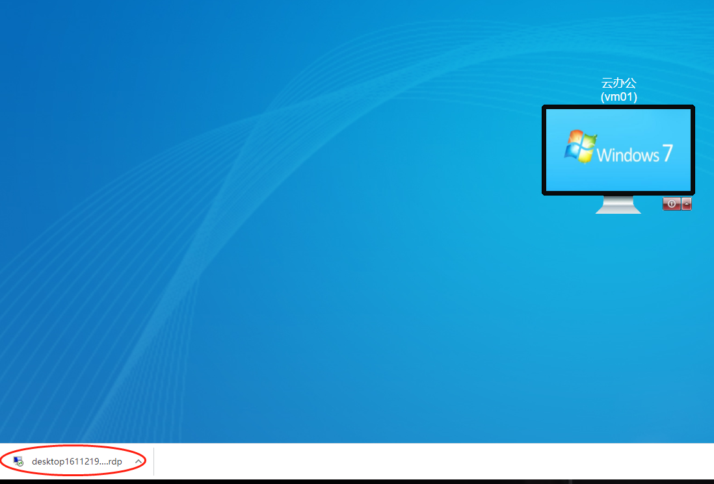

Deskpool 是一款桌面虚拟化管理软件，支持Hyper-V、vmwarer等虚拟化平台。Deskpool采用一体化设计理念，把桌面虚拟化所需的组件打包在一个虚拟机镜像中，极大的简化了虚拟桌面部署的难度.  

本手册用于在VMware vSphere操作系统上快速部署Deskpool桌面虚拟化管理平台。手册的阅读者，需要具备基本的VMware vSphere操作系统安装维护经验。具有虚拟化平台的使用经验，对于理解本手册的内容有很大帮助。  

本文介绍了如何在已安装VMware® vCenter Server、ESXi6.7的单服务器上的部署Deskpool桌面虚拟化管理平台，不涉及Deskpool集群的部署和配置。  

### 安装前准备：
1、一台服务器，配置为 :CPU i5 以上，内存 ≥16GB，硬盘为SSD或者RAID。在BIOS中开启CPU的虚拟化支持“Intel VirtualTechnology”   

2、网络中开启了 DHCP 服务

3、将本设施设置一个ip网络规划的表格，各个ip进行规划。这样会更容易部署，且管理员管理更方便

4、软件安装包已经下载
 
安装程序目录的结构:

|名称| 类型 | 下载 | 说明 |
|---|---|---|---|
|VMware ESXi 6.7U1|ISO|[下载][esxi67u1]| VMware-VMvisor-Installer-6.7.0.*.iso(此ISO用作U盘启动)|
|VMware Vcenter6.7|ISO|[下载][vcenter67]|  VMware-VCSA-all-6.7.0-*.iso   esxi直接安装包|
|VMware viewagent 32位| EXE|[下载][VMware viewagent 32位1]|  VMware-Horizon-Agent-x86_64-*.exe|
|VMware viewagent 32位| EXE|[下载][VMware viewagent 32位2]|  VMware-Horizon-Agent-x86_64-*.exe|
|viewagent-direct-connection 64位 |EXE|[下载][viewagent-direct-connection 64位 1]|  VMware-Horizon-Agent-Direct-Connection-x86_64-*.exe|
|viewagent-direct-connection 64位 |EXE|[下载][viewagent-direct-connection 64位 2]|  VMware-Horizon-Agent-Direct-Connection-x86_64-*.exe|
|Win7x86base |OVF|[下载][Win7x86base]|  Windowns7 OVF部署模板|
|Deskpool_VMware_V320 | OVF |[下载][Deskool_VMware_V320]| Deskpool_V3.2.0 OVA 部署模板|

[esxi67u1]: http://www1.deskpool.com:9000/software/VMware-VMvisor-Installer-6.7.0.update01-10302608.x86_64.iso
[vcenter67]: http://www1.deskpool.com:9000/software/VMware-VCSA-all-6.7.0-10244745.iso
[VMware viewagent 32位1]:http://www1.deskpool.com:9000/software/VMware-viewagent-7.1.0-5170901.exe
[VMware viewagent 32位2]:http://www1.deskpool.com:9000/software/VMware-viewagent-direct-connection-7.1.0-5170113.exe
[viewagent-direct-connection 64位 1]:http://www1.deskpool.com:9000/software/VMware-viewagent-direct-connection-x86_64-7.1.0-5170113.exe
[viewagent-direct-connection 64位 2]:http://www1.deskpool.com:9000/software/VMware-viewagent-x86_64-7.1.0-5170901.exe
[Win7x86base]:http://www1.deskpool.com:9000/software/Win7x86base.7z
[Deskool_VMware_V320]:http://www1.deskpool.com:9000/software/Deskpool_VMware_V320.7z
### 步骤一、ESXi and vCenter Server的安装
ESXi and vCenter Server的安装部署，请参见《2e、ESXi6.0 and vCenter Server安装》或者查阅vmware官方文档《vSphere 安装和设置》

### 步骤二、导入DeskPool模板
Deskpool 3.2 for VMware模板文件为安装程序目录中的Deskpool_VMware_V320  
1、登录vCenter Server 选中要部署Deskpool虚拟机的主机，右键选择“部署OVF模板”  
注：选择DeskpoolOVF模板，注意选择OVF模板时,3个文件都需要选择，选择完后点击“NEXT”。如下图
  

2、在“选择名称和文件夹”页面上,点击“NEXT”
 

3、 在“选择计算资源”点击“NEXT”
 

4、 在“查看详细信息”点击“NEXT”
 

5、 在“选择存储”页面上，选择对应存储后点击“NEXT”
 

6、 在“选择网络”页面上，选择网络后点击“NEXT”
 

7、在“即将完成”页面点击“FINISH”
 

8、 启动Deskpool虚拟机如下图
 

9、 记录下Deskpool IP地址 如下图：
注：
如果网络中无DHCP，需手动设置Deskpool的IP地址
 

### 步骤三、快速部署Deskpool桌面虚拟化系统
Deskpool桌面管理系统提供了完整的初始化导航，用户第一次安装Deskpool，可以在导航的引导下完成Deskpool的快速安装。  
在浏览器的地址栏输入Deskpool虚拟机IP地址：错误!超链接引用无效。，进入登录页面。  
注：Deskpool管理平台默认采用https安全访问协议，在首次访问Deskpool URL时，需要根据不同的浏览器提示，设置对该链接的信任。  

  

默认的管理员登录账户为：用户名：admin密码：deskpool   
如下图所示，第一次登录Deskpool系统，自动显示导航提示窗口，管理员可以在这个窗口右下角，选择语言，目前版本支持简体中文和英文：  

Deskpool管理系统的导航包括四个大任务，每个任务会包含若干步骤，用户可以根据导航的引导，按顺序完成：  
（1）系统初始化  
（2）创建模板  
（3）创建桌面池  
（4）创建用户  

##### 系统初始化    
点击导航提示窗口中的“开始”按钮，进入系统初始化导航任务，如下图，提示用户系统初始化配置的主要内容，点击【继续】，开始系统初始化配置。  
 

四个步骤完成系统初始化：  
**配置虚拟化：**
有Xen Server，Hyper-V和VMware vCenter三个主机类型。选择VMware vCenter 输入IP地址和vCenter 的管理员账户。(如：administrator@vsphere.local)
 

**配置资源池：**
用户可以为桌面虚拟机、用户数据盘、模板镜像选择不同的存储池，提供差异化的存储性能。网络资源池是指配置缺省的虚拟网络。如下图所示
 

**配置集群**：
缺省选择创建一个新的Deskpool集群，注意Deskpool集群和Hyper-V故障转移群集（Failover Cluster）是不同集群概念，如下图所示
 

如果需要加入集群，则选择加入集群，填写集群地址、用户名、密码
 

**配置用户数据库：**
缺省选择本地用户数据库，如果选择Active Directory域用户数据库，请参考《Deskpool管理员手册》。如下图
 

**设置网络：**
可以对Deskpool设置静态IP，如果设置静态IP，Deskpool会自动重启，需几分钟等待Deskpool重启成功后重新登录继续后续操作。如下图操作
 

### 步骤四、创建基础模板
完成系统初始化设置后， Deskpool导航会提示用户开始创建模板。  
创建模板支持从虚拟机镜像开始制作跟直接导入模板两种方法。  
制作模板前需要导入win7模板虚拟机 虚拟机模板文件为安装软件中的Win7x86base。

 

创建一个Deskpool桌面虚拟机模板需要5个步骤

**导入镜像：**
  准备的Windows虚拟机，输入新模板名称和描述信息后，开始导入镜像（如果镜像不可导入，请参考虚拟机状态信息，修改Windows虚拟机的设置）；  
注：被导入的Windows虚拟机必须处于运行状态，且满足导入条件，用户可以使用Deskpool Template Tool完成检查和设置。
  

 
输入windows的用户、密码点击确定
 

 
等待进度条完成，如下图

**安装代理：**
通常系统默认自动安装代理会自动跳过此步骤，如果选择手动安装代理，请参考《Deskpool管理员手册》，注：制作Windows 8 / Windows 10桌面模板，请选择手工安装代理。  

**编辑模板：**
在编辑模板阶段，可通过mstsc命令远程登录虚拟机安装基础软件（本章节只要是用于制作基础模板，可以不先安装或安装最最基本的软件，软件安装在步骤5安装），安装完成后点击“确认“  

在弹出确认框，全部选择“是”，点击“确定“窗口关闭后点击“下一步”。  

**准备模板：**
在准备模板阶段，确定本模板是用于“专用和公用桌面”还是只用于“公用桌面”，本文选择“专用和公用桌面”；
 

**测试模板：**
测试模板的可用性，用户可以通过mstsc命令远程（见下图）基于模板创建的虚拟机，无问题题就点击
【保存模板】，有问题点击【上一步】，重新从编辑模板开始创建模板。
 

### 步骤五、配制桌面模板

**给模板安装软件**
1.  登陆Deskpool桌面云管理系统，在模板菜单下，选择Win7x64base模板的复制操作。复制的新模板命名为 Win7x64stu，如下图所示。
 

 
 

在经过几分钟的模板复制操作后，模板的一个实例虚拟机被启动。启动完成后，系统开启了一个模板编辑向导。
 
 

根据向导的提示，使用Windows远程桌面客户端软件 mstsc 登陆模板虚拟机，输入账户密码，即可登陆。
我们提供的模板虚拟机的账户是 用户名 administrator  密码 123456。
 

保存模板

1、 安装完成应用软件后，返回deskpool模板编辑界面，点击“确认”，全部选择“是”，点击下一步。
如下图所示。
 
 

2、  进入准备模板，选择“专用和公用模板”，点击“准备模板”按钮。如下图所示。
 
 

3、  保存模板，完成模板配置。如下图所示。
 
 

### 步骤六、 配制桌面池

云教室的桌面虚拟机是通过配置桌面池自动创建的。桌面池定义了创建桌面所需要的模板，虚拟机规格，桌面创建策略等信息。在云教室中，桌面池类型配置为公用桌面。  
配置桌面池时，需要考虑服务器总的资源。云教室的资源配置为每个用户 2GB-4GB内存，处理器资源按照人均0.8 ~ 1.0个线程配置。云教室的总内存需求大致为： 8GB + 每桌面内存 * 用户数。  

6.1 创建桌面池
进入桌面池，点击“属性”。如下图所示。

6.2 填写桌面池信息                            
**填写基本信息:**【桌面池名称：云教室】、【模板：win7x64stu】、【选择网络：vswitch】、【前缀：VM】、
【后缀：01】、【内存：2048MB】、【虚拟机CPU数：1】。如下图所示。
 

**配置策略:** 填写信息。【最大虚拟机数：30】、【预创建虚拟机：30】、【用户名：administrator】、【密码：123456】。选择公用桌面池。本步骤的自动绑定账号的用户名、密码，必须与模板中的Windows账号相同。否则桌面用户登陆会出现认证错误，导致无法登陆。如下图所示。
 

**配置存储:** 勾选“启用用户数据盘”。填写信息，【数据盘名：Data】、【容量：20GB】。点击“确定”完成。如图（6-4）所示。
 

在桌面池配置后，Deskpool桌面虚拟化系统会自动创建桌面虚拟机。你可以在Deskpool管理系统的“桌面计算机”菜单中，查看“桌面计算机列表”，了解桌面计算机的创建情况。通常10分钟左右可以创建完成60个虚拟机。

#### 步骤七、 创建桌面用户，启用终端自动配置
在配置Deskpool桌面虚拟化系统的用户账户前，需要先明确几个概念：  
【只能从桌面池分配桌面】  
1、Deskpool的用户是从桌面池自动分配桌面的。不需要也不能手动为每个用户分配桌面计算机。  
2、用户在连接桌面池时，会自动从桌面池中分配可用的桌面计算机。  
方法1：用户具有桌面池权限，用户登录时，从桌面池中分配桌面。  
方法2：用户属于某个群组，群组具有桌面池权限，用户登录时，从桌面池中分配桌面。
  
云教室中，我们采用方法2，把用户配置到一个群组中，为群组指定桌面池即可。  
由于桌面计算机是用户登陆时分配的，如何保证用户编号和桌面计算机编号的对应呢？比如用户stu01分配桌面vm01，stu02分配vm02。  
Deskpool的桌面池中有一个选项“强制后缀匹配”。该选项会确保在为用户分配桌面时，桌面计算机的后缀数字编号与用户名的数字编号后缀匹配。

【终端的两种认证方式】  
***用户账号认证***：终端在新建Deskpool连接的时候，保存用户账号。终端凭借用户账号进行用户认证。  
***终端标识认证***：终端在新建Deskpool连接的时候，把用户名设置为 @ ，表示使用终端标识认证。终端第一次连接时，Deskpool系统为自动为终端分配一个用户账号。我们称之为绑定账号。后续连接时，该终端会自动关联到该用户账号。  
终端侧的配置	  
 

Deskpool桌面云系统侧配置  
 

如果Deskpool上有多个群组，可以在用户名中输入 @群组名，表示绑定该群组的用户。比如上图的终端配置可以修改为 @group1

【云教室按照座位顺序编号】
为了维护和管理的方便，管理员一般会希望按照云教室的用户和桌面编号与座位号对应。

如果终端采用用户账号认证，那么只需要根据终端的座位编号设置用户账号即可。座位01的终端配置用户名为stu01，座位02的终端配置用户名为stu02，依次类推。我们可以手工配置每个终端的账号，实现云教室的顺序编号。

如果终端采用终端标识认证，那么可以批量设置所有终端的连接的用户名为@，然后根据座位顺序依次把每个终端开机。这样终端会按照开机顺序依次绑定用户账号 stu01，stu02，stu03，依次类推，顺序编号。

在云教室的场景下，为了简化对终端的管理，Deskpool系统集成了对云终端的批量自动化配置功能。可以根据策略对云终端进行自动配置，与终端ID认证机制相结合，可以实现云终端的即插即用。避免了对终端配置账号的繁琐操作。

7.1 增加用户群组

还原的备份环境中，已经添加了群组 Group1，群组配置如下。一个群组代表一个教室。你可以参考下图，增加自己的云教室配置。

 
 
认证方式：支持三种模式。用户名+密码、ID、ID+用户名+密码。其中的选择ID认证时，可以使用ID或者用户账号登陆。选择ID+用户名+密码时，系统会同时对ID和账号认证。该模式可以限定用户只能从特定的终端登录，提供更高的安全性。  
云教室中，推荐采用ID认证，简化云终端的配置和管理。并勾选“自动绑定终端标识”、“禁止用户修改密码”。

7.2 增加云教室的用户
还原的配置中，已经包括了60个用户账号。你也可以选择删除这些用户账号，批量新增用户账号。
1.  在用户管理界面中，点击“批量新增”，填写信息。【用户名：stu】、【后缀：01】、【数量：60】、【密码:****】。点击“提交”按钮。如下图所示。
 
 

添加用户后，我们可以看到用户列表的界面。每个用户有一个终端属性，终端ID认证的机制是通过把终端ID与用户账号绑定实现的。我们可以手工编辑用户账号，把终端与用户绑定。前面的群组配置中，启用了自动绑定终端标识，可以实现终端登录的时候，自动绑定到用户账号。 在此复述一下终端启用自动绑定的要求：终端的Deskpool连接中，用户名填写@表示绑定到任何一个账号。填写@group1表示绑定到群组group1中用户账户。如果一个Deskpool系统支持多个教室，每个教室的云终端可以绑定到不同群组的用户。
  

7.3 终端自动配置
在用户管理菜单下，有一个终端管理的功能，可以实现对终端的自动配置。还原的备份环境已经包含了对本网段终端的自动配置。
 

编辑该策略，可以看到如下对话框，基本上是用缺省值，即可满足对云教室终端的自动配置需求。 
 

自动配置策略启用后，搜索范围内的云终端将会被自动配置。自动连接Deskpool系统。
如果您的云教室内已经安装好了云终端，并且云终端已经上电联网，网络中有DHCP服务，您会观察到这些终端会在重启一次后，自动进入桌面云系统。 

### 步骤八：通过朵拉云瘦客户机或者DoraOS瘦客户机软件系统连接DoraCloud桌面云

 **方式1**: **旧改Doraos或者使用朵拉云DC20云终端登录云桌面.** 

这里以朵拉云DoraCloud专用终端DC20为例，连接DoraCloud系统。如果没有朵拉云DC20云终端，可以在一个x86机器上部署DoraoS系统，把机器改造成瘦客户机。DoraoS的下载和部署参考如下链接DoraoS下载和安装。

1. 安装好朵拉云瘦客户机，并将瘦客户机连接到网络

2. 打开朵拉云瘦客户机，进入设置页面,点击第一个“添加Deskpool连接”。

3. 编辑Deskpool连接，设置服务器地址和连接名称。
填写DoraCloud管理系统的IP地址，不是Windows Server的IP地址

4. 设置完成，点击红框区域的“连接”，进入DoraCloud系统。

5. 然后以 用户名user01  密码123456  登陆，即可连接桌面。

6. 选择桌面，点击即可进入系统。

**方式2**： **直接在网页登录云桌面.** 

用网页登录云桌面，USB使用会受限制，我们可以用网页登录来测试创建的云桌面是否能正常登录，并且测试桌面云的部分功能等.

1.如图所示，我们正在登录DoraCloud管理后台，点击右上角退出。

2.在后台登录界面输入之前创建的，用户名：user01 密码：123456，输入完毕点击登录.

3.登录成功以后，会自动下载RDP文件，点击图中RDP文件，连接用户桌面，进入以后输入用户名：administrator,密码：123456，
点击登录就进入云桌面了。

**方式3**： **下载DoraClient客户端登录.** 

DoraClient是DoraCloud的客户端，可以用来登录我们的云桌面。

[DoraClient下载地址][DoraClient]

1.下载完毕，打开DoraClient，提示输入服务器地址，就是DoraCloud管理后台的地址。

2.输入在管理后台创建的用户名：user01，密码：123456,点击登录就会自动下载rdp文件进入云桌面。

[DoraClient]: https://www.doracloud.cn/downloads/doraclient-cn.html
 
