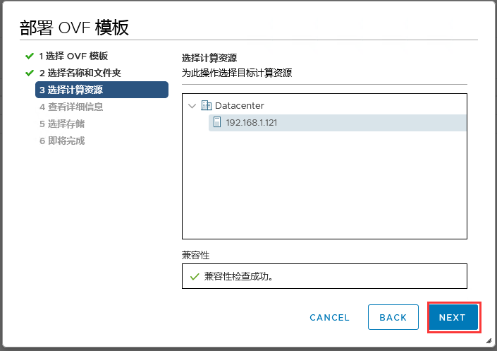
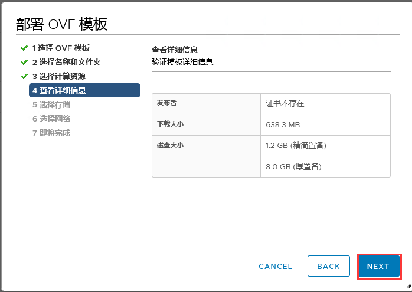
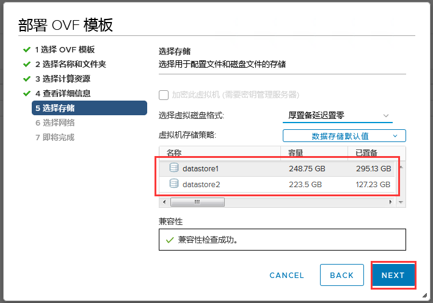
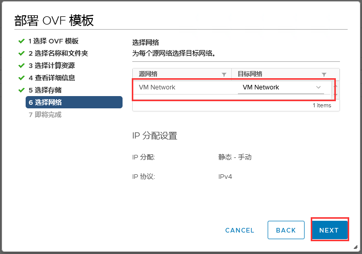
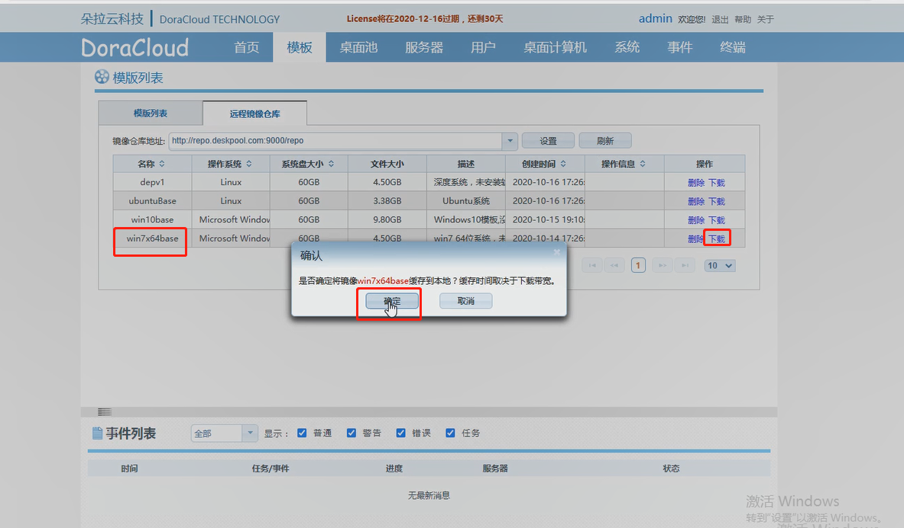
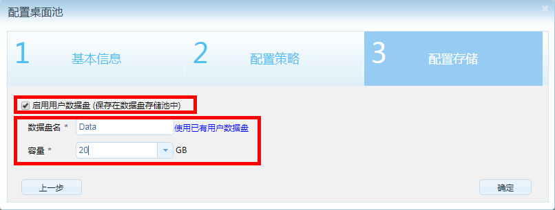
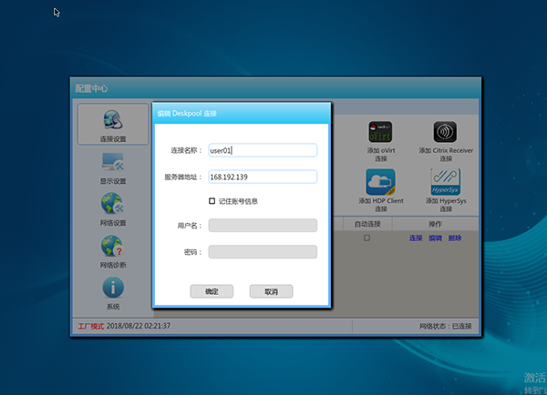
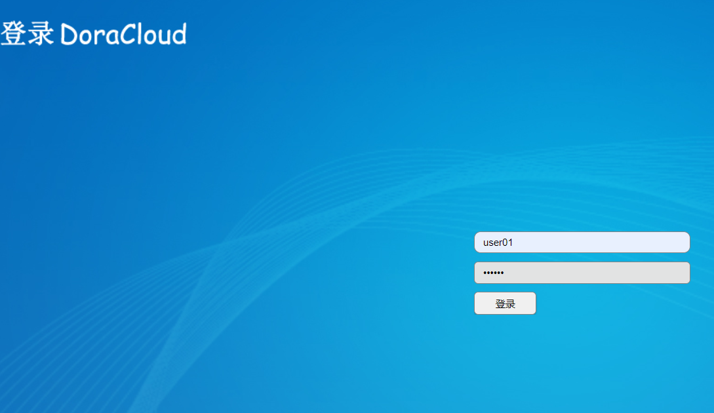
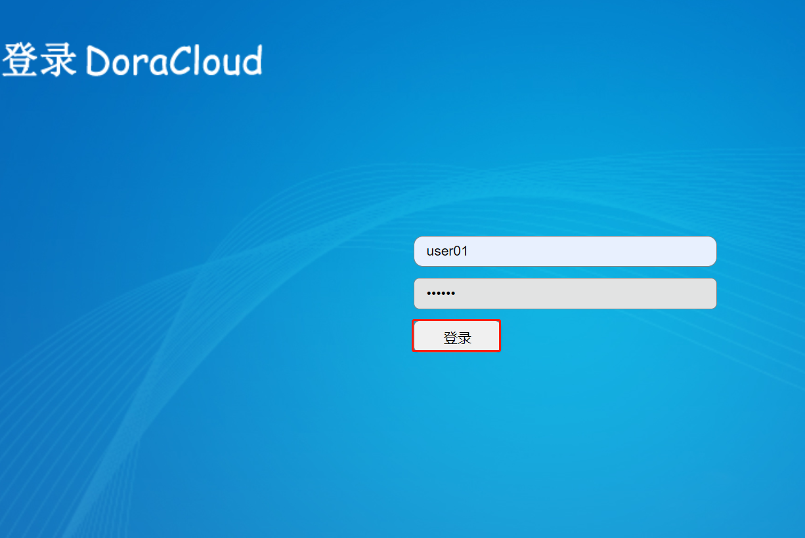
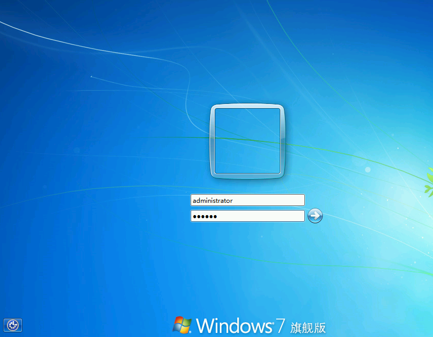

---
title: "安装指南【VMware平台】"
linkTitle: "安装指南【VMware平台】"
date: 2019-12-20
weight: 4
aliases:
    - /docs/getting-started/VMware/
description: >
  本文描述了在VMware虚拟化平台下安装DoraCloud桌面虚拟化的过程。
---
DoraCloud是一款桌面虚拟化管理软件，支持Hyper-V、vmware等虚拟化平台。DoraCloud采用一体化设计理念，把桌面虚拟化所需的组件打包在一个虚拟机镜像中，极大的简化了虚拟桌面部署的难度.  

本手册用于在VMware vSphere操作系统上快速部署DoraCloud桌面虚拟化管理平台。手册的阅读者，需要具备基本的VMware vSphere操作系统安装维护经验。具有虚拟化平台的使用经验，对于理解本手册的内容有很大帮助。  

本文介绍了如何在已安装VMware® vCenter Server、ESXi6.7的单服务器上的部署DoraCloud桌面虚拟化管理平台，不涉及DoraCloud集群的部署和配置。  

### 安装前准备：
1、一台服务器，配置为 :CPU i5 以上，内存 ≥16GB，硬盘为SSD或者RAID。在BIOS中开启CPU的虚拟化支持“Intel VirtualTechnology”   

2、网络中开启了 DHCP 服务

3、将本设施设置一个ip网络规划的表格，各个ip进行规划。这样会更容易部署，且管理员管理更方便

4、软件安装包已经下载
 
安装程序目录的结构:

|名称| 类型 | 下载 | 说明 |
|---|---|---|---|
|VMware ESXi 6.7U1|ISO|[下载][esxi67u1]| VMware-VMvisor-Installer-6.7.0.*.iso(此ISO用作U盘启动)|
|VMware Vcenter6.7|ISO|[下载][vcenter67]|  VMware-VCSA-all-6.7.0-*.iso   esxi直接安装包|
|VMware viewagent 32位| EXE|[下载][viewagent32]|  VMware-viewagent-7.1.0-5170901.exe|
|VMware viewagent 32位| EXE|[下载][viewagent64]|  VMware-viewagent-x86_64-7.1.0-5170901.exe|
|viewagent-direct-connection 32位 |EXE|[下载][viewagentdirectconnect32]|  VMware-viewagent-direct-connection-7.1.0-5170113.exe|
|viewagent-direct-connection 64位 |EXE|[下载][viewagentdirectconnect64]|  VMware-viewagent-direct-connection-x86_64-7.1.0-5170113.exe|
|DoraCloud_VMware_V320 | OVF |[下载][Deskool_VMware_V320]| DoraCloud_V3.2.0 OVA 部署模板|

[esxi67u1]: http://www1.deskpool.com:9000/software/VMware-VMvisor-Installer-6.7.0.update01-10302608.x86_64.iso
[vcenter67]: http://www1.deskpool.com:9000/software/VMware-VCSA-all-6.7.0-10244745.iso
[viewagent32]:http://www1.deskpool.com:9000/software/VMware-viewagent-7.1.0-5170901.exe
[viewagent64]:http://www1.deskpool.com:9000/software/VMware-viewagent-x86_64-7.1.0-5170901.exe
[viewagentdirectconnect32]:http://www1.deskpool.com:9000/software/VMware-viewagent-direct-connection-7.1.0-5170113.exe
[viewagentdirectconnect64]:http://www1.deskpool.com:9000/software/VMware-viewagent-direct-connection-x86_64-7.1.0-5170113.exe

[Win7x86base]:http://www1.deskpool.com:9000/software/Win7x86base.7z
[Deskool_VMware_V320]:https://www.doracloud.cn/downloads/5-cn.html
### 步骤一、ESXi and vCenter Server的安装
一.ESXi的安装部署，请参见《2e、ESXi6.0 安装》或者查阅vmware官方文档

二.安装vCenter Server

1、下载好cVenter镜像后右击点击装载，再进入文件vcsa-ui-installer\win32，进入后双击应用程序，如图下









2、我们先将vCenter进行阶段一安装配置设置，点击Install。如图下



3、点击下一步，如图下



4、勾选接受许可协议条款，点击确认。如图下



5、点击下一步，如图下



6、输入ESXI主机的ip地址以及用户名与密码，点击下一步。如图下



7、设置cVenter虚拟机名以及密码，点击下一步。如图下



8、点击下一步。如图下



9、将cVenter安装在自己所规划的储存盘里，如图下



10、设置cVenter静态ip，并点击下一步。如图下



11、如图所示。



12、已完成阶段一安装设置，正在安装部署vCenter服务器设备。等待完成。如图下



13、完成安装后，输入vCenter给到的部署网址，如图下



14、进入vCenter管理界面后，此时需要对此vCenter进行阶段二的安装设置，点击设置。如图下



15、进入设置需要输入阶段一设置时的密码，进入后，根据安装导向点击下一步，如图下





16、设备配置这里注意，需要将系统名称改为vCenter的ip地址，并点击下一步。如图下



17、在SSO配置中，设置vCenter的用户名与密码，并点击下一步。如图下



18、根据向导，完成安装配置。如图下







### 步骤二、导入DoraCloud模板
DoraCloud 3.3 for VMware模板文件为安装程序目录中的DoraCloud_VMware_V320  

1、在刚部署的vCenter Server是没有数据中心以及主机的，这时先进行添加，先新建数据中心，如图下





2、再为vCenter新建数据中心添加主机，如图下



3、输入ESXI主机的ip地址，并点击下一步。如图下



4、输入ESXI用户名以及密码，并点击下一步



5、根据导向进行下一步，如图下











6、登录vCenter Server 选中要部署DoraCloud虚拟机的主机，右键选择“部署OVF模板”  
注：选择DoraCloudOVF模板，注意选择OVF模板时,3个文件都需要选择，选择完后点击“NEXT”。如下图 

 
 

7、在“选择名称和文件夹”页面上,点击“NEXT”

8、 在“选择计算资源”点击“NEXT”
 

9、 在“查看详细信息”点击“NEXT”
 

10、 在“选择存储”页面上，选择对应存储后点击“NEXT”
 

11、 在“选择网络”页面上，选择网络后点击“NEXT”
 

12、在“即将完成”页面点击“FINISH”

13、 启动DoraCloud虚拟机如下图

14、 记录下DoraCloud IP地址 如下图：
注：
如果网络中无DHCP，需手动设置DoraCloud的IP地址

### 步骤三、快速部署DoraCloud桌面虚拟化系统
DoraCloud桌面管理系统提供了完整的初始化导航，用户第一次安装DoraCloud，可以在导航的引导下完成DoraCloud的快速安装。  
在浏览器的地址栏输入DoraCloud虚拟机IP地址：错误!超链接引用无效。，进入登录页面。  
注：DoraCloud管理平台默认采用https安全访问协议，在首次访问DoraCloud URL时，需要根据不同的浏览器提示，设置对该链接的信任。  

默认的管理员登录账户为：用户名：admin密码：DoraCloud   
如下图所示，第一次登录DoraCloud系统，自动显示导航提示窗口，管理员可以在这个窗口右下角，选择语言，目前版本支持简体中文和英文：  

Deskpool管理系统的导航包括四个大任务，每个任务会包含若干步骤，用户可以根据导航的引导，按顺序完成：  
（1）系统初始化  
（2）创建模板  
（3）创建桌面池  
（4）创建用户  

##### 系统初始化    
点击导航提示窗口中的“开始”按钮，进入系统初始化导航任务，如下图，提示用户系统初始化配置的主要内容，点击【继续】，开始系统初始化配置。  

四个步骤完成系统初始化：  
**配置虚拟化：**
有Xen Server，Hyper-V和VMware vCenter三个主机类型。选择VMware vCenter 输入IP地址和vCenter 的管理员账户。(如：administrator@vsphere.local)
 

**配置资源池：**
用户可以为桌面虚拟机、用户数据盘、模板镜像选择不同的存储池，提供差异化的存储性能。网络资源池是指配置缺省的虚拟网络。如下图所示
 

**配置集群**：
缺省选择创建一个新的Deskpool集群，注意Deskpool集群和Hyper-V故障转移群集（Failover Cluster）是不同集群概念，如下图所示

**配置用户数据库：**
缺省选择本地用户数据库，如果选择Active Directory域用户数据库，请参考《DoraCloud管理员手册》。如下图

**设置网络：**
选择是，后面可以自定义设置DoraCloud管理后台的ip地址。如下图操作。
 

### 步骤四、在远程镜像仓库下载模板
1.完成系统初始化设置后退出，如下图操作。

2.点击远程镜像仓库，进行下载模板，观察下面的时间列表，进度到100%，模板下载完毕，如下图操作。

### 步骤五、 配制桌面池

云教室的桌面虚拟机是通过配置桌面池自动创建的。桌面池定义了创建桌面所需要的模板，虚拟机规格，桌面创建策略等信息。在云教室中，桌面池类型配置为公用桌面。  
配置桌面池时，需要考虑服务器总的资源。云教室的资源配置为每个用户 2GB-4GB内存，处理器资源按照人均0.8 ~ 1.0个线程配置。云教室的总内存需求大致为： 8GB + 每桌面内存 * 用户数。  

6.1 创建桌面池
进入桌面池，点击“属性”。如下图所示。

6.2 填写桌面池信息                            
**填写基本信息:**【桌面池名称：云教室】、【模板：win7x64Base】、【选择网络：缺省网络资源】、【前缀：VM】、
【后缀：01】、【内存：2048MB】、【虚拟机CPU数：1】。如下图所示。

**配置策略:** 填写信息。【最大虚拟机数：30】、【预创建虚拟机：30】、【用户名：administrator】、【密码：123456】。选择公用桌面池。本步骤的自动绑定账号的用户名、密码，必须与模板中的Windows账号相同。否则桌面用户登陆会出现认证错误，导致无法登陆。如下图所示。
 

**配置存储:** 勾选“启用用户数据盘”。填写信息，【数据盘名：Data】、【容量：20GB】。点击“确定”完成。如图（6-4）所示。
 

在桌面池配置后，DoraCloud桌面虚拟化系统会自动创建桌面虚拟机。你可以在DoraCloud管理系统的“桌面计算机”菜单中，查看“桌面计算机列表”，了解桌面计算机的创建情况。通常10分钟左右可以创建完成60个虚拟机。

#### 步骤六、 创建桌面用户，启用终端自动配置  

6.1创建桌面池后， DoraCloud导航会直接引导用户进入账户管理页面。
1、创建群组（用户->群组点击新增） 填写群组名称 并选择桌面池

 

2.批量创建用户（可以单独创建）

 

在配置DoraCloud桌面虚拟化系统的用户账户，需要明确几个概念：  
【只能从桌面池分配桌面】  
1、DoraCloud的用户是从桌面池自动分配桌面的。不需要也不能手动为每个用户分配桌面计算机。  
2、用户在连接桌面池时，会自动从桌面池中分配可用的桌面计算机。
3、自动配置策略启用后，搜索范围内的云终端将会被自动配置。自动连接DoraCloud系统。
如果您的云教室内已经安装好了云终端，并且云终端已经上电联网，网络中有DHCP服务，您会观察到这些终端会在重启一次后，自动进入桌面云系统。 

### 步骤七：通过朵拉云瘦客户机或者DoraOS瘦客户机软件系统连接DoraCloud桌面云

 **方式1**: **旧改Doraos或者使用朵拉云JC10云终端登录云桌面.** 

这里以朵拉云DoraCloud专用终端JC10为例，连接DoraCloud系统。如果没有朵拉云JC10云终端，可以在一个x86机器上部署DoraoS系统，把机器改造成瘦客户机。DoraoS的下载和部署参考如下链接DoraoS下载和安装。

1. 安装好朵拉云瘦客户机，并将瘦客户机连接到网络

2. 打开朵拉云瘦客户机，进入设置页面,点击第一个“添加Deskpool连接”。

3. 编辑Deskpool连接，设置服务器地址和连接名称。
填写DoraCloud管理系统的IP地址，不是Windows Server的IP地址

4. 设置完成，点击红框区域的“连接”，进入DoraCloud系统。

5. 然后以 用户名user01  密码123456  登陆，即可连接桌面。

6. 选择桌面，点击即可进入系统。

**方式2**： **直接在网页登录云桌面.** 

用网页登录云桌面，USB使用会受限制，我们可以用网页登录来测试创建的云桌面是否能正常登录，并且测试桌面云的部分功能等.

1.如图所示，我们正在登录DoraCloud管理后台，点击右上角退出。

2.在后台登录界面输入之前创建的，用户名：user01 密码：123456，输入完毕点击登录.

3.登录成功以后，会自动下载RDP文件，点击图中RDP文件，连接用户桌面，进入以后输入用户名：administrator,密码：123456，
点击登录就进入云桌面了。

**方式3**： **下载DeskpoolClient客户端登录.** 

DeskpoolClient是Deskpool、DoraCloud的客户端，可以用来登录我们的云桌面。

[DeskpoolClient下载地址][DeskpoolClient]

1.下载完毕，打开DeskpoolClient，提示输入服务器地址，就是DoraCloud管理后台的地址。

2.输入在管理后台创建的用户名：user01，密码：123456,点击登录就会自动下载rdp文件进入云桌面。

[DeskpoolClient]: https://dl.doracloud.cn/DeskpoolClient.exe
 
[deskpoolSoftwar]: http://www.jieyung.com/software/showdownload.php?id=62
[DoraOS]:https://www.doracloud.cn/downloads/3-cn.html

