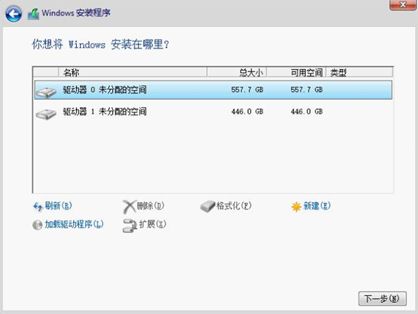
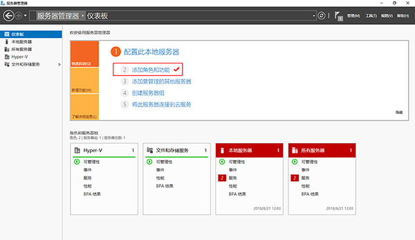
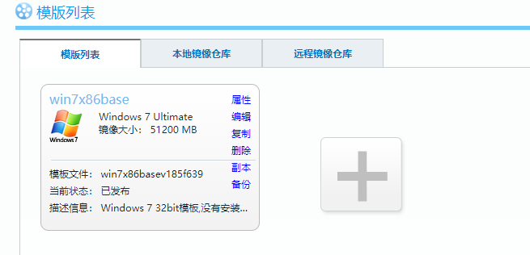
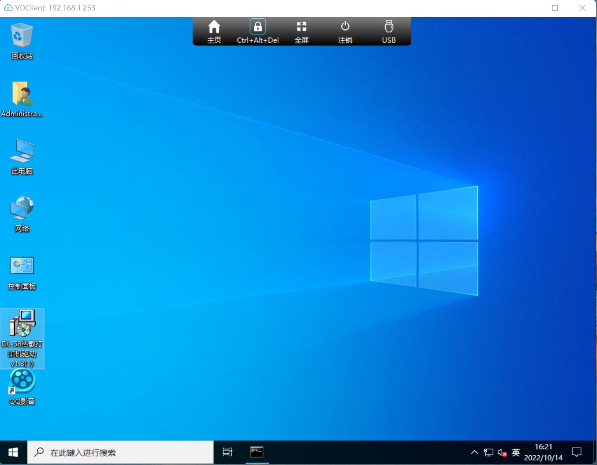

DoraCloud 是一款桌面虚拟化管理软件，支持Hyper-V、XenServer等虚拟化平台。DoraCloud采用一体化设计理念，把桌面虚拟化所需的组件打包在一个虚拟机镜像中，极大的简化了虚拟桌面部署的难度。

本文主要讲述在windows server 2012 R2中快速部署朵拉云系统。

操作思路：下载window server 2012 R2镜像，制作启动启动盘，按照步骤安装系统，然后在系统中下载并安装 DoraCloud 3.3,进行快速部署。

DoraCloud 3.3 for Hyper-V支持“模板仓库”的功能，支持从在线仓库中下载模板，只需一次点击，即可为系统创建所需的模板，极大的简化了模板的创建过程。初学者可以无障碍的体验DoraCloud创建和管理虚拟桌面的过程。

安装前准备
一台服务器，配置为 :CPU i5 以上，内存 ≥16GB，硬盘为SSD或者RAID。在BIOS中开启CPU的虚拟化支持“Intel VirtualTechnology”

网络中开启了 DHCP 服务。

三种方法下载windows Server 2012 R2 ISO镜像

1.迅雷下载地址：[迅雷精简版下载地址][URL_ThunderMini]
 
迅雷下载ISO文件(复制到迅雷下载)：
> ed2k://|file|cn_windows_server_2012_r2_x64_dvd_2707961.iso|4413020160|010CD94AD1F2951567646C99580DD595|/>
 
2.Windows Server 2012 R2 ISO镜像 官方下载地址： http://technet.microsoft.com/zh-cn/evalcenter/dn205286.aspx 
 
3.另外msdn.itellyou.cn网站也提供了P2P下载Windows Server安装包的地址。 
Windows Server 2012R2的 ISO文件：cn_windows_server_2012_r2_vl_x64_dvd_3316795.iso

U盘制作：

1）使用rufus制作Windows Server启动U盘。

1.rufus下载地址：[rufus下载地址][URL_rufus]

2）使用UltraISO制作Windows Server启动U盘。

下载并安装 DoraCloud 3.3。

DoraCloud 3.3 for Hyper-V 的下载地址为：https://www.doracloud.cn/downloads/1-cn.html

### 步骤一：安装Windows Server 2012R2 和原厂网卡、主板驱动程序
安装 Windows Server 2012R2的过程比较简单，注意几点：

1. 选择标准版（带有GUI的服务器）或者 数据中心版本（带有GUI的服务器）。

2. 选择自定义安装，如果有分区，则删除已有的分区。

3. 安装完成后，需要设置管理员账户的密码。

### 步骤二：安装 Hyper-V 角色，创建虚拟交换机，确保网络中有DHCP服务
Hyper-V角色可以手工通过Windows的“服务器管理”安装，也可以通过DoraCloud向导自动安装Hyper-V。

通过“服务器管理”安装的过程如下：

1. 打开“服务器管理”，管理页面如下图所示
点击勾选的区域“添加角色和功能”

2. 进入安装步骤

3. 选择“基于角色或基于功能的安装”

4. 选择“Hyper-V”

5. 勾选选择“以太网”

向导执行完毕后，会提示需要重启服务器，服务器重启后，可以完成 Hyper-V角色的安装。

### 步骤三：下载并安装 DoraCloud 桌面虚拟化管理系统
DoraCloud 3.3 for Hyper-V 的下载地址为：https://www.doracloud.cn/downloads/1-cn.html

1. 执行安装向导，选择“下一步”，会启动DoraCloud安装程序。

2. 选择存储池和虚拟网络。

3. 完成安装

### 步骤四：完成【系统初始化】配置
安装完成以后我们会看到DoraCloud的ip地址，去浏览器中访问，注意，是填写DoraCloud管理系统的IP地址，不是Windows Server的IP地址。缺省账号为：用户 admin，密码 DoraCloud。

1. 登陆DoraCloud管理系统后，系统会启动配置向导，如下图所示。
DoraCloud的配置大致包括四个步骤：系统初始化、创建模板、创建桌面池、创建群组和用户。选择【开始】，进入系统初始化配置。

 

2. 配置虚拟化。

DoraCloud系统会自动检测到所在服务器的配置，并与之建立连接。

 
 
3. 配置资源池。
包括桌面存储池、数据盘存储池、镜像存储池。其中桌面存存储池、镜像存储池最好使用SSD介质的存储，或者高速的RAID磁盘阵列。 网络资源池是 DoraCloud默认所在的网络。

 
 
4. 配置集群，选择创建新的DoraCloud集群。

 
 
5. 配置用户数据库，选择本地群组数据库。
如果您有AD，可以选择使用AD作为用户数据库。 

 

### 步骤五：在远程镜像仓库下载模板
1. 在向导的第2步：创建模板时，关闭向导，然后选择【远程镜像仓库】

 
 
2. 在远程镜像库中，点击【刷新】，建议选择占用空间较小的 win7x86base 模板下载。下载速度最高约5MB/s。3GB的镜像需要大约10分钟下载。

 

 

3. 等待模板下载完毕，然后选择恢复模板。 

 
 
4. 模板恢复完毕后，可以在模板列表中看到被恢复的模板。

 

### 步骤六：创建桌面池

1. 在桌面池菜单中，新建桌面池。 填写【桌面池名称】、【模板】、【虚拟机名称前缀】、【虚拟机名称后缀】、【顺序编号】。不推荐虚拟机前缀使用中文。虚拟机后缀必须是数字。为了管理方便，建议顺序编号。

 
 
2. 配置桌面池创建策略，设置最大创建数目、预创建数目。
下图设置预创建3个，最大创建10个。系统会自动创建3个桌面。如果1个桌面被分配，系统会自动再创建一个，保证桌面池有3个空闲的桌面，直到总的桌面数目达到最大创建数目。
对于办公等需要保存数据的应用场景，一般创建【专用桌面池】。对于教学、培训、阅览室等场景，一般采用【公用桌面池】。
如果选择【设置为默认桌面池】，即使用户不签约该桌面池，也能从该桌面池内分配到桌面。
在采用本地用户账户时，DoraCloud桌面云系统的账号与Windows桌面的账号是独立的。为了避免用户输入两次账号，DoraCloud通过账号绑定的方式来避免用户再次输入Windows用户密码。可以设置【自动设置初始绑定账号】可以在用户首次连接桌面池，把Windows模板的默认账号作为填写在用户桌面的绑定账号中。用户如果修改了桌面Windows系统的账号，可以在DoraCloud的门户中修改绑定账号。
 
 

3. 配置用户数据盘，然后点击【确定】，保存桌面池。
 
 

4. 进入菜单【桌面计算机】，观察桌面池创建状态，状态进入【正在运行】时，桌面计算机才能分配给用户。如果长时间无法创建成功，可以观察事件列表，观察【创建虚拟桌面】任务的状态信息。
 
 

### 步骤七：创建用户和群组

1. 在用户管理菜单中，创建群组 group1，选择桌面池【办公】。

 

2. 然后批量增加用户 user01 ~ user10，密码 123456，选择所属群组 Group1。

 

### 步骤八：通过朵拉云瘦客户机或者DoraOS客户机软件系统连接DoraCloud桌面云

 **方式1**: **旧改Doraos或者使用朵拉云JC10云终端登录云桌面.** 

这里以朵拉云DoraCloud专用终端DC20为例，连接DoraCloud系统。

如果没有朵拉云DC20云终端，可以在一个x86机器上部署DoraoS系统，把机器改造成瘦客户机。DoraoS的下载和部署参考如下链接   
[DoraoS下载和安装][DoraOS]

1. 安装好朵拉云瘦客户机，并将瘦客户机连接到网络

2. 打开朵拉云瘦客户机，进入设置页面,点击第一个“添加Deskpool连接”。

3. 编辑Deskpool连接，设置服务器地址和连接名称。
填写DoraCloud管理系统的IP地址，不是Windows Server的IP地址

4. 设置完成，点击红框区域的“连接”，进入DoraCloud系统。

5. 然后以 用户名user01  密码123456  登陆，即可连接桌面。

6. 选择桌面，点击即可进入系统。

**方式2**： **直接在网页登录云桌面.** 

用网页登录云桌面，USB使用会受限制，我们可以用网页登录来测试创建的云桌面是否能正常登录，并且测试桌面云的部分功能等.

1.如图所示，我们正在登录DoraCloud管理后台，点击右上角退出。

2.在后台登录界面输入之前创建的，用户名：user01 密码：123456，输入完毕点击登录.

3.登录成功以后，会自动下载RDP文件，点击图中RDP文件，连接用户桌面，进入以后输入用户名：administrator,密码：123456，
点击登录就进入云桌面了。

**方式3**： **下载DoraClient客户端登录.** 

DoraClient是DoraCloud的客户端，可以用来登录我们的云桌面。

[DoraClient下载地址][DoraClient]

1.下载完毕，打开DoraClient，提示输入服务器地址，就是DoraCloud管理后台的地址。

2.输入在管理后台创建的用户名：user01，密码：123456,点击登录就会自动下载rdp文件进入云桌面。

[URL_rufus]: https://dl.doracloud.cn/tools/rufus-3.5p.exe 
[URL_ThunderMini]: https://dl.doracloud.cn/tools/ThunderMini_dl1.5.3.288.exe
[backup001_addr1]: http://www1.deskpool.com:9000/software/backup001.zip
[backup001_addr2]: http://www1.deskpool.com:9000/software/backup001.zip
[DoraClient]: https://www.doracloud.cn/downloads/doraclient-cn.html
[DoraOS]: https://www.doracloud.cn/downloads/14-cn.html

