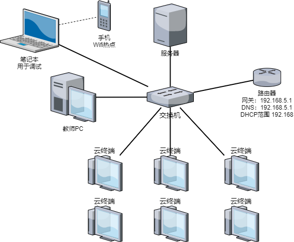

### 1. 概述
本文以部署30用户云教室为范例，描述了朵拉云科技云教室的安装过程。本文档适用于使用朵拉云Deskpool桌面虚拟化系统部署云教室、电子阅览室、电子会议室等应用场景。

#### 1.1 云教室构成
一个30用户云教室的组网如下图：


云教室硬件包括：

1. 30台学生机（云终端，显示器，键鼠）

2. 1台教师PC机

3. 一台服务器

4. 一台交换机

5. 一台路由器

云教室的软件系统包括：

1. 朵拉云Deskpool桌面虚拟化系统。部署在服务器上。 

2. 多媒体教学软件。部署在教师PC上。

一个典型的30用户的云教室的配置清单如下：

|序号|产品名称|规格|数量|单位
| --- | --- | --- | --- | --- |
|1|	服务器|	CPU：E5-2620V4*2 内存：128GB(16GB DDR4 * 8) SSD：240GB * 1 [Intel S4500/S3520] 硬盘：2TB 7.2K * 1 网卡：GE*4 电源：双电源	|1	|台
|2|	桌面云软件|	朵拉云 Deskpool标准版：支持公用桌面、专用桌面；|	30	|用户授权|
|3|	瘦终端|	朵拉云 云终端 JC10, ARM 4核2.0Ghz/1G/4G;1000M RJ45;3.5mm音频input/output;5*USB2.0;三年质保;多协议  配套显示器、键盘、鼠标。	|30	|台|
|4|	教学软件|	多媒体电子教学软件，支持屏幕广播，学生演示，文件收发，分组教学，作业提交|1|	套|
|5|	教师机	|I3、4GB内存、500G硬盘、19寸显示器	|1|	台|
|6|	交换机	|48口千兆交换机	|1|	台|
|7|	路由器	|路由器，待机量在50-100用户|	1|	台|

#### 1.2 云教室配置规划
在开始云教室配置前，需要先做好配置的规划。云教室配置规划包括：网络规划、模板规划、其他规划。  
网络规划定义了云教室的组网，主要参考用户单位的网络管理员的意见。  
模板规划定义了云桌面使用的操作系统版本和应用软件清单，由云教室的用户需求决定。  
其他规划定义了桌面池、用户、终端的编号和配置策略，方便云教室的管理员进行日常管理。  

**【网络规划】**  
1. 一个教室的云终端、虚拟桌面、教师机必须在同一个局域网，并位于同一个VLAN内。以便进行教学广播。  
2. 网络内的IP地址推荐采用DHCP动态分配。建议的DHCP IP地址池设置为学生数目的3倍。DHCP的周期，建议配置为30-60分钟。并且DHCP Server支持原IP地址续约。以免IP变化引起连接中断的问题。比如：30用户云教室，终端需?要30个地址，桌面虚拟机需要30个地址，再预留30个地址，作为备用。这样在重建桌面时有足够的空闲IP。  
3. 预留2个静态IP地址，分别留给物理服务器的Windows Server和 Deskpool管理系统。静态IP不应该出现在DHCP的IP地址池中。  
4. 在开始 Deskpool 软件安装前，请务必确认网络已经配置好，并且开启了DHCP服务。  
请就上述网络规划问题与云教室的管理员以及网络管理员沟通，并填写《云教室规划表》的相应内容，参见下图红框内的内容。  
  

**【模板规划】**

模板规划是确定桌面模板的Windows操作系统版本，以及应用软件的清单。一个云教室可以有多个桌面模板。  
本文档作为范例的模板为Windows 7 64位操作系统，安装的应用软件有：Office、QQ、极域学生端。  
  

**【其他规划】**

Deskpool桌面云系统中还有其他一些配置，包括桌面池、用户、缺省账号等。这些规划可以使用缺省配置，或者根据管理员的要求调整。下表是本文使用的云教室规划表。  
 

#### 1.3 云教室部署前准备工作
在云教室部署过程中，需要准备一台笔记本电脑，最好有互联网连接，以便于朵拉云科技工程师进行远程协助的部署。  
在您开始云教室的软件部署前，需要检查【硬件准备】、【软件准备】、【网络准备】已经准备就绪。  
##### 1.3.1 【硬件准备】
1. 完成服务器的硬件安装。如果服务器放置在教室内，服务器与学生机（云终端、显示器）能够分别开关机。避免下课时关学生机，服务器也被断电的情况出现。  
2. 完成云终端的硬件安装。含显示器、键盘、鼠标的硬件安装。  
3. 完成教师机硬件安装，教师机预装了Windows操作系统。  
4. 一台笔记本电脑用于调试，一个空闲的U盘，容量在8G以上。  
5. 确认服务器的硬件配置足够满足30用户的云教室需求。  
30用户按照人均4G内存规划，典型硬件配置为： 
 
**内存： 128GB**  
**SSD ： 480G Intel S45xx/S35xx 企业级固态盘**  
**HDD ： 2TB SATA或者SAS**  

##### 1.3.2 【软件准备】
1. 服务器虚拟化  
推荐使用 Windows Server 2012R2 或者 Windows Server 2016标准版  
[下载mini迅雷][minixunlei]  
使用迅雷下载Windows Server 2012R2  
`ed2k://|file|cn_windows_server_2012_r2_x64_dvd_2707961.iso|4413020160|010CD94AD1F2951567646C99580DD595|/> `
[下载Windows USB/DVD Download Tool][win7usbtool]  
[Windows预安装脚本Pre-Setup][presetup]  

2. 驱动程序  
Windows Server必须安装硬件原厂的主板驱动程序和网卡驱动程序。  
Dell R730 驱动
http://www1.deskpool.com:9000/software/R730Driver.zip  
如果是Dell R730服务器，我们建议您更新RAID卡的固件，并安装最新的RAID卡驱动程序。如果RAID卡固件与驱动程序版本不匹配，会出现磁盘IO错误的告警。在Dell R730服务的iDrac系统中，检查相关告警提示。  
兼容服务器驱动（E5-2600V3/V4系列，Intel网卡 I350 或者 I250网卡）  
http://www1.deskpool.com:9000/software/IntelDriver.zip  
也可以去Intel 官网下载服务器主板驱动  
https://downloadcenter.intel.com/download/28531  
Intel的网卡驱动链接如下：  
https://downloadcenter.intel.com/download/23073/Intel-Network-Adapter-Driver-for-Windows-Server-2012-R2-?product=36773  

3. 桌面虚拟化  
[Deskpool for Hyper-V V3.2下载][deskpoolv32addr1]

4. 云终端管理  
[ThinClientManager下载][thinclientmgr]	

5. 教学软件  
[VDClass多媒体教学软件][vdclass]

6. 教学软件  
极域多媒体电子教室软件 请从附带的光盘下载安装程序

7. 桌面模板  
DoraCloud支持在线模板仓库。 
如果项目现场不具备在线下载模板的条件，可以事先下载模板，到现场从本地恢复桌面模板。
模板的离线恢复方法参见

https://docs.doracloud.cn/operation-maintenance/kb0007/

8. 应用软件  
具体请咨询用户的云教室管理员  
请云教室的管理员提供所需应用软件的安装程序  

[minixunlei]: http://www1.deskpool.com:9000/software/ThunderMini_dl1.5.3.288.exe
[winsrv2012r2]: ed2k://|file|cn_windows_server_2012_r2_x64_dvd_2707961.iso|4413020160|010CD94AD1F2951567646C99580DD595|/
[win7usbtool]: http://www1.deskpool.com:9000/software/Windows7-USB-DVD-Download-Tool-Installer-en-US.exe
[presetup]: http://www1.deskpool.com:9000/deploy/Pre-Setup.ps1
[deskpoolv32addr1]: http://www1.deskpool.com:9000/software/Deskpool_Hyper-V_2012R2_V3_2_0.msi
[thinclientmgr]: http://www1.deskpool.com:9000/software/TCManager_2.5.6.exe
[vdclass]: http://www1.deskpool.com:9000/software/VDClassTeacher.exe
[backup008part1]: http://www1.deskpool.com:9000/software/backup008.7z.001
[backup008part2]: http://www1.deskpool.com:9000/software/backup008.7z.002
[7z]: http://www1.deskpool.com:9000/software/7z1900-x64.exe

##### 1.3.3 【网络准备】
1. 将服务器、教师机、所有的云终端与交换机连接。  
2. 如果配置有路由器，将路由器的LAN口与交换机连接，并按照规划表的要求，设置路由器的LAN网络地址为：192.168.5.1；LAN网络内启用DHCP服务，IP地址范围为192.168.5.20-192.168.5.250，DHCP分配的网关为 192.168.5.1，分配的DNS为192.168.5.1。 路由器的WAN口，根据云教室的联网要求进行配置，比如设置为PPoE拨号到运营商的网络，或者DHCP Client模式直接接入校园网。 参见下图左侧。  
  
如果用户单位的网络可以在路由器或者三层交换机为云教室划出一个VLAN和子网，则直接把云教室配置的交换机与上行的端口连接。根据本文的规划，需要用户单位的管理员在上级网络设备上划出一个VLAN，并配置网关为192.168.5.1。 DHCP可以由上级交换机（路由器）提供。参见上图右侧。  
如果单位的网络可以提供VLAN和子网，但是不愿意为云教室启用DHCP，我们可以在服务器上启用DHCP服务。具体参见2.7节。还有一些云教室要求使用静态IP分配方式，具体参见TBD2。
3. 将笔记本有线网口与交换机连接，有线网卡配置成DHCP。如果云教室的网络不能连接互联网，建议将笔记本通过手机热点连接互联网，以便于远程协助进行云教室的调测。如下图  
  
4. 我们在笔记本上检查一下，是否获取到地址段为192.168.5.x动态IP地址。然后ping一下网关地址 192.168.5.1。如果云教室的网络可以连接互联网，ping一下 baidu.com，确认互联网连接正常。 如果云教室的网络不能连接互联网，请开启手机热点，笔记本通过手机热点联网，以便于远程协助进行云教室的部署。  
★注意1：开始部署前，请确保已经按照云教室的网络规划，预留了网段和IP资源，并开启DHCP服务。  
★注意2：为了提高远程支持的效率，请务必准备好互联网连接，以便于朵拉云工程师远程协助部署。  

##### 1.3.4 开始云教室的安装之旅  
如果您已经确认按照上述要求完成了【硬件准备】、【软件准备】、【网络准备】，您可以开始下一步的安装过程。  
朵拉云云教室的安装过程包括以下几个环节，各环节的大致耗时如下表。

| ID  | 内容    |  耗时   |  章节   |  备注   |
| --- | --- | --- | --- | --- |
| 1 |	Windows Server 2012R2系统的安装|	10分钟	|第2章|	
| 2 |	安装Deskpool桌面虚拟化系统|	5分钟	|第3章|	
| 3 |	恢复备份档案	|10分钟	|第4章|	
| 4 |	编辑模板	|不确定	|第5章	|在模板中安装应用软件是管理员例行维护工作之一。 我们建议现场部署人员与云教室管理员一起安装应用软件。|
| 5 |	配置桌面池|	20分钟	|第6章	|正常情况下，10分钟可以创建30-60个桌面。|
| 6 |	增加用户和终端自动配置	|3分钟	|第7章	|
| 7 |	安装教师机	|5分钟	|第8章|	
| 8 |	系统测试|	30分钟	|	|    |
| 9 |	用户培训|	120分钟	|	| |

### 2. Windows Server 2012R2系统安装
安装Windows Server前，需要对服务器完成如下配置：  
1. 在服务器的RAID卡中，把SSD硬盘设置成直通模式。HDD硬盘也建议配置成直通。如果有两块HDD，则配置成RAID1模式。  
2. RAID卡中，把HDD硬盘设置为启动盘。如果不确定第一启动盘是HDD还是SSD，可以把SSD拔出后安装Windows。安装完毕再插入SSD硬盘。避免出现引导区在SSD盘，但是Windows系统安装在了HDD的情况。  
3. 建议把服务器的BIOS中设置为最大性能模式（CPU Power Management ：Maximum Performance）  
4. 建议更新服务器的BIOS和硬件的固件为最新版本。  
5. 建议配置服务器的远程管理。比如Dell服务器为iDrac系统。HP服务器为iLO系统。便于后续进行服务器远程维护。具体的配置，请参考服务器相关资料。

Windows Server 2012R2的安装要求如下：  
1. HDD盘作为启动盘，划分200GB空间，安装系统(C盘)，剩余空间划分为E盘。SSD划分为D盘。  
2. 必须安装服务器厂家提供的主板驱动、网卡驱动。推荐安装RAID卡驱动。  
3. 安装Hyper-V角色，创建外部虚拟交换机连接当前网卡，并把虚拟交换机命名为 vswitch。  
4. 安装Windows Server 2012R的更新，并把更新配置为：“自动下载，但是让我选择是否安装更新”  
5. 配置Windows Server的静态IP地址。  
6. 关闭“IE增强的安全配置”，以便IE浏览器能够正常访问 Deskpool。或者您可以选择安装 Chrome浏览器，或者Firefox浏览器，用于对Deskpool系统的管理。  

最后强调一下，请勿使用激活工具或者破解工具对Windows Server进行破解或者激活。这类工具多带有病毒或者木马，会影响Windows Server运行的稳定性。我们推荐您购买正版Windows Server授权，或者使用免费的Hyper-V Server 2012R2、Hyper-V Server 2016作为服务器虚拟化系统。Hyper-V Server的安装，可以参考朵拉云官网技术支持板块的相关内容。  
如果您的项目购买了【朵拉云科技云教室的远程部署服务】，您可以在完成本章节内容后，请求朵拉云科技的工程师进行远程安装部署工作。远程部署时间约为1-2小时。

下面描述实现上述要求的详细的安装过程。

#### 2.1 制作U盘启动盘
首先安装Windows USB/DVD Download Tool。安装时，如果提示需要 .NET Framework2.0，请在Windows的程序和功能中开启 .NET 2.0。  
  
启用Windows USB/DVD Download Tool程序，选择Windows Server 2012R2的ISO。  
  
然后选择U盘。  
  
确认U盘数据可以被删除后，即开始Windows Server启动U盘的制作。  
  
制作完成后拔出U盘，用于服务器的安装。  
除了使用本文推荐的工具，还可以使用UltraISO制作U盘，以及Rufus工具制作U盘。  
UltraISO 的下载位置  https://cn.ultraiso.net/  
Rufus下载位置： http://rufus.ie/  
需要说明一下，UltraISO制作Windows Server 2016启动U盘会出错。原因是有个文件超出了4G，无法保存在FAT32文件系统中。  
另外，不要使用其他一些U盘制作工具制作U盘启动。有些工具制作的U盘启动会篡改IE启动选项，植入广告或者木马，存在技术风险。  

#### 2.2 安装windows Server2012 R2
1. 插入U盘，启动服务器。  
2. 按“启动选择”热键（F7，不同服务器可能有所不同，大致在F7，F9，F11，F12这几个功能键）选择U盘启动，如图所示。
  
3. 选择安装语言，时间和键盘输入法。如图所示。  

4. 选择带GUI的标准版的Windows Server 2012 R2，如图所示。  
  
5. 接受协议，如图所示。  
  
6. 选择自定义安装，如图所示。  
  
7. 新建200GB分区，选择主分区。如图所示。  
  
8. 开始安装，大约3~5分钟，安装过程会自动重启，如图所示。  
  
9. 设置管理员账户密码（请根据云教室规划表中的账号信息填写），如图所示。  
  

#### 2.3 设置Windows 磁盘分区  
1. 进入磁盘管理。如图所示。如果“系统保留”出现在了SSD盘，则属于安装错误。

|  |  |
| --- | --- |

2. 把HDD硬盘剩余的空间分区为 E盘。  
  
3. 把SSD硬盘配置为D盘。  
  

#### 2.4 执行Windows Server预设置脚本
我们提供了Pre-Setup.PS脚本，完成如下工作：  
1. 安装 Windows Server的Hyper-V角色，安装后服务器会自动重启。  
2. Windows Server上启用远程桌面服务（RDP服务），并开启RDP（3389端口）的防火墙  
3. 远程桌面服务启用网络级安全认证（NLA）  
4. 在桌面创建 Hyper-V Manager 的快捷方式  
5. 配置Windows更新为自动下载，手工启用  
6. 禁用浏览器的增强安全特性  
由于安装Hyper-V角色后，服务器会自动重启，脚本的执行会中断。重启后需要再次运行该脚本。  
为了便于您了解上述修改的作用，我们给出手工修改上述配置的界面，供核对和检查。  
Hyper-V角色  
  
远程桌面服务  
  
Hyper-V 管理器快捷方式  
  
Windows更新的配置，建议安装一下Windows的补丁。  
  
关闭管理员的IE增强安全特性  
  
 
#### 2.5 修改服务器IP地址
在服务器右下角右键点击网卡，选择“打开网络和共享中心”，选择网卡属性，Internet协议版本4，在TCP/IPv4属性对话框中设置服务器的静态IP。  
  

设置完毕后，可以ping 一下网关 192.168.5.1，以及互联网是否可以访问（比如ping baidu.com）  
#### 2.6 安装服务器硬件驱动（网卡、主板、Raid卡）
##### 2.6.1 Dell R730驱动安装
下载R730Driver.zip驱动包，解压，可以看到如下文件  
   
分别是显卡驱动、主板驱动、网卡驱动、iDrac本地管理程序、Raid卡驱动程序。驱动的安装过程不详细介绍了。  
在此提示一下，Dell R730的Raid卡（H330、H730）的固件和驱动存在匹配关系。如果版本不匹配会导致存储工作不稳定。可以通过iDrac管理系统查看到这些告警信息。  

#####  2.6.2 其他服务器驱动安装
如果服务器厂家提供了驱动程序，请安装厂家提供主板驱动、网卡驱动。
如果找不到厂家的驱动，可以下载 IntelDriver.zip，解压。分别安装网卡驱动、主板驱动。其中的网卡驱动适用于 Intel I350,I250网卡。
驱动的安装过程不再详细介绍。

2.7 【可选】在Windows Server上开启DHCP服务
如果云教室的网络设备无法提供DHCP，可以在Windows Server上添加 DHCP服务角色。通过Windows Server启用DHCP服务。
1、在Windows Server中，依次选择“服务器管理”、“添加角色和功能”、勾选“DHCP服务器”、“添加功能”，完成“DHCP服务器” 角色的安装。

|  |  |
| --- | --- |

2、在服务器管理器中，点击DHCP，右键点击服务器名称，在菜单中选择“DHCP管理器”。  

|  |  |
| --- | --- |

3、在DHCP管理器中，添加作用域，并设置 DHCP的地址池范围，以及网关和DNS。  

|  |  |
| --- | --- |
|  |  |
|  |  |
|  |  |
|  |  |

4、配置完成后，可以看到作用域的情况如下：  
  

可以使用调测的笔记本电脑，或者教师机连接到交换机，看能否正常获得IP地址。 如果能够正常获得192.168.5.x的IP地址，表明DHCP成功配置。 

### 3. 安装Deskpool
Deskpool for Hyper-V提供基于图形界面、向导化的安装程序。  
Deskpool安装的要点为：  
1. 安装Deskpool时，需要为桌面配置选择存储池、网络池。存储池包括三个存储路径。  
2. 安装Deskpool后，可以通过驱动检查工具ServerChecker，检查Windows Server的硬件驱动安装是否合规。  
3. 如果您的服务器没有开启 CPU对硬件虚拟化的支持，安装可能会出错。请进入服务器的BIOS，开启CPU对于硬件虚拟化的支持。  
4. Deskpool管理系统运行在一个VM中，该VM的网络设置为DHCP模式。如果网络中没有DHCP，也会导致Deskpool管理系统的VM无法得到IP地址，从而导致安装失败。  
#### 3.1 安装Deskpool 3.2
1. 执行 Deskpool_Hyper-V_2012R2_V3_2_0.msi，选择安装目录。如图（3-1）所示。  
  

2. 选择存储池和虚拟网络。Deskpool系统中，虚拟机、模板、数据盘可以分别放在不同的存储池中。安装程序会创建三个存储池，用于存放 虚拟机、模板和数据盘。具体的用途，会在Deskpool的初始化配置阶段指定。如图（3-2）所示。  
如果没有创建虚拟交换机，选择 连接了网线的网卡创建虚拟交换机，命名为 vswitch。  
   
然后选择存储池，网络池。  
  

3. 完成安装。  
安装程序执行完毕后，如果安装成功，会出现如下两个窗口。一个窗口是 Deskpool 管理虚拟机的控制台。内有Deskpool 管理系统的IP。另外一个窗口是浏览器访问 Deskpool 的窗口。如图（3-3）所示。  
  
由于Deskpool初始化需要一定时间，可以稍后关闭浏览器，重新输入地址 http://192.168.5.9，访问Deskpool管理系统。 缺省的账号为： 用户 admin ，密码 deskpool  
  
为了便于后续访问快捷的访问，可以在桌面建立一个快捷方式，内容如下，命名为 deskpool 管理。后续可以直接点击链接，进入 Deskpool 管理系统
https://192.168.5.9/?username=admin&password=deskpool  
  

#### 3.2 检查驱动的合规性  
Deskpool安装程序带有一个 ServerChecker程序，可以检查Windows Server是否安装了远程驱动。如果服务器不安装原厂的主板驱动和网卡驱动，性能会很差。  
可以在应用界面，找到“serverchecker”，点击。如图（3-7）所示。  
  
也可以直接按 Windows热键+R，在“运行”窗口中，输入 serverchecker，启动该程序。  
  
进入“Hyper-V服务器检查工具”，点击“检查”。  
如果全部显示为白色，说明驱动都安装成功。如图（3-9）所示。
  
如果有黄色的项目，请确认一下这些黄色的项目是不是网卡和主板的硬件。如果不是，也没有关系。只需要保证主板驱动、网卡驱动使用硬件原厂驱动即可。

### 4. 使用备份文档快速安装
Deskpool 桌面虚拟化系统提供了基于向导的系统初始化和配置过程，配置Deskpool系统的过程也相当简单，但是虚拟桌面的Windows模板的制作过程还是相对繁琐和耗时。为了提高云教室系统的部署效率，我们还是推荐采用使用备份档案恢复Deskpool桌面云系统的方式来部署云教室系统。  
备份档案是Deskpool备份工具（vdibackup）产生一个备份文件夹。包括了Deskpool桌面虚拟化环境的配置数据，以及桌面模板文件。Deskpool备份工具可以对桌面云环境进行备份、恢复。本章节是利用备份工具来快快速部署一个新的云教室环境。  
目前朵拉云科技提供包含Windows 7 32位模板的备份档案，以及包含Windows 7 64位模板的备份档案。您可以使用我们提供的备份档案进行本章节的安装过程。如果你之前搭建过其他云教室，您也可以使用之前云教室的备份档案来安装当前的云教室。如果需要其他的操作系统的桌面模板，还是需要现场制作。模板的制作方法参见朵拉云科技官网技术支持板块有关模板制作的内容。  

本章主要完成两个工作：  
1、使用备份恢复工具，恢复备份档，快速搭建一个云教室环境。  
2、登陆Deskpool的Web管理系统，设置Deskpool管理系统的IP为静态IP。  

#### 4.1 启动恢复数据软件
1.  解压backup008.7z.001、backup008.7z.002到磁盘。进入backup008目录，可以看到数据库备份文件 deskpool.tar.gz，以及桌面模板的备份目录 win7x64base 。如图所示。  
  
  
2.  在backup008目录下，地址栏输入 vdibackup，按“Enter”键。如图所示。  
  
#### 4.2 数据库恢复
1. 进入桌面云备份和恢复工具页面，点击“恢复”，进入恢复功能。然后填写管理系统IP，点击“刷新”。勾选选择“恢复数据库”，“恢复桌面模板”，选择虚拟机、数据盘、镜像的存储池位置。  
根据云教室的规划，虚拟机和镜像的存储池使用SSD硬盘（D:\Deskpool）,数据盘存储池使用HDD硬盘（E:\Deskpool）。 如果存储池中的位置不可选，请点击“刷新”按钮。如果提示中显示无法连接桌面云服务器，请检查桌面管理虚拟机IP（即Deskpool管理系统IP）是否填写正确了。  
  
2.  点击“恢复”按钮，开始恢复过程。如图所示。恢复过程耗时5-10分钟。  
  
下图是一次完成的恢复过程的日志。恢复大致包括：1）恢复数据库；2）重启动Deskpool；3）调整虚拟网络配置；4）调整存储池配置；5）恢复模板虚拟机；6）再次重启Deskpool。  
  
#### 4.3 修改deskpool的IP地址
Deskpool 管理系统是一个基于CentOS 6的Linux 虚拟机。我们可以通过Deskpool的Web管理系统修改Deskpool的IP地址。在Deskpool管理系统中，依次选择“服务器”“属性”“Deskpool网络”“静态IP配置”即可对Deskpool管理系统的IP进行修改。修改IP后，以新的IP地址登陆Deskpool系统。
  
管理系统修改的IP地址仅限于当前网段的地址。如果需要更换其他网段，或者需要配置网关、DNS，则需要进入Linux系统。通过相关的命令进行修改。具体请了解 CentOS 6修改IP地址的相关知识。  
下图描述了修改 Deskpool IP的方法。 使用 putty 登陆 Deskpool VM，使用 vi编辑  /etc/sysconfig/network-scripts/ifcfg-eth0 文件。  
  
修改BOOTPROTO，IPADDR，NETMASK，GATEWAY参数。然后保存。  
  
然后输入 :wq! 退出后，重启这个Linux 虚拟机，以新的IP地址登陆 Deskpool即可。  
有关Linux vi 编辑命令的使用，请查询有关资料。  

### 5. 配制桌面模板
前一章节的通过恢复备份档案部署了一个Deskpool桌面云环境。备份档案中包括了一个win7x86base（或者win7x64base）的模板。本章通过拷贝win7x86base（或者win7x64base）模板到新的模板，然后在新的模板中安装多媒体教学软件和日常教学所需软件，最后保存新产生的模板。  
在模板中安装应用软件是云教室管理员的日常工作之一，不属于朵拉云科技云教室项目部署服务的内容。本章节主要目的是示范桌面模板的制作和编辑方法。在云教室的部署过程中，现场工程师负责提供一个包含Windows操作系统以及云教学软件学生端的基础模板。然后培训和指导云教室管理员安装教学所需的应用软件。  
一般情况下，我们不建议现场工程师独自帮客户安装应用软件。一方面现场工程师未必熟悉客户的应用软件的配置，另一方面云教室管理员在不参与模板制作过程，后续很难对桌面云系统的模板进行日常维护。  
Deskpool的模板支持“创建模板”、“编辑模板”“复制模板”操作。建议基于基础模板Win7x64base复制一个新模板出来作为云教室的模板。编辑模板并安装应用软件是一个比较繁琐的过程，如果模板制作出错，可以重新从基础模板复制一个新模板出来制作，不会破坏基础模板。  
模板的制作也建议按照循序渐进的原则，分多个版本制作模板。比如先制作win7x64v1包含软件A、B，win7x64v2包含软件A、B、C、D。这样如果某个软件的配置有问题，可以回退到上一个模板版本，而不必全部重新安装。另外杀毒软件、安全软件、防火墙等软件特别容易和桌面云平台产生冲突，建议单独做一个模板版本，安装验证这些软件。  
#### 5.1 复制模板
登陆Deskpool桌面云管理系统，在模板菜单下，选择Win7x64base模板的复制操作。复制的新模板命名为 Win7x64stu，如图所示。  
  
在经过几分钟的模板复制操作后，模板的一个实例虚拟机被启动。  
  
启动完成后，系统开启了一个模板编辑向导。  
  
根据向导的提示，使用Windows远程桌面客户端软件 mstsc 登陆模板虚拟机，输入账户密码，即可登陆。  
我们提供的模板虚拟机的账户是 用户名 administrator  密码 123456。  
  

#### 5.2 在模板中安装应用软件
##### 5.2.1 安装极域2017教学软件学生端
如果模板中，已经包含极域教学软件的学生端，请忽略本节。  
极域学生端在朵拉云桌面云系统上的安装要求如下：  
- 安装学生端时，使用 noscreendriver参数安装。 不启用显卡驱动截屏。  
- 学生端，不通过服务方式启动，而是改为通过自动运行程序的方式启动。  
本章节提供手工安装 和 工具辅助安装两种方法的说明。  

**手工安装模式**  
第一步：以noscreendriver 模式安装学生端。  
在资源管理器中，找到极域2017的安装程序所在目录。进入cmd，执行  
Student_2.7.13787 /verysilent /noscreendriver  
执行该命令后，模板虚拟机会自动重启动。  
  
重启动完毕后，重新登陆模板虚拟机。  
如果您需要对极域做一些设置，可以不加 verysilent 参数，但保留noscreendriver参数，进行交互式安装。可以设置一些参数，比如卸载口令。  
第二步：禁止极域学生端服务。  
进入cmd，如下命令。 注意=符号后有空格。  
sc stop studsrv  
sc config studsrv start= disabled  
  
第三步：设置为基于学生端为自动启动  
自动运行极域学生端有两种方法。一种为添加到程序菜单的“启动”项中。  

|  |  |
| --- | --- |  
另一种为添加到注册表如下位置：
`[HKEY_LOCAL_MACHINE\SOFTWARE\Microsoft\Windows\CurrentVersion\Run]`  
  

**工具辅助安装模式**  
我们提供了一个批处理工具，可以自动化完成上述操作。  
  
以管理员身份运行该脚本得到如下菜单。  

第一次按1运行极域安装程序后，系统重启。第二次运行按2，执行学生端程序的服务和自动运行配置。  

##### 5.2.2 安装QQ  
找到QQ软件，点击完成安装。  
##### 5.2.3 安装Microsoft Office 2010  
找到Microsoft Office 2010软件，点击完成安装。  
#### 5.3 保存模板  
1. 安装完成应用软件后，返回deskpool模板编辑界面，点击“确认”，全部选择“是”，点击下一步。  
如图（5-17）所示。  
  
2. 进入准备模板，选择“专用和公用模板”，点击“准备模板”按钮。如图（5-18）所示。  
  
3. 保存模板，完成模板配置。如图（5-19）所示。  
  

### 6. 配制桌面池
云教室的桌面虚拟机是通过配置桌面池自动创建的。桌面池定义了创建桌面所需要的模板，虚拟机规格，桌面创建策略等信息。在云教室中，桌面池类型配置为公用桌面。  
配置桌面池时，需要考虑服务器总的资源。云教室的资源配置为每个用户 2GB-4GB内存，处理器资源按照人均0.8 ~ 1.0个线程配置。云教室的总内存需求大致为： 8GB + 每桌面内存 * 用户数。  
#### 6.1 创建桌面池
1. 进入桌面池，点击“属性”。如图（6-1）所示。  
  

#### 6.2 填写桌面池信息                            
1. 填写基本信息。【桌面池名称：云教室】、【模板：win7x64stu】、【选择网络：vswitch】、【前缀：VM】、【后缀：01】、【内存：2048MB】、【虚拟机CPU数：1】。如图（6-2）所示。
  

2. 配置策略，填写信息。【最大虚拟机数：30】、【预创建虚拟机：30】、【用户名：administrator】、【密码：123456】。选择公用桌面池。本步骤的自动绑定账号的用户名、密码，必须与模板中的Windows账号相同。否则桌面用户登陆会出现认证错误，导致无法登陆。如图（6-3）所示。  
  

3. 配置存储，勾选“启用用户数据盘”。填写信息，【数据盘名：Data】、【容量：20GB】。点击“确定”完成。如图（6-4）所示。  
  

在桌面池配置后，Deskpool桌面虚拟化系统会自动创建桌面虚拟机。你可以在Deskpool管理系统的“桌面计算机”菜单中，查看“桌面计算机列表”，了解桌面计算机的创建情况。通常10分钟左右可以创建完成60个虚拟机。  

### 7. 创建桌面用户，启用终端自动配置  
在配置Deskpool桌面虚拟化系统的用户账户前，需要先明确几个概念：  
**【只能从桌面池分配桌面】**
1. Deskpool的用户是从桌面池自动分配桌面的。不需要也不能手动为每个用户分配桌面计算机。  
2. 用户在连接桌面池时，会自动从桌面池中分配可用的桌面计算机。  
**方法1**：用户具有桌面池权限，用户登录时，从桌面池中分配桌面。  
**方法2**：用户属于某个群组，群组具有桌面池权限，用户登录时，从桌面池中分配桌面。  
云教室中，我们采用方法2，把用户配置到一个群组中，为群组指定桌面池即可。  
由于桌面计算机是用户登陆时分配的，如何保证用户编号和桌面计算机编号的对应呢？比如用户stu01分配桌面vm01，stu02分配vm02。  
Deskpool的桌面池中有一个选项“强制后缀匹配”。该选项会确保在为用户分配桌面时，桌面计算机的后缀数字编号与用户名的数字编号后缀匹配。
  

**【终端的两种认证方式】**  
用户账号认证：终端在新建Deskpool连接的时候，保存用户账号。终端凭借用户账号进行用户认证。  
终端标识认证：终端在新建Deskpool连接的时候，把用户名设置为 @ ，表示使用终端标识认证。终端第一次连接时，Deskpool系统为自动为终端分配一个用户账号。我们称之为绑定账号。后续连接时，该终端会自动关联到该用户账号。  

| 终端侧的配置 | Deskpool桌面云系统侧配置 |
| ------------ | ------------------------ |
|  |  |

如果Deskpool上有多个群组，可以在用户名中输入 @群组名，表示绑定该群组的用户。比如上图的终端配置可以修改为 @group1  

**【云教室按照座位顺序编号】**  
为了维护和管理的方便，管理员一般会希望按照云教室的用户和桌面编号与座位号对应。  
如果终端采用用户账号认证，那么只需要根据终端的座位编号设置用户账号即可。座位01的终端配置用户名为stu01，座位02的终端配置用户名为stu02，依次类推。我们可以手工配置每个终端的账号，实现云教室的顺序编号。  
如果终端采用终端标识认证，那么可以批量设置所有终端的连接的用户名为@，然后根据座位顺序依次把每个终端开机。这样终端会按照开机顺序依次绑定用户账号 stu01，stu02，stu03，依次类推，顺序编号。  
在云教室的场景下，为了简化对终端的管理，Deskpool系统集成了对云终端的批量自动化配置功能。可以根据策略对云终端进行自动配置，与终端ID认证机制相结合，可以实现云终端的即插即用。避免了对终端配置账号的繁琐操作。

#### 7.1 增加用户群组
还原的备份环境中，已经添加了群组 Group1，群组配置如下。一个群组代表一个教室。你可以参考下图，增加自己的云教室配置。  
  
认证方式：支持三种模式。用户名+密码、ID、ID+用户名+密码。其中的选择ID认证时，可以使用ID或者用户账号登陆。选择ID+用户名+密码时，系统会同时对ID和账号认证。该模式可以限定用户只能从特定的终端登录，提供更高的安全性。
云教室中，推荐采用ID认证，简化云终端的配置和管理。并勾选“自动绑定终端标识”、“禁止用户修改密码”。  

#### 7.2 增加云教室的用户
还原的配置中，已经包括了60个用户账号。你也可以选择删除这些用户账号，批量新增用户账号。

在用户管理界面中，点击“批量新增”，填写信息。【用户名：stu】、【后缀：01】、【数量：60】、【密码:****】。点击“提交”按钮。如图（7-2）所示。  
  

添加用户后，我们可以看到用户列表的界面。每个用户有一个终端属性，终端ID认证的机制是通过把终端ID与用户账号绑定实现的。我们可以手工编辑用户账号，把终端与用户绑定。前面的群组配置中，启用了自动绑定终端标识，可以实现终端登录的时候，自动绑定到用户账号。 在此复述一下终端启用自动绑定的要求：终端的Deskpool连接中，用户名填写@表示绑定到任何一个账号。填写@group1表示绑定到群组group1中用户账户。如果一个Deskpool系统支持多个教室，每个教室的云终端可以绑定到不同群组的用户。  
  

#### 7.3 终端自动配置
在用户管理菜单下，有一个终端管理的功能，可以实现对终端的自动配置。还原的备份环境已经包含了对本网段终端的自动配置。  
  
编辑该策略，可以看到如下对话框，基本上是用缺省值，即可满足对云教室终端的自动配置需求。  
  
自动配置策略启用后，搜索范围内的云终端将会被自动配置。自动连接Deskpool系统。  
如果您的云教室内已经安装好了云终端，并且云终端已经上电联网，网络中有DHCP服务，您会观察到这些终端会在重启一次后，自动进入桌面云系统。  

### 8. 配置教师机和云终端
教师机上可以安装三套软件：极域多媒体教学软件（教师端）， VDClass多媒体教学软件，瘦客户机管理软件TCM。  
极域多媒体教学软件用于日常的教学。 VDClass用于对云终端进行开关机，以及广播教学。VDClass采用的是直接广播的云终端的模式进行屏幕广播，效果会比极域做屏幕广播效果好。 
TCM主要用于对云终端进行管理和配置。如果启用了7.3节中的云终端自动配置策略功能，就不需要使用TCM对云终端进行管理了。如果没有启动7.3节的自动配置功能，可以通过TCM对云终端进行批量配置。  
#### 8.1 配置教师机
##### 8.1.1 安装VDClass
找到VDClass安装软件（VDClassTeacher.exe），在教师机上安装。
##### 8.1.2 安装TCM
找到TCM安装软件（TCManager_2.5.6.exe），在教师机上安装。
##### 8.1.3 安装极域教师端软件
朵拉云桌面的配套的极域课堂管理系统一般采用U-key授权的方式。发货的U-key内置的授权为试用授权，带有一定时间的试用时间。需要找销售索取序列号，转化为正式授权。也有部分发货的U-key已经内置了正式授权。

1. 点击Teacher_2.7.17218.exe，根据安装向导，完成安装，安装完毕会后重启机器。如图（8-1）所示。
  
2. 将极域的U-key插入教师机，点击桌面的极域课堂管理系统，启动极域，根据提示创建老师账号。
  
3. 在极域的右上角菜单中，选择“关于极域课堂管理系统V6.0”
  
4. 进入“注册信息”页面，点击“更新注册信息”，如图（8-5）所示。 如果过期时间为“永不过期”，则表明发货的U-key已经正式激活了。 
  
5. 进入"产品注册"页面，如图（8-6）所示。
  
6. 输入密码（密码咨询朵拉云员工），点击“注册”按钮，如图（8-7）所示。
  
7. 激活成功后，会弹出说明，如图（8-8）所示。
  
#### 8.2 配置云终端
云终端有三种配置方式：  
1. 手工配置：直接在终端上操作，对单台终端进行配置。比如配置为每个终端配置固定IP，或者按照座位号顺序配置登陆账号时，需要用手工配置。  
2. 批量配置：通过TCM进行批量配置。批量配置一般对云终端的属性进行统一设置。  
3. 自动配置：通过Deskpool的终端管理功能，添加终端自动配置策略。可以实现终端的即插即用。具体参见本文7.3节。  
朵拉云云教室的应用场景中，我们推荐的云终端配置如下：  
【分辨率：自动】、【语言：中文】、【管理员密码：tcadmin】、【启用VNC：是】、【永远自动重连：是】  
云终端需要添加Deskpool桌面连接。云教室内的Deskpool连接一般终端ID认证方式。  
我们推荐云教室采用云终端自动配置的方式，可以大大减少云终端的管理工作。如果您的云教室已经采用自动配置模式，请忽略本章的内容。  
下面我们分别描述手工配置、批量配置的实现上述配置要求的方法。如果您已经按照7.3节启用了自动配置，请暂停7.3节的自动配置策略，然后进行后续的操作。  

##### 8.2.1 云终端用户界面介绍
在配置前，我们首先认识一下云终端的用户界面。云终端主要有两个界面，一个是【连接窗口】，一个是【控制中心】。当终端连接了Deskpool桌面云系统后，进入【桌面云用户门户】，也称【用户Portal】。这个界面的内容是由Deskpool系统决定的。  
连接窗口的界面如下，点击桌面连接的图标，可以进行连接。如果启用了自动连接，系统也会延迟3秒自动登陆。  
  
配置中心界面如下：  
  
当以用户账号登陆到Deskpool管理系统时，【桌面云用户门户】登陆前后的效果如下图。  
  
 

##### 8.2.2 手工配置云终端
云终端出厂设置状态为英文界面。如果您的终端有管理密码，并且您已经遗忘密码，可以通过热键 Ctrl+Alt+Shift+F2，恢复出厂设置。可以参见第8.4章节。  

第一步设置语言为中文和分辨率为Auto，如图所示。设置后，云终端会重启动。
  
  

第二步：设置管理员密码。在终端的“系统”、“操作”、“设置密码”菜单中。可以设置密码为tcadmin。  
  

第三步：设置永远自动连接。  
  
 
第四步，增加Deskpool连接。设置服务器地址为 192.168.5.9，【用户名】如果是使用使用终端ID登陆，填写 @；如果有多个群组（班级），用户名填写@group1。如果是使用账号登陆，填写用户名。点击保存。连接保存后，勾选“自动连接”。  

|  |  |
| ------------ | ------------------------ |

  

第五步，验证Deskpool连接可以正常登陆桌面云。  
可以在连接窗口中，点击连接的图标，即可连接。 也可以在配置中心中，点击“连接”操作。  
  

登陆桌面后，应该会自动进入Windows。 我们选择断开，或者注销，或者按Shift + F12（退出桌面的快捷键），离开Windows，可以看到如下界面。  
  

接下来，我们登陆 Deskpool 管理系统后台，可以看到终端自动的绑定到了用户stu01。  
  

##### 8.2.3 批量配置云终端
1. 启动TCM，设置搜索区间，192.168.5.1--192.168.5.254，点击搜索。如图（8-10）所示。  
  
 
2. 点击“任务管理”，点击“云教室配置”。勾选“账号绑定”，填写信息。【填写服务器地址：192.168.5.9】、【用户名前缀：@】。如图（8-12）所示。此处我们假定终端是采用终端标识认证。  
   
除了桌面云连接账号外，还需要配置终端的分辨率、语言、管理员口令。配置界面如下。  

|  |  |
| ------------ | ------------------------ |
|  |  |
| ------------ | ------------------------ |

最后选择“全选”，“执行任务”，执行上述的6个配置任务。即可完成云终端的批量配置。  
  

##### 8.2.4 云终端的管理（VDClass）
VDClass用于对云终端进行管理。在云教室中，我们主要使用VDClass的三个功能：云终端远程监控、屏幕广播、云终端的开机和关机。  
1. 远程监控：右键菜单，选择“远程监控”，即可开启远程监控功能。  
2. 屏幕广播：选择云终端，点击广播按钮，即可开启广播。使用VDClass广播，可以直接广播到云终端。  
3. 云终端的开机和关机：搜索所有云终端，保存云终端列表。然后执行云终端的关机。执行开机，选择列表中的云终端，确认，即可对云终端开机。  

### 9. 云教室验收测试
#### 9.1 上课
1. 开启服务器机柜电源开关。
2. 按服务器电源开关，启动服务器。
3. 开启学生机供电总开关。
4. 使用VDClass进行远程上电。
5. 观察学生终端，是否正常登陆了桌面Windows。

#### 9.2  下课
1. 按服务器电源按钮，将服务器关机。
2. 关闭服务器机柜电源开关。
3. 对学生机远程关机。
4. 关闭学生机电源总开关。
#### 9.3  桌面云系统还原
1. 进入Deskpool管理系统，进入“桌面池”界面。 点击“还原”操作。

  

2. 进入弹窗，点击“确定”按钮。完成还原。如图（9-4）所示。

  

3. 在桌面列表中观察桌面状态，2-3分钟会完成还原，显示“正在运行”状态。重启云终端，即可登录。

#### 9.4 桌面云系统修改模板
请参见本文 5.2 、5.3、5.4章节的内容。 对模板进行编辑，增加新的软件。
模板编辑完毕后，需要使用新的模板重建桌面池。
#### 9.5 桌面云系统重建
重建桌面池时，系统的处理负荷比较大。建议关闭云终端后进行桌面池的重建操作。如果不关闭云终端，云终端的反复重连操作，会消耗Deskpool的资源，影响桌面池的重建。  
1. 进入Dekpool页面，在“桌面池”页面，点击“重建”。如图（9-5）所示。
 
  

2. 进入重建桌面池虚拟机，点击“确定”按钮。完成重建。如图（9-8）所示。
 
 
 
3. 在桌面列表中观察桌面状态，10分钟（按照10台虚拟机计算时间）会完成重建，显示“正在运行”状态。重启云终端，即可登录。

#### 9.6 多媒体教学软件广播
1. 启动极域课堂管理系统教师端，设置用户名、密码（可以设置为空）。如图（9-9）所示。

 

2. 在极域课堂管理系统内观察上线的学生桌面，观察学生是否上线。 
3. 演示广播。点击“屏幕广播”按钮，完成演示。如图（9-10）所示。
 
 

### 10. 云教室的其他设置
#### 10.1 终端上电模式的配置
朵拉云的JC10云终端支持三种开机模式：  
远程开机（Wake On LAN）、上电自启动、手动开机。

##### 10.1.1 远程开机
在教室机上安装vdclass软件。  
搜索所有云终端  
保存云终端列表  
将终端关机，然后选择开机，选中保存的终端列表，即可对云终端进行远程开机。
注意：远程开机依赖于广播，仅仅对于同一广播段内的终端有效。
##### 10.1.2 上电自启动
朵拉云JC10支持配置上电自启动。可以通过TCManager来启用上电自动开机功能。请使用最新TCManager。

 

J70、J90有上电自启动的拨码开关。
#### 10.2 如何保证终端和桌面按照顺序编号
为了实现顺序编号，一种方案是云终端按照座位编号配置，手工顺序配置每个云终端的用户账号。第一个终端用户名 stu01，依次类推。
云教室如果采用终端ID认证模式，可以快速实现云终端的顺序编号。操作步骤为：
1. 全部云终端采用终端ID认证模式（用户名设置为@，或者@Group1）登陆桌面云系统。
2. 把所有云终端关机。
3. 在Deskpool用户管理菜单中，清除用户的终端ID的绑定关系。
4. 按照座位顺序，将云终端依次手工开机。第一个开机的为绑定用户 stu01，依次类推就实现了云终端的桌面的顺序编号。

 

#### 10.3 如何防止学生修改云终端的配置
为云终端设置管理员密码。这样云终端本地进入控制中心时，会提示输入密码。

 

#### 10.4 云教室新换了一个云终端，如何配置这个云终端？
如果云教室采用手工配置，或者批量配置方式，请参见8.2.2一节的配置。
如果云教室采用的是7.3节的自动配置模式。可以找到旧终端对应的用户，然后新终端的ID填写在用户属性中。如下图所示

 
 
也可以清除旧终端与用户的绑定关系，新的终端连接时，会自动绑定该用户。参见10.3一节的内容，重新重新绑定一下。

### 11. 高级课题
##### 11.1 云教室采用静态IP分配模式
静态IP有两种模式：  
混合模式：网络中有DHCP。桌面虚拟机采用静态IP分配。云终端、模板虚拟机采用DHCP配置。  
全静态模式：网络中没有DHCP。桌面虚拟机，云终端，模板虚拟机，都采用静态IP配置。  
混合模式的配置比较简单。需要规划一段IP地址，不再DHCP池的范围内，把这段地址配置给桌面池即可。其他配置不需要改动。如下图，使用了 192.168.5.101 – 192.168.5.130的地址段为桌面池的静态IP。这一IP段就不能再用于DHCP地址段。混合模式下，模板虚拟的网卡可以配置为DHCP方式。创建出的虚拟机先获得一个动态地址，然后Deskpool管理系统根据桌面池的IP范围为桌面配置静态IP。如果编辑模板，模板虚拟机得到的是动态IP。

 
 
全静态模式的配置相对复杂一些。  
首先，Deskpool安装时，选择静态IP安装。如果静态IP没有办法安装成功，可以考虑临时搭建一个dhcp安装Deskpool。  
其次，Deskpool制作模板时，需要为模板配置一个静态IP地址。否则无法正常的编辑模板，基于模板也无法正常创建桌面。  
另外，在Deskpool的桌面池内，启用“绑定IP”，并配置IP池。  
最后，由于没有DHCP，需要为每个云终端手工配置固定IP。该工作只能手工完成，比较费时。  
总体上讲，我们不推荐使用全静态IP分配模式。如果业务上有静态IP分配要求，可以考虑混合模式。  
#### 11.2 使用Deskpool对等集群
Deskpool桌面虚拟化系统支持对等集群。配置对等集群时，先部署好第一个Deskpool系统，后续节点部署好后，加入集群即可。  

#### 11.3 使用其他虚拟化系统（VMware、Proxmox）
请联系朵拉云科技技术支持
### 12. 常见故障处理
#### 12.1 终端无法开机（电源指示灯不亮）
故障现象：云终端电源指示灯不亮。  
排查方法：  
1. 按云终端电源按键，看能否正常开机。
2. 检查电源适配器与电源插座的连接是否正常。
3. 更换其他电源适配器，检查电源适配器是否正常。
可能原因：  
1. 云终端电源适配器故障。
2. 云终端故障。
#### 12.2 屏幕没有显示（终端电源指示亮）
故障现象：云终端电源指示灯亮，屏幕没有显示。  
排查方法：  
1. 检查云终端与显示器的连接是否正常。  
2. 检查显示器是否正常，可以把云终端连接到其他显示器。  
3. 将云终端断电，重新开机，看是否有显示。  
可能原因：
1. 云终端故障。  
2. 云终端与显示器的连接线故障或者接触不良。  
3. 显示器故障。  	
#### 12.3 终端网络故障
故障现象：云终端提示“等待网络”，或者提示“正在连接Deskpool”。
排查方法：
1. 退出到云终端的控制台界面，按F1，检查是否有IP地址。
2. 检查云终端的网线连接是否正常。
可能原因：
1. 云终端的网络物理连接不正常。
2. 没有配置正确的IP地址，或者无法从DHCP分配到IP地址。
#### 12.4 无法连接Deskpool
故障现象：云终端提示“正在连接Deskpool”。  
排查方法：  
1. 检查Deskpool是否正常运行。
2. 检查云终端到Deskpool的网络通信是否正常。
可能原因：  
1. Deskpool没有运行。  
2. 云终端到Deskpool的网络不可达。  
#### 12.5 无可用的桌面资源
三个可能原因：  
1. 用户对应的桌面池内，没有空闲的桌面资源了。
2. 桌面池选择了“强制后缀匹配”。没有与用户编号对应的虚拟机。比如stu03连接时，桌面池中没有vm03的虚拟机资源。
3. 如果终端采用的是ID认证。终端连接Deskpool时，没有空闲的用户捆版到该终端。这种情况发生在一个云终端故障了，换了一个新的云终端。但是由于旧终端的ID还与用户绑定，新的终端登录时，无法分配到空闲用户。会出现无可用资源的提示。
#### 12.6 登陆桌面密码错误
检查终端的账号是否在Deskpool桌面管理系统中存在。并且密码与终端上配置的账号密码一致。
 

