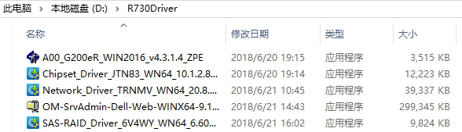
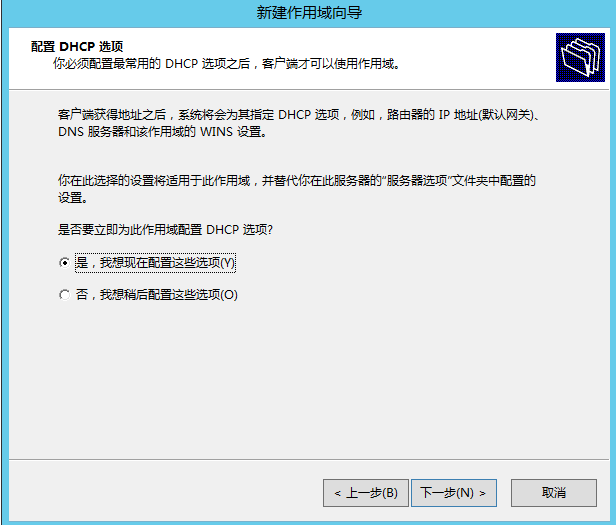
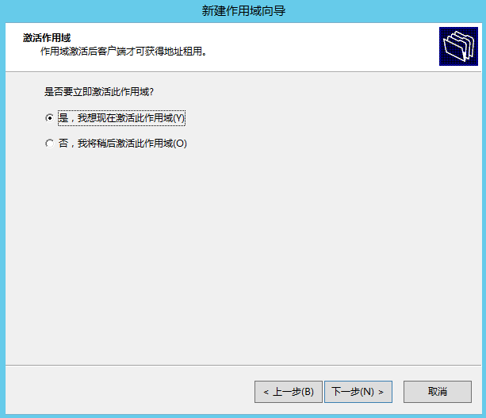
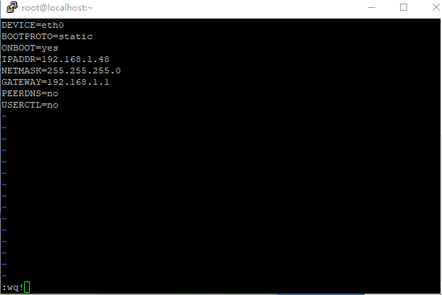

### 1. 概述
本文以部署30用户云办公为范例，描述了朵拉云科技云办公的安装过程。本文档适用于使用朵拉云DoraCloud桌面虚拟化系统部署云办公、电子阅览室、电子会议室等应用场景。

#### 1.1 云办公构成
一个30用户云办公的组网如下图：

云办公硬件包括：

1. 30台个人办公机（云终端，显示器，键鼠）

2. 一台服务器

3. 一台交换机

4. 一台路由器

云办公的软件系统包括：

1. 朵拉云DoraCloud桌面虚拟化系统。部署在服务器上。 

2. DoraClient/DoraOS。部署在个人办公终端上。

一个典型的30用户的云办公的配置清单如下：

|序号|产品名称|规格|数量|单位
| --- | --- | --- | --- | --- |
|1|服务器 (Dell R750xd)|CPU：银牌4310 2.1G 12C/24T*2 内存：256GB(32GB DDR4 * 8) SSD：2960GB * 2 [Intel S4510/S4500] 硬盘：4TB 7.2K * 6 系统盘：240G SSD * 2 [Intel S4500/S3520] 网卡：GE*4 电源：双电源	|1	|台
|2|	桌面云软件|	朵拉云 DoraClient标准版/DoraOS：支持公用桌面、专用桌面；|	30	|用户授权|
|3|	瘦终端|	朵拉云 云终端 JC10, ARM 4核2.0Ghz/1G/4G;1000M RJ45;3.5mm音频input/output;5*USB2.0;三年质保;多协议  配套显示器、键盘、鼠标。	|30	|台|
|4|	交换机	|48口千兆交换机	|1|	台|
|5|	路由器	|路由器，待机量在50-100用户|	1|	台|

#### 1.2 云办公配置规划
在开始云办公配置前，需要先做好配置的规划。云办公配置规划包括：网络规划、模板规划、其他规划。  
网络规划定义了云办公的组网，主要参考用户单位的网络管理员的意见。  
模板规划定义了云桌面使用的操作系统版本和应用软件清单，由云办公的用户需求决定。  
其他规划定义了桌面池、用户、终端的编号和配置策略，方便云办公的管理员进行日常管理。

**【网络规划】**  
1. 一个单位的云终端、虚拟桌面必须在同一个局域网，并位于同一个VLAN内。
2. 网络内的IP地址推荐采用DHCP动态分配。建议的DHCP IP地址池设置为办公数目的3倍。DHCP的周期，建议配置为30-60分钟。并且DHCP Server支持原IP地址续约。以免IP变化引起连接中断的问题。比如：30用户云办公，终端需要30个地址，桌面虚拟机需要30个地址，再预留30个地址，作为备用。这样在重建桌面时有足够的空闲IP。  
3. 预留2个静态IP地址，分别留给物理服务器的Windows Server和 DoraCloud管理系统。静态IP不应该出现在DHCP的IP地址池中。  
4. 在开始 DoraCloud 软件安装前，请务必确认网络已经配置好，并且开启了DHCP服务。  
请就上述网络规划问题与云办公的管理员以及网络管理员沟通，并填写《云办公规划表》的相应内容，参见下图红框内的内容。  

**【模板规划】**

模板规划是确定桌面模板的Windows操作系统版本，以及应用软件的清单。一个云办公可以有多个桌面模板。  
本文档作为范例的模板为Windows 10LTSC2021R2 64位操作系统，安装的应用软件有：根据办公需要。  

**【其他规划】**

DoraCloud桌面云系统中还有其他一些配置，包括桌面池、用户、缺省账号等。这些规划可以使用缺省配置，或者根据管理员的要求调整。下表是本文使用的云办公规划表。  

#### 1.3 云办公部署前准备工作
在云办公部署过程中，需要准备一台笔记本电脑，最好有互联网连接，以便于朵拉云科技工程师进行远程协助的部署。  
在您开始云办公的软件部署前，需要检查【硬件准备】、【软件准备】、【网络准备】已经准备就绪。  
##### 1.3.1 【硬件准备】
1. 完成服务器的硬件安装。服务器与办公机（云终端、显示器）能够分别开关机。避免下班时关办公机，服务器也被断电的情况出现。  
2. 完成云终端的硬件安装。含显示器、键盘、鼠标的硬件安装。  
3. 一台笔记本电脑用于调试，一个空闲的U盘，容量在8G以上。  
4. 确认服务器的硬件配置足够满足30用户的云办公需求。  
30用户按照人均4G内存规划，典型硬件配置为： 
 
**内存： 128GB**  
**SSD ： 480G Intel S45xx/S35xx 企业级固态盘**  
**HDD ： 2TB SATA或者SAS**  

##### 1.3.2 【软件准备】
1. 服务器虚拟化  
推荐使用 Windows Server 2012R2 或者 Windows Server 2016标准版 或者 Windows Server 2019标准版 
[下载mini迅雷][minixunlei]  
使用迅雷下载Windows Server 2012R2  
`ed2k://|file|cn_windows_server_2012_r2_x64_dvd_2707961.iso|4413020160|010CD94AD1F2951567646C99580DD595|/> `
[下载Ventoy][win7usbtool]  
[Windows预安装脚本Pre-Setup][presetup]  

2. 驱动程序  
Windows Server必须安装硬件原厂的主板驱动程序和网卡驱动程序。  
Dell R730 驱动
http://www1.deskpool.com:9000/software/R730Driver.zip  
如果是Dell R730服务器，我们建议您更新RAID卡的固件，并安装最新的RAID卡驱动程序。如果RAID卡固件与驱动程序版本不匹配，会出现磁盘IO错误的告警。在Dell R730服务的iDrac系统中，检查相关告警提示。  
兼容服务器驱动（E5-2600V3/V4系列，Intel网卡 I350 或者 I250网卡）  
http://www1.deskpool.com:9000/software/IntelDriver.zip  
也可以去Intel 官网下载服务器主板驱动  
https://downloadcenter.intel.com/download/28531  
Intel的网卡驱动链接如下：  
https://downloadcenter.intel.com/download/23073/Intel-Network-Adapter-Driver-for-Windows-Server-2012-R2-?product=36773  

3. 桌面虚拟化  
[DoraCloud V3.4下载][deskpoolv32addr1]

4. 云终端管理  
[ThinClientManager下载][thinclientmgr]	

5. 备份档  
DeskCloud备份档，包含桌面模板和配置数据，用于快速部署  
[用于解压的7z压缩软件][7z]  
下载后，使用 7z 工具解压。  
更多模板，请联系项目对应的技术支持工程师，获得DeskCloud备份档，以节省安装部署的时间

6. 应用软件  
具体请咨询用户的云办公管理员  
请云办公的管理员提供所需应用软件的安装程序  

[minixunlei]: http://www1.deskpool.com:9000/software/ThunderMini_dl1.5.3.288.exe
[winsrv2012r2]: ed2k://|file|cn_windows_server_2012_r2_x64_dvd_2707961.iso|4413020160|010CD94AD1F2951567646C99580DD595|/
[win7usbtool]: https://gitee.com/longpanda/Ventoy/releases/download/v1.0.84/ventoy-1.0.84-windows.zip
[presetup]: http://www1.deskpool.com:9000/software/Pre-Setup.ps1
[deskpoolv32addr1]: http://www1.deskpool.com:9000/software/DoraCloud_Hyper-V_2012R2_V3_4_0.msi
[thinclientmgr]: http://www1.deskpool.com:9000/software/TCManager_2.5.6.exe
[backup008part1]: http://www1.deskpool.com:9000/software/backup008.7z.001
[backup008part2]: http://www1.deskpool.com:9000/software/backup008.7z.002
[7z]: http://www1.deskpool.com:9000/software/7z1900-x64.exe

##### 1.3.3 【网络准备】
1. 将服务器、所有的云终端与交换机连接。  
2. 如果配置有路由器，将路由器的LAN口与交换机连接，并按照规划表的要求，设置路由器的LAN网络地址为：192.168.5.1；LAN网络内启用DHCP服务，IP地址范围为192.168.5.20-192.168.5.250，DHCP分配的网关为 192.168.5.1，分配的DNS为192.168.5.1。 路由器的WAN口，根据云办公的联网要求进行配置，比如设置为PPoE拨号到运营商的网络，或者DHCP Client模式直接接入Internet网。 参见下图左侧。  

如果用户单位的网络可以在路由器或者三层交换机为云办公划出一个VLAN和子网，则直接把云办公配置的交换机与上行的端口连接。根据本文的规划，需要用户单位的管理员在上级网络设备上划出一个VLAN，并配置网关为192.168.5.1。 DHCP可以由上级交换机（路由器）提供。参见上图右侧。  
如果单位的网络可以提供VLAN和子网，但是不愿意为云办公启用DHCP，我们可以在服务器上启用DHCP服务。具体参见2.7节。还有一些云办公要求使用静态IP分配方式，具体参见TBD2。
3. 将笔记本有线网口与交换机连接，有线网卡配置成DHCP。如果云办公的网络不能连接互联网，建议将笔记本通过手机热点连接互联网，以便于远程协助进行云办公的调测。如下图  

4. 我们在笔记本上检查一下，是否获取到地址段为192.168.5.x动态IP地址。然后ping一下网关地址 192.168.5.1。如果云办公的网络可以连接互联网，ping一下 baidu.com，确认互联网连接正常。 如果云办公的网络不能连接互联网，请开启手机热点，笔记本通过手机热点联网，以便于远程协助进行云办公的部署。  
★注意1：开始部署前，请确保已经按照云办公的网络规划，预留了网段和IP资源，并开启DHCP服务。  
★注意2：为了提高远程支持的效率，请务必准备好互联网连接，以便于朵拉云工程师远程协助部署。

##### 1.3.4 开始云办公的安装之旅  
如果您已经确认按照上述要求完成了【硬件准备】、【软件准备】、【网络准备】，您可以开始下一步的安装过程。  
朵拉云云办公的安装过程包括以下几个环节，各环节的大致耗时如下表。

| ID  | 内容    |  耗时   |  章节   |  备注   |
| --- | --- | --- | --- | --- |
| 1 |	Windows Server 2012R2系统的安装|	10分钟	|第2章|	
| 2 |	安装DoraCloud桌面虚拟化系统|	5分钟	|第3章|	
| 3 |	恢复备份档案	|10分钟	|第4章|	
| 4 |	编辑模板	|不确定	|第5章	|在模板中安装应用软件是管理员例行维护工作之一。 我们建议现场部署人员与云办公管理员一起安装应用软件。|
| 5 |	配置桌面池|	20分钟	|第6章	|正常情况下，10分钟可以创建30-60个桌面。|
| 6 |	增加用户和终端自动配置	|3分钟	|第7章	|
| 7 |	系统测试|	30分钟	|	|    |
| 8 |	用户培训|	120分钟	|	| |
<<<<<<< HEAD
=======

### 2. Windows Server 2012R2系统安装
安装Windows Server前，需要对服务器完成如下配置：  
1. 在服务器的RAID卡中，把SSD硬盘设置成直通模式。HDD硬盘也建议配置成直通。如果有两块HDD，则配置成RAID1模式。  
2. RAID卡中，把HDD硬盘设置为启动盘。如果不确定第一启动盘是HDD还是SSD，可以把SSD拔出后安装Windows。安装完毕再插入SSD硬盘。避免出现引导区在SSD盘，但是Windows系统安装在了HDD的情况。  
3. 建议把服务器的BIOS中设置为最大性能模式（CPU Power Management ：Maximum Performance）  
4. 建议更新服务器的BIOS和硬件的固件为最新版本。  
5. 建议配置服务器的远程管理。比如Dell服务器为iDrac系统。HP服务器为iLO系统。便于后续进行服务器远程维护。具体的配置，请参考服务器相关资料。

Windows Server 2012R2的安装要求如下：  
1. HDD盘作为启动盘，划分200GB空间，安装系统(C盘)，剩余空间划分为E盘。SSD划分为D盘。  
2. 必须安装服务器厂家提供的主板驱动、网卡驱动。推荐安装RAID卡驱动。  
3. 安装Hyper-V角色，创建外部虚拟交换机连接当前网卡，并把虚拟交换机命名为 vswitch。  
4. 安装Windows Server 2012R的更新，并把更新配置为：“自动下载，但是让我选择是否安装更新”  
5. 配置Windows Server的静态IP地址。  
6. 关闭“IE增强的安全配置”，以便IE浏览器能够正常访问 DoraCloud。或者您可以选择安装 Chrome浏览器，或者Firefox浏览器，用于对DoraCloud系统的管理。

最后强调一下，请勿使用激活工具或者破解工具对Windows Server进行破解或者激活。这类工具多带有病毒或者木马，会影响Windows Server运行的稳定性。我们推荐您购买正版Windows Server授权，或者使用免费的Hyper-V Server 2012R2、Hyper-V Server 2016作为服务器虚拟化系统。Hyper-V Server的安装，可以参考朵拉云官网技术支持板块的相关内容。  
如果您的项目购买了【朵拉云科技云办公的远程部署服务】，您可以在完成本章节内容后，请求朵拉云科技的工程师进行远程安装部署工作。远程部署时间约为1-2小时。

下面描述实现上述要求的详细的安装过程。

#### 2.1 制作U盘启动盘
首先下载Ventoy。
运行Ventoy。

生成启动盘后，将下载好Windows Server2019.iso文件拷贝U盘根目录下，U盘启动盘制作成功。
制作完成后拔出U盘，用于服务器的安装。  
除了使用本文推荐的工具，还可以使用UltraISO制作U盘，以及Rufus工具制作U盘。  
UltraISO 的下载位置  https://cn.ultraiso.net/  
Rufus下载位置： http://rufus.ie/  
需要说明一下，UltraISO制作Windows Server 2016启动U盘会出错。原因是有个文件超出了4G，无法保存在FAT32文件系统中。  
另外，不要使用其他一些U盘制作工具制作U盘启动。有些工具制作的U盘启动会篡改IE启动选项，植入广告或者木马，存在技术风险。

#### 2.2 安装windows Server2012 R2
1. 插入U盘，启动服务器。  
2. 按“启动选择”热键（F7，不同服务器可能有所不同，大致在F7，F9，F11，F12这几个功能键）选择U盘启动，如图所示。

3. 选择安装语言，时间和键盘输入法。如图所示。  
 
4. 选择带GUI的标准版的Windows Server 2012 R2，如图所示。  

5. 接受协议，如图所示。  

6. 选择自定义安装，如图所示。  

7. 新建200GB分区，选择主分区。如图所示。  

8. 开始安装，大约3~5分钟，安装过程会自动重启，如图所示。  
 
9. 设置管理员账户密码（请根据云办公规划表中的账号信息填写），如图所示。  
 

#### 2.3 设置Windows 磁盘分区  
1. 进入磁盘管理。如图所示。如果“系统保留”出现在了SSD盘，则属于安装错误。

|  |  |
| --- | --- |

2. 把HDD硬盘剩余的空间分区为 E盘。  
 
3. 把SSD硬盘配置为D盘。  
 

#### 2.4 执行Windows Server预设置脚本
我们提供了Pre-Setup.PS脚本，完成如下工作：  
1. 安装 Windows Server的Hyper-V角色，安装后服务器会自动重启。  
2. Windows Server上启用远程桌面服务（RDP服务），并开启RDP（3389端口）的防火墙  
3. 远程桌面服务启用网络级安全认证（NLA）  
4. 在桌面创建 Hyper-V Manager 的快捷方式  
5. 配置Windows更新为自动下载，手工启用  
6. 禁用浏览器的增强安全特性  
由于安装Hyper-V角色后，服务器会自动重启，脚本的执行会中断。重启后需要再次运行该脚本。  
为了便于您了解上述修改的作用，我们给出手工修改上述配置的界面，供核对和检查。  
Hyper-V角色  
 
远程桌面服务  
 
Hyper-V 管理器快捷方式  
 
Windows更新的配置，建议安装一下Windows的补丁。  
 
关闭管理员的IE增强安全特性  
 

#### 2.5 修改服务器IP地址
在服务器右下角右键点击网卡，选择“打开网络和共享中心”，选择网卡属性，Internet协议版本4，在TCP/IPv4属性对话框中设置服务器的静态IP。  
 

设置完毕后，可以ping 一下网关 192.168.5.1，以及互联网是否可以访问（比如ping baidu.com）  
#### 2.6 安装服务器硬件驱动（网卡、主板、Raid卡）
##### 2.6.1 Dell R730驱动安装
下载R730Driver.zip驱动包，解压，可以看到如下文件  
 
分别是显卡驱动、主板驱动、网卡驱动、iDrac本地管理程序、Raid卡驱动程序。驱动的安装过程不详细介绍了。  
在此提示一下，Dell R730的Raid卡（H330、H730）的固件和驱动存在匹配关系。如果版本不匹配会导致存储工作不稳定。可以通过iDrac管理系统查看到这些告警信息。  

#####  2.6.2 其他服务器驱动安装
如果服务器厂家提供了驱动程序，请安装厂家提供主板驱动、网卡驱动。
如果找不到厂家的驱动，可以下载 IntelDriver.zip，解压。分别安装网卡驱动、主板驱动。其中的网卡驱动适用于 Intel I350,I250网卡。
驱动的安装过程不再详细介绍。

2.7 【可选】在Windows Server上开启DHCP服务
如果云办公的网络设备无法提供DHCP，可以在Windows Server上添加 DHCP服务角色。通过Windows Server启用DHCP服务。
1、在Windows Server中，依次选择“服务器管理”、“添加角色和功能”、勾选“DHCP服务器”、“添加功能”，完成“DHCP服务器” 角色的安装。

|   |   |
| --- | --- |

2、在服务器管理器中，点击DHCP，右键点击服务器名称，在菜单中选择“DHCP管理器”。  

|   |   |
| --- | --- |

3、在DHCP管理器中，添加作用域，并设置 DHCP的地址池范围，以及网关和DNS。  

|  |  |
| --- | --- |
|  |  |
|  |  |
|  |  |
|  |  |

4、配置完成后，可以看到作用域的情况如下：  
  

可以使用调测的笔记本电脑连接到交换机，看能否正常获得IP地址。 如果能够正常获得192.168.5.x的IP地址，表明DHCP成功配置。 

### 3. 安装DoraCloud
DoraCloud for Hyper-V提供基于图形界面、向导化的安装程序。  
DoraCloud安装的要点为：  
1. 安装DoraCloud时，需要为桌面配置选择存储池、网络池。存储池包括三个存储路径。  
2. 安装DoraCloud后，可以通过驱动检查工具ServerChecker，检查Windows Server的硬件驱动安装是否合规。  
3. 如果您的服务器没有开启 CPU对硬件虚拟化的支持，安装可能会出错。请进入服务器的BIOS，开启CPU对于硬件虚拟化的支持。  
4. DoraCloud管理系统运行在一个VM中，该VM的网络设置为DHCP模式。如果网络中没有DHCP，也会导致DoraCloud管理系统的VM无法得到IP地址，从而导致安装失败。  
#### 3.1 安装DoraCloud 3.4
1. 执行 DoraCloud_Hyper-V_2012R2_V3_4_0.msi，选择安装目录。如图（3-1）所示。
   

2. 选择存储池和虚拟网络。DoraCloud系统中，虚拟机、模板、数据盘可以分别放在不同的存储池中。安装程序会创建三个存储池，用于存放 虚拟机、模板和数据盘。具体的用途，会在DoraCloud的初始化配置阶段指定。如图（3-2）所示。  
如果没有创建虚拟交换机，选择 连接了网线的网卡创建虚拟交换机，命名为 vswitch。  
  
然后选择存储池，网络池。  

3. 完成安装。  
安装程序执行完毕后，如果安装成功，会出现如下两个窗口。一个窗口是 DoraCloud 管理虚拟机的控制台。内有DoraCloud 管理系统的IP。另外一个窗口是浏览器访问 DoraCloud 的窗口。如图（3-3）所示。  
 
由于DoraCloud初始化需要一定时间，可以稍后关闭浏览器，重新输入地址 http://192.168.5.9，访问DoraCloud管理系统。 缺省的账号为： 用户 admin ，密码 DoraCloud  

为了便于后续访问快捷的访问，可以在桌面建立一个快捷方式，内容如下，命名为 DoraCloud 管理。后续可以直接点击链接，进入 DoraCloud 管理系统
https://192.168.5.9/?username=admin&password=DoraCloud  

#### 3.2 检查驱动的合规性  
DoraCloud安装程序带有一个 ServerChecker程序，可以检查Windows Server是否安装了远程驱动。如果服务器不安装原厂的主板驱动和网卡驱动，性能会很差。  
可以在应用界面，找到“serverchecker”，点击。如图（3-7）所示。  
 
也可以直接按 Windows热键+R，在“运行”窗口中，输入 serverchecker，启动该程序。  

进入“Hyper-V服务器检查工具”，点击“检查”。  
如果全部显示为白色，说明驱动都安装成功。如图（3-9）所示。

如果有黄色的项目，请确认一下这些黄色的项目是不是网卡和主板的硬件。如果不是，也没有关系。只需要保证主板驱动、网卡驱动使用硬件原厂驱动即可。

### 4. 使用备份文档快速安装
DoraCloud 桌面虚拟化系统提供了基于向导的系统初始化和配置过程，配置DoraCloud系统的过程也相当简单，但是虚拟桌面的Windows模板的制作过程还是相对繁琐和耗时。为了提高云办公系统的部署效率，我们还是推荐采用使用备份档案恢复DoraCloud桌面云系统的方式来部署云办公系统。  
备份档案是DoraCloud备份工具（vdibackup）产生一个备份文件夹。包括了DoraCloud桌面虚拟化环境的配置数据，以及桌面模板文件。DoraCloud备份工具可以对桌面云环境进行备份、恢复。本章节是利用备份工具来快快速部署一个新的云办公环境。  
目前朵拉云科技提供包含Windows 7 32位模板的备份档案，以及包含Windows 7 64位模板的备份档案。您可以使用我们提供的备份档案进行本章节的安装过程。如果你之前搭建过其他云办公，您也可以使用之前云办公的备份档案来安装当前的云办公。如果需要其他的操作系统的桌面模板，还是需要现场制作。模板的制作方法参见朵拉云科技官网技术支持板块有关模板制作的内容。  

本章主要完成两个工作：  
1、使用备份恢复工具，恢复备份档，快速搭建一个云办公环境。  
2、登陆DoraCloud的Web管理系统，设置DoraCloud管理系统的IP为静态IP。
#### 4.1 启动恢复数据软件
#### 4.2 数据库恢复
#### 4.3 修改DoraCloud的IP地址
DoraCloud 管理系统是一个基于CentOS 6的Linux 虚拟机。我们可以通过DoraCloud的Web管理系统修改DoraCloud的IP地址。在DoraCloud管理系统中，依次选择“服务器”“属性”“DoraCloud网络”“静态IP配置”即可对DoraCloud管理系统的IP进行修改。修改IP后，以新的IP地址登陆DoraCloud系统。

管理系统修改的IP地址仅限于当前网段的地址。如果需要更换其他网段，或者需要配置网关、DNS，则需要进入Linux系统。通过相关的命令进行修改。具体请了解 CentOS 6修改IP地址的相关知识。  
下图描述了修改 DoraCloud IP的方法。 使用 putty 登陆 DoraCloud VM，使用 vi编辑  /etc/sysconfig/network-scripts/ifcfg-eth0 文件。  

修改BOOTPROTO，IPADDR，NETMASK，GATEWAY参数。然后保存。 
 

然后输入 :wq! 退出后，重启这个Linux 虚拟机，以新的IP地址登陆 DoraCloud 即可。  
有关Linux vi 编辑命令的使用，请查询有关资料。    

### 5. 配制桌面模板
前一章节的通过恢复备份档案部署了一个DoraCloud桌面云环境。备份档案中包括了一个win7x86base（或者win7x64base）的模板。本章通过拷贝win7x86base（或者win7x64base）模板到新的模板，然后在新的模板中安装日常办公所需软件，最后保存新产生的模板。  
在模板中安装应用软件是云办公管理员的日常工作之一，不属于朵拉云科技云办公项目部署服务的内容。本章节主要目的是示范桌面模板的制作和编辑方法。在云办公的部署过程中，现场工程师负责提供一个包含Windows操作系统以及云办公软件基础模板。然后培训和指导云办公管理员安装办公所需的应用软件。  
一般情况下，我们不建议现场工程师独自帮客户安装应用软件。一方面现场工程师未必熟悉客户的应用软件的配置，另一方面云办公管理员在不参与模板制作过程，后续很难对桌面云系统的模板进行日常维护。  
DoraCloud的模板支持“创建模板”、“编辑模板”“复制模板”操作。建议基于基础模板Win7x64base复制一个新模板出来作为云办公的模板。编辑模板并安装应用软件是一个比较繁琐的过程，如果模板制作出错，可以重新从基础模板复制一个新模板出来制作，不会破坏基础模板。  
模板的制作也建议按照循序渐进的原则，分多个版本制作模板。比如先制作win7x64v1包含软件A、B，win7x64v2包含软件A、B、C、D。这样如果某个软件的配置有问题，可以回退到上一个模板版本，而不必全部重新安装。另外杀毒软件、安全软件、防火墙等软件特别容易和桌面云平台产生冲突，建议单独做一个模板版本，安装验证这些软件。  
#### 5.1 复制模板
登陆DoraCloud桌面云管理系统，在模板菜单下，选择Win7x64base模板的复制操作。复制的新模板命名为 Win7x64stu，如图所示。

   
在经过几分钟的模板复制操作后，模板的一个实例虚拟机被启动。  
   
启动完成后，系统开启了一个模板编辑向导。  
   
根据向导的提示，使用Windows远程桌面客户端软件 mstsc 登陆模板虚拟机，输入账户密码，即可登陆。  
我们提供的模板虚拟机的账户是 用户名 administrator  密码 123456。 
  
#### 5.2 在模板中安装应用软件
#### 5.3 保存模板  
1. 安装完成应用软件后，返回DoraCloud模板编辑界面，点击“确认”，全部选择“是”，点击下一步。  
如图所示。 
    
2. 进入准备模板，选择“专用和公用模板”，点击“准备模板”按钮。如图所示。 
    
3. 保存模板，完成模板配置。如图所示。  
    

### 6. 配制桌面池
云办公的桌面虚拟机是通过配置桌面池自动创建的。桌面池定义了创建桌面所需要的模板，虚拟机规格，桌面创建策略等信息。在云办公中，桌面池类型配置为专用桌面。  
配置桌面池时，需要考虑服务器总的资源。云办公的资源配置为每个用户 2GB-4GB内存，处理器资源按照人均0.8 ~ 1.0个线程配置。云办公的总内存需求大致为： 8GB + 每桌面内存 * 用户数。  
#### 6.1 创建桌面池
1. 进入桌面池，点击“属性”。如图（6-1）所示。  
  

#### 6.2 填写桌面池信息                            
1. 填写基本信息。【桌面池名称：云办公】、【模板：win7x64stu】、【选择网络：vswitch】、【前缀：VM】、【后缀：01】、【内存：2048MB】、【虚拟机CPU数：1】。如图（6-2）所示。
  

2. 配置策略，填写信息。【最大虚拟机数：30】、【预创建虚拟机：30】、【用户名：administrator】、【密码：123456】。选择专用桌面池。本步骤的自动绑定账号的用户名、密码，必须与模板中的Windows账号相同。否则桌面用户登陆会出现认证错误，导致无法登陆。如图（6-3）所示。  
  

3. 配置存储，勾选“启用用户数据盘”。填写信息，【数据盘名：Data】、【容量：20GB】。点击“确定”完成。如图（6-4）所示。  
  

在桌面池配置后，DoraCloud桌面虚拟化系统会自动创建桌面虚拟机。你可以在DoraCloud管理系统的“桌面计算机”菜单中，查看“桌面计算机列表”，了解桌面计算机的创建情况。通常10分钟左右可以创建完成60个虚拟机。  

### 7. 创建桌面用户，启用终端自动配置  
在配置DoraCloud桌面虚拟化系统的用户账户前，需要先明确几个概念：  
**【只能从桌面池分配桌面】**
1. DoraCloud的用户是从桌面池自动分配桌面的。不需要也不能手动为每个用户分配桌面计算机。  
2. 用户在连接桌面池时，会自动从桌面池中分配可用的桌面计算机。  
**方法1**：用户具有桌面池权限，用户登录时，从桌面池中分配桌面。  
**方法2**：用户属于某个群组，群组具有桌面池权限，用户登录时，从桌面池中分配桌面。  
云办公中，我们采用方法2，把用户配置到一个群组中，为群组指定桌面池即可。  
由于桌面计算机是用户登陆时分配的，如何保证用户编号和桌面计算机编号的对应呢？比如用户off01分配桌面vm01，off02分配vm02。  
DoraCloud的桌面池中有一个选项“强制后缀匹配”。该选项会确保在为用户分配桌面时，桌面计算机的后缀数字编号与用户名的数字编号后缀匹配。
  

**【终端的两种认证方式】**  
用户账号认证：终端在新建DoraCloud连接的时候，保存用户账号。终端凭借用户账号进行用户认证。  
终端标识认证：终端在新建DoraCloud连接的时候，把用户名设置为 @ ，表示使用终端标识认证。终端第一次连接时，DoraCloud系统为自动为终端分配一个用户账号。我们称之为绑定账号。后续连接时，该终端会自动关联到该用户账号。  

| 终端侧的配置 | DoraCloud桌面云系统侧配置 |
| ------------ | ------------------------ |
|    |  |

如果DoraCloud上有多个群组，可以在用户名中输入 @群组名，表示绑定该群组的用户。比如上图的终端配置可以修改为 @group1  

**【云办公按照座位顺序编号】**  
为了维护和管理的方便，管理员一般会希望按照云办公的用户和桌面编号与座位号对应。  
如果终端采用用户账号认证，那么只需要根据终端的座位编号设置用户账号即可。座位01的终端配置用户名为off01，座位02的终端配置用户名为off02，依次类推。我们可以手工配置每个终端的账号，实现云办公的顺序编号。  
如果终端采用终端标识认证，那么可以批量设置所有终端的连接的用户名为@，然后根据座位顺序依次把每个终端开机。这样终端会按照开机顺序依次绑定用户账号 off01，off02，off03，依次类推，顺序编号。  
在云办公的场景下，为了简化对终端的管理，DoraCloud系统集成了对云终端的批量自动化配置功能。可以根据策略对云终端进行自动配置，与终端ID认证机制相结合，可以实现云终端的即插即用。避免了对终端配置账号的繁琐操作。

#### 7.1 增加用户群组
还原的备份环境中，已经添加了群组 Group1，群组配置如下。一个群组代表一个部门。你可以参考下图，增加自己的云办公配置。  

认证方式：支持三种模式。用户名+密码、ID、ID+用户名+密码。其中的选择ID认证时，可以使用ID或者用户账号登陆。选择ID+用户名+密码时，系统会同时对ID和账号认证。该模式可以限定用户只能从特定的终端登录，提供更高的安全性。
云办公中，推荐采用ID认证，简化云终端的配置和管理。并勾选“自动绑定终端标识”、“禁止用户修改密码”。  

#### 7.2 增加云办公的用户
还原的配置中，已经包括了60个用户账号。你也可以选择删除这些用户账号，批量新增用户账号。

在用户管理界面中，点击“批量新增”，填写信息。【用户名：off】、【后缀：01】、【数量：60】、【密码:****】。点击“提交”按钮。如图（7-2）所示。  

添加用户后，我们可以看到用户列表的界面。每个用户有一个终端属性，终端ID认证的机制是通过把终端ID与用户账号绑定实现的。我们可以手工编辑用户账号，把终端与用户绑定。前面的群组配置中，启用了自动绑定终端标识，可以实现终端登录的时候，自动绑定到用户账号。 在此复述一下终端启用自动绑定的要求：终端的DoraCloud连接中，用户名填写@表示绑定到任何一个账号。填写@group1表示绑定到群组group1中用户账户。如果一个DoraCloud系统支持多个部门办公，每个办公的云终端可以绑定到不同群组的用户。  
  

#### 7.3 终端自动配置
在用户管理菜单下，有一个终端管理的功能，可以实现对终端的自动配置。还原的备份环境已经包含了对本网段终端的自动配置。  
 
编辑该策略，可以看到如下对话框，基本上是用缺省值，即可满足对云办公终端的自动配置需求。  

自动配置策略启用后，搜索范围内的云终端将会被自动配置。自动连接DoraCloud系统。  
如果您的云办公内已经安装好了云终端，并且云终端已经上电联网，网络中有DHCP服务，您会观察到这些终端会在重启一次后，自动进入桌面云系统。  
>>>>>>> 0d5b07a3371b4207e77d64f8ba888b2fd33c3f3b
