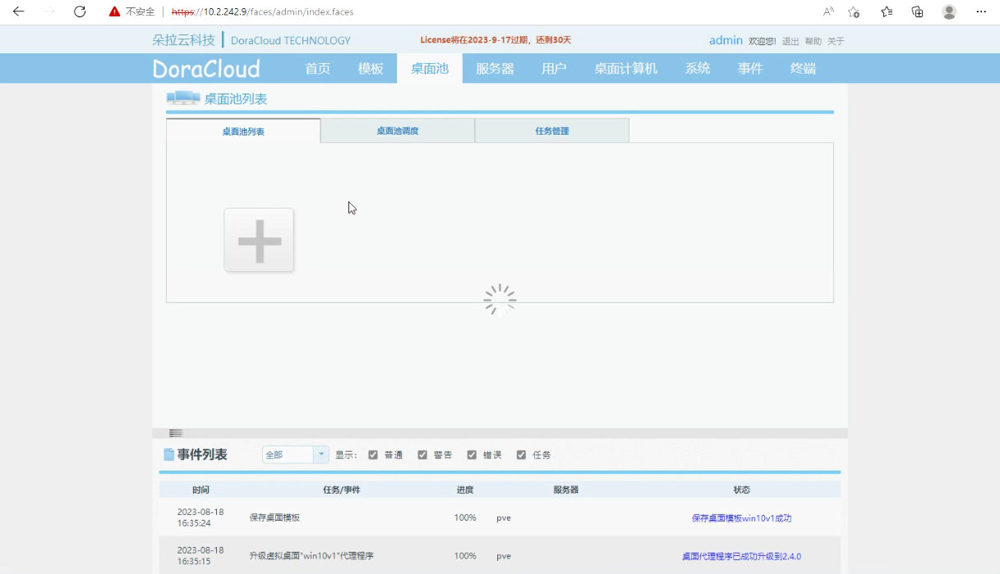

### 1. 概述
本文以部署50用户云教室为范例，描述了朵拉云科技云教室的安装过程。本文档适用于使用朵拉云DoraCloud桌面虚拟化系统部署云教室、电子阅览室、电子会议室等应用场景。

#### 1.1 云教室构成
一个50用户云教室的组网如下图：


云教室硬件包括：

1. 50台学生机（云终端，显示器，键鼠）

2. 1台教师PC机

3. 一台服务器

4. 一台交换机

5. 一台路由器

云教室的软件系统包括：

1. 朵拉云DoraCloud桌面虚拟化系统。部署在服务器上。 

2. 多媒体教学软件。部署在教师PC上。

一个典型的50用户的云教室的配置清单如下：

|序号|产品名称|规格|数量|单位
| --- | --- | --- | --- | --- |
|1|	服务器|	Intel Xeon Gold 6148 2.4Ghz 20C/40T * 2<br>内存：156GB(DDR4-2666 32G * 8)<br>SSD：1.92TB 企业级SSD * 1<br>硬盘：2TB 7.2K * 1<br>网卡：板载 2个1GbE LAN with Intel X722<br>电源：双电源	|1	|台
|2|	桌面云软件|	朵拉云 DoraCLoud标准版：支持公用桌面、专用桌面；|	50	|用户授权|
|3|	瘦终端|	朵拉云 云终端 DC20, ARM A55 四核2.0Ghz主频；内存1G DDR3；硬盘8G；VGA+HDMI（最大1920*1080）；1000M RJ45；3.5mm音频输入输出；4个USB2.0+2个USB3.0;三年质保;多协议<br> 配套显示器、键盘、鼠标。	|50	|台|
|4|	教学软件|	多媒体电子教学软件，支持屏幕广播，学生演示，文件收发，分组教学，作业提交|1|	套|
|5|	教师机	|I3、4GB内存、500G硬盘、21.5寸显示器	|1|	台|
|6|	交换机	|48口千兆交换机	|1|	台|
|7|	路由器	|路由器，待机量在50-100用户|	1|	台|

#### 1.2 云教室配置规划
在开始云教室配置前，需要先做好配置的规划。云教室配置规划包括：网络规划、模板规划、其他规划。  
网络规划定义了云教室的组网，主要参考用户单位的网络管理员的意见。  
模板规划定义了云桌面使用的操作系统版本和应用软件清单，由云教室的用户需求决定。  
其他规划定义了桌面池、用户、终端的编号和配置策略，方便云教室的管理员进行日常管理。  

**【网络规划】**  
1. 一个教室的云终端、虚拟桌面、教师机必须在同一个局域网，并位于同一个VLAN内。以便进行教学广播。  
2. 网络内的IP地址推荐采用DHCP动态分配。建议的DHCP IP地址池设置为学生数目的3倍。DHCP的周期，建议配置为30-60分钟。并且DHCP Server支持原IP地址续约。以免IP变化引起连接中断的问题。比如：50用户云教室，终端需要50个地址，桌面虚拟机需要50个地址，再预留50个地址，作为备用。这样在重建桌面时有足够的空闲IP。  
3. 预留2个静态IP地址，分别留给物理服务器的 Proxmox 和 DoraCloud 管理系统。静态IP不应该出现在DHCP的IP地址池中。  
4. 在开始 DoraCloud 软件安装前，请务必确认网络已经配置好，并且开启了DHCP服务。  
请就上述网络规划问题与云教室的管理员以及网络管理员沟通，并填写《云教室规划表》的相应内容，参见下图的内容。  


**【模板规划】**

模板规划是确定桌面模板的Windows操作系统版本，以及应用软件的清单。一个云教室可以有多个桌面模板。  
本文档作为范例的模板为Windows 10 64位操作系统，安装的应用软件有：Office、QQ、极域学生端。  


**【其他规划】**

DoraCloud桌面云系统中还有其他一些配置，包括桌面池、用户、缺省账号等。这些规划可以使用缺省配置，或者根据管理员的要求调整。

#### 1.3 云教室部署前准备工作
在云教室部署过程中，需要准备一台笔记本电脑，最好有互联网连接，以便于朵拉云科技工程师进行远程协助的部署。  
在您开始云教室的软件部署前，需要检查【硬件准备】、【软件准备】、【网络准备】已经准备就绪。  
##### 1.3.1 【硬件准备】
1. 完成服务器的硬件安装。如果服务器放置在教室内，服务器与学生机（云终端、显示器）能够分别开关机。避免下课时关学生机，服务器也被断电的情况出现。  
2. 完成云终端的硬件安装。含显示器、键盘、鼠标的硬件安装。  
3. 完成教师机硬件安装，教师机预装了Windows操作系统。  
4. 一台笔记本电脑用于调试，一个空闲的U盘，容量在8G以上。  
5. 确认服务器的硬件配置足够满足50用户的云教室需求。  
50用户按照人均4G内存规划，典型硬件配置为： 
 
**内存： 256GB**  
**SSD ： 1.92TB 企业级固态盘**  

##### 1.3.2 【软件准备】
1. 服务器虚拟化  
[proxmox 下载](http://mirrors.ustc.edu.cn/proxmox/iso/)

3. 桌面虚拟化  
[DoraCloud V3.4 for proxmox 下载](https://www.doracloud.cn/downloads/2-cn.html)

4. 云终端管理  
[云终端管理软件 TCManager 下载](https://www.doracloud.cn/downloads/11-cn.html)	

5. 教学软件  
[VDClass 云教室管理软件 下载](https://www.doracloud.cn/downloads/12-cn.html)

6. 教学软件  
极域多媒体电子教室软件 请从附带的光盘下载安装程序

7. 桌面模板  
DoraCloud支持在线模板仓库。 
如果项目现场不具备在线下载模板的条件，可以事先下载模板，到现场从本地恢复桌面模板。

[模板的离线恢复方法参见链接](https://docs.doracloud.cn/operation-maintenance/kb0007/)

8. 应用软件  
具体请咨询用户的云教室管理员。
请云教室的管理员提供所需应用软件的安装程序。

##### 1.3.3 【网络准备】
1. 将服务器、教师机、所有的云终端与交换机连接。  
2. 如果配置有路由器，将路由器的LAN口与交换机连接，并按照规划表的要求，设置路由器的LAN网络地址为：10.2.242.254；LAN网络内启用DHCP服务，IP地址范围为10.2.242.11-10.2.242.60，DHCP分配的网关为 10.2.242.254，分配的DN为114.114.114.114。 路由器的WAN口，根据云教室的联网要求进行配置，比如设置为PPoE拨号到运营商的网络，或者DHCP Client模式直接接入校园网。 参见下图左侧。


如果用户单位的网络可以在路由器或者三层交换机为云教室划出一个VLAN和子网，则直接把云教室配置的交换机与上行的端口连接。根据本文的规划，需要用户单位的管理员在上级网络设备上划出一个VLAN，并配置网关为10.2.242.254。 DHCP可以由上级交换机（路由器）提供。参见上图右侧。  
如果单位的网络可以提供VLAN和子网，但是不愿意为云教室启用DHCP，我们可以在服务器上启用DHCP服务。还有一些云教室要求使用静态IP分配方式。
3. 将笔记本有线网口与交换机连接，有线网卡配置成DHCP。如果云教室的网络不能连接互联网，建议将笔记本通过手机热点连接互联网，以便于远程协助进行云教室的调测。如下图


4. 我们在笔记本上检查一下，是否获取到地址段为10.2.242.x动态IP地址。然后ping一下网关地址 10.2.242.254。如果云教室的网络可以连接互联网，ping一下 baidu.com，确认互联网连接正常。 如果云教室的网络不能连接互联网，请开启手机热点，笔记本通过手机热点联网，以便于远程协助进行云教室的部署。  
★注意1：开始部署前，请确保已经按照云教室的网络规划，预留了网段和IP资源，并开启DHCP服务。  
★注意2：为了提高远程支持的效率，请务必准备好互联网连接，以便于朵拉云工程师远程协助部署。  

##### 1.3.4 开始云教室的安装之旅  
如果您已经确认按照上述要求完成了【硬件准备】、【软件准备】、【网络准备】，您可以开始下一步的安装过程。  
朵拉云云教室的安装过程包括以下几个环节，各环节的大致耗时如下表。

| ID  | 内容    |  耗时   |  章节   |  备注   |
| --- | --- | --- | --- | --- |
| 1 |	proxmox系统的安装|	10分钟	|第2章|	
| 2 |	安装DoraCloud桌面虚拟化系统|	5分钟	|第3章|	
| 3 |	DoraCloud的初始化设置	|5分钟	|第4章|	
| 4 |	创建和编辑桌面模板	|不确定	|第5章	|在模板中安装应用软件是管理员例行维护工作之一。<br>我们建议现场部署人员与云教室管理员一起安装应用软件。|
| 5 |	配置桌面池|	20分钟	|第6章	|正常情况下，10分钟可以创建30-60个桌面。|
| 6 |	用户和群组	|3分钟	|第7章	|
| 7 |	教师机和云终端	|5分钟	|第8章|	
| 8 |	云教室验收测试|	30分钟	|第9章	|    |
| 9 |	常见问题处理|	120分钟	|第10章	| |


### 2. Proxmox系统安装

如果您的项目购买了【朵拉云科技云教室的远程部署服务】，您可以在完成本章节内容后，请求朵拉云科技的工程师进行远程安装部署工作。远程部署时间约为1-2小时。

下面描述实现上述要求的详细的安装过程。

#### 2.1通过U盘启动盘安装proxmox
Rufus/Venoty/UltraIOS制作Proxmox7.4.1系统U盘启动盘

[以Rufus为例：链接](/getting-started/proxmox/#%E6%AD%A5%E9%AA%A4%E4%B8%80%E5%AE%89%E8%A3%85proxmox-ve64)

#### 2.2通过ipmi安装proxmox
浏览器远程登录ipmi管理页面，挂载iso，进行安装
impi的登录账户密码询问服务器提供商


#### 2.3修改默认存储方式
将缺省安装的 local-lvm 存储改成 目录机制，提升io性能

1.登录 PVE web界面，在 数据中心->存储中，选择 local-lvm，然后点击删除。


2.通过命令删除 lvm，新建lvm，并创建文件系统。
```
# 一键复制即可
umount /dev/pve/data

lvremove /dev/pve/data -y

vgdisplay pve | grep Free | awk '{print "lvcreate -l " $5 " -n data pve -y"}' |bash

mkfs.ext4 /dev/pve/data
mkdir /mnt/data
mount /dev/pve/data /mnt/data

echo "/dev/pve/data /mnt/data ext4 defaults 0 0" >> /etc/fstab
```

3.在Proxmox 将注册目录为存储
在Proxmox后台，选择 DataCenter->存储->添加， ID填写 data， 目录填写 /mnt/data。 即可添加名为  Data 的存储


### 3. 安装DoraCloud
#### 3.1 在线安装 DoraCloud
```
cd /var/lib/vz/dump; wget -qO- https://dl.doracloud.cn/dpinstall.pl --referer https://doracloud.cn | perl
``` 


安装成功


#### 3.2 离线安装 DoraCloud
proxmox默认开启ssh-server服务 ，直接用scp命令传DoraCloud安装文件即可

1.上传安装包
```
C:\Users\Administrator>scp vzdump-qemu-500-2023_08_01-17_18_58.vma.zst root@10.2.242.8:/var/lib/vz/dump/
```

2.恢复DoraCloud虚拟机


### 4. DoraCloud的初始化设置

1.启动DoraCloud虚拟机,启动完成后查看DoraCloud的IP


2.浏览器输入https://DoraCloudIP

注：DoraCloud管理平台默认采用https安全访问协议，在首次访问DoraCloud URL时，需要根据不同的浏览器提示，设置对该链接的信任。

默认的管理员登录账户为：用户名：admin 密码：DoraCloud


3.等待1分钟，浏览器输入新IP登录


### 5. 创建和编辑桌面模板
本章节主要目的是示范桌面模板的制作和编辑方法。
在云教室的部署过程中，现场工程师负责提供一个包含Windows操作系统以及云教学软件学生端的基础模板。然后培训和指导云教室管理员安装教学所需的应用软件。  

一般情况下，我们不建议现场工程师独自帮客户安装应用软件。一方面现场工程师未必熟悉客户的应用软件的配置，另一方面云教室管理员在不参与模板制作过程，后续很难对桌面云系统的模板进行日常维护。  

DoraCloud的模板支持“创建模板”、“编辑模板”“复制模板”操作。建议基于基础模板Win10x64复制一个新模板出来作为云教室的模板。编辑模板并安装应用软件是一个比较繁琐的过程，如果模板制作出错，可以重新从基础模板复制一个新模板出来制作，不会破坏基础模板。  

模板的制作也建议按照循序渐进的原则，分多个版本制作模板。比如先制作win10x64v1包含软件A、B，win10x64v2包含软件A、B、C、D。这样如果某个软件的配置有问题，可以回退到上一个模板版本，而不必全部重新安装。另外杀毒软件、安全软件、防火墙等软件特别容易和桌面云平台产生冲突，建议单独做一个模板版本，安装验证这些软件。 

#### 5.1 在线下载模板

从远程仓库拉取需要模板


#### 5.2 离线上传模板(TBD)
1.联系朵拉云工程师，获取系统，模板scp命令上传到服务器

```
C:\Users\Administrator\Desktop>scp vzdump-qemu-702-2023_06_06-00_06_37.vma.zst root@192.168.1.145:/var/lib/vz/dump/
```

2.promox 恢复模板


3.管理系统添加本地模板


#### 5.3 编辑模板
1.复制一个新模板进行编辑。


2.添加软件
以添加极域教学软件为例。

1）极域安装要做特殊处理。

因为桌面云安装环境的特殊性，极域软件需要做特殊处理才能安装使用。
现场安装工程师需要联系 DoraCloud 原厂获得极域云桌面专属版本。

2）执行安装脚本。

两次都是以管理员权限操作，第1次执行操作1，执行完系统会自动重启，第2次执行操作2


### 6. 配置桌面池

云教室的桌面虚拟机是通过配置桌面池自动创建的。桌面池定义了创建桌面所需要的模板，虚拟机规格，桌面创建策略等信息。在云教室中，桌面池类型配置为公用桌面。

配置桌面池时，需要考虑服务器总的资源。云教室的资源配置为每个用户 2GB-4GB内存，处理器资源按照人均0.8 ~ 1.0个线程配置。云教室的总内存需求大致为： 8GB + 每桌面内存 * 用户数。  

1. 创建桌面池


2.填写基本信息

【桌面池名称：云教室】、【模板：win10v1】、【选择网络：vmbr0】、【前缀：vm】、【后缀：01】、【内存：4096MB】、【虚拟机CPU数：1】、【每个CPU的核数：4】


3.配置策略

【最大虚拟机数：50】、【预创建虚拟机：50】、【用户名：administrator】、【密码：123456】。选择公用桌面池。本步骤的自动绑定账号的用户名、密码，必须与模板中的Windows账号相同。否则桌面用户登陆会出现认证错误，导致无法登陆。


4.配置存储，勾选“启用用户数据盘”

【数据盘名：data】、【容量：30GB】。
注意填写的DoraCloud VM ID，默认为100，如果不确定，返回proxmox查看即可。点击“确定”完成。


5.在桌面池配置后，DoraCloud桌面虚拟化系统会自动创建桌面虚拟机。你可以在DoraCloud管理系统的“桌面计算机”菜单中，查看“桌面计算机列表”，了解桌面计算机的创建情况。通常10分钟左右可以创建完成60个虚拟机。  


### 7. 用户和群组

在配置DoraCloud桌面虚拟化系统的用户账户前，需要先明确几个概念：  
**【只能从桌面池分配桌面】**
1. DoraCloud的用户是从桌面池自动分配桌面的。不需要也不能手动为每个用户分配桌面计算机。  
2. 用户在连接桌面池时，会自动从桌面池中分配可用的桌面计算机。  
**方法1**：用户具有桌面池权限，用户登录时，从桌面池中分配桌面。  
**方法2**：用户属于某个群组，群组具有桌面池权限，用户登录时，从桌面池中分配桌面。  
云教室中，我们采用方法2，把用户配置到一个群组中，为群组指定桌面池即可。  
由于桌面计算机是用户登陆时分配的，如何保证用户编号和桌面计算机编号的对应呢？比如用户user01分配桌面vm01，user02分配vm02。  
DoraCloud的桌面池中有一个选项“强制后缀匹配”。该选项会确保在为用户分配桌面时，桌面计算机的后缀数字编号与用户名的数字编号后缀匹配。
  

**【终端的两种认证方式】**  
用户账号认证：终端在新建DoraCloud连接的时候，保存用户账号。终端凭借用户账号进行用户认证。  
终端标识认证：终端在新建DoraCloud连接的时候，把用户名设置为 @ ，表示使用终端标识认证。终端第一次连接时，DoraCloud系统为自动为终端分配一个用户账号。我们称之为绑定账号。后续连接时，该终端会自动关联到该用户账号。  


**【云教室按照座位顺序编号】**  
为了维护和管理的方便，管理员一般会希望按照云教室的用户和桌面编号与座位号对应。  
如果终端采用用户账号认证，那么只需要根据终端的座位编号设置用户账号即可。座位01的终端配置用户名为user01，座位02的终端配置用户名为user02，依次类推。我们可以手工配置每个终端的账号，实现云教室的顺序编号。  
如果终端采用终端标识认证，那么可以批量设置所有终端的连接的用户名为@，然后根据座位顺序依次把每个终端开机。这样终端会按照开机顺序依次绑定用户账号 user01，user02，user03，依次类推，顺序编号。  
在云教室的场景下，为了简化对终端的管理，DoraCloud系统集成了对云终端的批量自动化配置功能。可以根据策略对云终端进行自动配置，与终端ID认证机制相结合，可以实现云终端的即插即用。避免了对终端配置账号的繁琐操作。

#### 7.1 创建群组

绑定创建的桌面池

认证方式：支持三种模式。用户名+密码、ID、ID+用户名+密码。其中的选择ID认证时，可以使用ID或者用户账号登陆。选择ID+用户名+密码时，系统会同时对ID和账号认证。该模式可以限定用户只能从特定的终端登录，提供更高的安全性。
云教室中，推荐采用ID认证，简化云终端的配置和管理。并勾选“自动绑定终端标识”、“禁止用户修改密码”。


#### 7.2 创建云教室的用户

在用户管理界面中，点击“批量新增”，填写信息。【用户名：user】、【后缀：01】、【数量：50】、【密码:****】。点击“提交”按钮。


#### 7.3 终端自动配置

在用户管理菜单下，有一个终端管理的功能，可以实现对终端的自动配置。

编辑该策略，可以看到如下对话框，基本上是用缺省值，即可满足对云教室终端的自动配置需求。  
自动配置策略启用后，搜索范围内的云终端将会被自动配置。自动连接DoraCloud系统。  
如果您的云教室内已经安装好了云终端，并且云终端已经上电联网，网络中有DHCP服务，您会观察到这些终端会在重启一次后，自动进入桌面云系统。  


### 8. 教师机和云终端

教师机上可以安装三套软件：极域多媒体教学软件（教师端）， VDClass多媒体教学软件，瘦客户机管理软件TCM。 
 
极域多媒体教学软件用于日常的教学。

 VDClass用于对云终端进行开关机，以及广播教学。VDClass采用的是直接广播的云终端的模式进行屏幕广播，效果会比极域做屏幕广播效果好。 

TCM主要用于对云终端进行管理和配置。如果启用了7.3节中的云终端自动配置策略功能，就不需要使用TCM对云终端进行管理了。如果没有启动7.3节的自动配置功能，可以通过TCM对云终端进行批量配置。
  
#### 8.1 配置教师机

##### 8.1.1 安装VDClass
找到VDClass安装软件（VDClassTeacher.exe），在教师机上安装。


##### 8.1.2 安装TCM
找到TCM安装软件（TCManager_2.5.6.exe），在教师机上安装。


##### 8.1.3 安装极域教师端软件
朵拉云桌面的配套的极域课堂管理系统一般采用U-key授权的方式。发货的U-key内置的授权为试用授权，带有一定时间的试用时间。需要找销售索取序列号，转化为正式授权。也有部分发货的U-key已经内置了正式授权。

1. 点击Teacher_2.7.17218.exe，根据安装向导，完成安装，安装完毕会后重启机器。


2. 将极域的U-key插入教师机，点击桌面的极域课堂管理系统，启动极域，根据提示创建老师账号。

3. 在极域的右上角菜单中，选择“关于极域课堂管理系统V6.0”

4. 进入“注册信息”页面，点击“更新注册信息”。 如果过期时间为“永不过期”，则表明发货的U-key已经正式激活了。 

5. 进入"产品注册"页面,

6. 输入密码（密码咨询朵拉云员工），点击“注册”按钮.

7. 激活成功后，会弹出说明.


#### 8.2 配置云终端
云终端有三种配置方式：  
1. 手工配置：直接在终端上操作，对单台终端进行配置。比如配置为每个终端配置固定IP，或者按照座位号顺序配置登陆账号时，需要用手工配置。  
2. 批量配置：通过TCM进行批量配置。批量配置一般对云终端的属性进行统一设置。  
3. 自动配置：通过DoraCloud的终端管理功能，添加终端自动配置策略。可以实现终端的即插即用。具体参见本文7.3节。  
朵拉云云教室的应用场景中，我们推荐的云终端配置如下：  
【分辨率：自动】、【语言：中文】、【管理员密码：tcadmin】、【启用VNC：是】、【永远自动重连：是】  
云终端需要添加DoraCloud桌面连接。云教室内的DoraCloud连接一般终端ID认证方式。  
我们推荐云教室采用云终端自动配置的方式，可以大大减少云终端的管理工作。如果您的云教室已经采用自动配置模式，请忽略本章的内容。  
下面我们分别描述手工配置、批量配置的实现上述配置要求的方法。如果您已经按照7.3节启用了自动配置，请暂停7.3节的自动配置策略，然后进行后续的操作。  


##### 8.2.1 云终端用户界面介绍
在配置前，我们首先认识一下云终端的用户界面。云终端主要有两个界面，一个是【连接窗口】，一个是【控制中心】。当终端连接了DoraCloud桌面云系统后，进入【桌面云用户门户】，也称【用户Portal】。这个界面的内容是由DoraCloud系统决定的。  
连接窗口的界面如下，点击桌面连接的图标，可以进行连接。如果启用了自动连接，系统也会延迟3秒自动登陆。  


配置中心界面如下：  


当以用户账号登陆到DoraCloud管理系统时，【桌面云用户门户】登陆前后的效果如下图。  


 

##### 8.2.2 手工配置云终端
云终端出厂设置状态为英文界面。如果您的终端有管理密码，并且您已经遗忘密码，可以通过热键 Ctrl+Alt+Shift+F2，恢复出厂设置。可以参见第8.4章节。  

第一步设置语言为中文和分辨率为Auto，如图所示。设置后，云终端会重启动。


第二步：设置管理员密码。在终端的“系统”、“操作”、“设置密码”菜单中。可以设置密码为tcadmin。  


第三步：设置永远自动连接。  


 
第四步，增加DoraCloud连接。设置服务器地址为 192.168.5.9，【用户名】如果是使用使用终端ID登陆，填写 @；如果有多个群组（班级），用户名填写@group1。如果是使用账号登陆，填写用户名。点击保存。连接保存后，勾选“自动连接”。  


第五步，验证DoraCloud连接可以正常登陆桌面云。  
可以在连接窗口中，点击连接的图标，即可连接。 也可以在配置中心中，点击“连接”操作。  


登陆桌面后，应该会自动进入Windows。 我们选择断开，或者注销，或者按Shift + F12（退出桌面的快捷键），离开Windows，可以看到如下界面。  


接下来，我们登陆 DoraCloud 管理系统后台，可以看到终端自动的绑定到了用户user01。  


##### 8.2.3 批量配置云终端
1. 启动TCM，设置搜索区间，192.168.1.162-192.168.1.162，点击搜索。


 
2. 点击“任务管理”，点击“云教室配置”。勾选“账号绑定”，填写信息。【填写服务器地址：192.168.5.9】、【用户名前缀：@】。如图（8-12）所示。此处我们假定终端是采用终端标识认证。  


除了桌面云连接账号外，还需要配置终端的分辨率、语言、管理员口令。配置界面如下。  


最后选择“全选”，“执行任务”，执行上述的配置任务。即可完成云终端的批量配置。  

##### 8.2.4 云终端的管理（VDClass）
VDClass用于对云终端进行管理。在云教室中，我们主要使用VDClass的三个功能：云终端远程监控、屏幕广播、云终端的开机和关机。  
1. 远程监控：右键菜单，选择“远程监控”，即可开启远程监控功能。  
2. 屏幕广播：选择云终端，点击广播按钮，即可开启广播。使用VDClass广播，可以直接广播到云终端。  
3. 云终端的开机和关机：搜索所有云终端，保存云终端列表。然后执行云终端的关机。执行开机，选择列表中的云终端，确认，即可对云终端开机。  


### 9. 云教室验收测试
#### 9.1 上课
1. 开启服务器机柜电源开关。
2. 按服务器电源开关，启动服务器。
3. 开启学生机供电总开关。
4. 使用VDClass进行远程上电。
5. 观察学生终端，是否正常登陆了桌面Windows。

#### 9.2  下课
1. 按服务器电源按钮，将服务器关机。
2. 关闭服务器机柜电源开关。
3. 对学生机远程关机。
4. 关闭学生机电源总开关。

#### 9.3  桌面云系统还原
1. 进入DoraCloud管理系统，进入“桌面池”界面。 点击“还原”操作。


2. 进入弹窗，点击“确定”按钮。完成还原。

3. 在桌面列表中观察桌面状态，2-3分钟会完成还原，显示“正在运行”状态。重启云终端，即可登录。

#### 9.4 桌面云系统修改模板
请参见本文 5.2 、5.3、5.4章节的内容。 对模板进行编辑，增加新的软件。
模板编辑完毕后，需要使用新的模板重建桌面池。
#### 9.5 桌面云系统重建
重建桌面池时，系统的处理负荷比较大。建议关闭云终端后进行桌面池的重建操作。如果不关闭云终端，云终端的反复重连操作，会消耗DoraCloud的资源，影响桌面池的重建。  
1. 进入Dekpool页面，在“桌面池”页面，点击“重建”。


2. 进入重建桌面池虚拟机，点击“确定”按钮。完成重建。
 
3. 在桌面列表中观察桌面状态，10分钟（按照10台虚拟机计算时间）会完成重建，显示“正在运行”状态。重启云终端，即可登录。

#### 9.6 多媒体教学软件广播
1. 启动极域课堂管理系统教师端，设置用户名、密码（可以设置为空）。

2. 在极域课堂管理系统内观察上线的学生桌面，观察学生是否上线。 

3. 演示广播。点击“屏幕广播”按钮，完成演示。

### 10. 云教室的其他设置

#### 10.1 终端上电模式的配置

朵拉云的DC20云终端支持三种开机模式：  
远程开机（Wake On LAN）、上电自启动、手动开机。

##### 10.1.1 远程开机
在教室机上安装vdclass软件。  
搜索所有云终端  
保存云终端列表  
将终端关机，然后选择开机，选中保存的终端列表，即可对云终端进行远程开机。
注意：远程开机依赖于广播，仅仅对于同一广播段内的终端有效。
##### 10.1.2 上电自启动
朵拉云DC20支持配置上电自启动。可以通过TCManager来启用上电自动开机功能。请使用最新TCManager。


J70、J90有上电自启动的拨码开关。

#### 10.2 如何保证终端和桌面按照顺序编号

为了实现顺序编号，一种方案是云终端按照座位编号配置，手工顺序配置每个云终端的用户账号。第一个终端用户名 user01，依次类推。

云教室如果采用终端ID认证模式，可以快速实现云终端的顺序编号。操作步骤为：
1. 全部云终端采用终端ID认证模式（用户名设置为@，或者@Group1）登陆桌面云系统。
2. 把所有云终端关机。
3. 在DoraCloud用户管理菜单中，清除用户的终端ID的绑定关系。
4. 按照座位顺序，将云终端依次手工开机。第一个开机的为绑定用户 user01，依次类推就实现了云终端的桌面的顺序编号。

#### 10.3 如何防止学生修改云终端的配置
为云终端设置管理员密码。这样云终端本地进入控制中心时，会提示输入密码。


#### 10.4 云教室新换了一个云终端，如何配置这个云终端？
如果云教室采用手工配置，或者批量配置方式，请参见8.2.2一节的配置。
如果云教室采用的是7.3节的自动配置模式。可以找到旧终端对应的用户，然后新终端的ID填写在用户属性中。如下图所示


 
也可以清除旧终端与用户的绑定关系，新的终端连接时，会自动绑定该用户。参见10.3一节的内容，重新重新绑定一下。


### 11. 高级课题
##### 11.1 云教室采用静态IP分配模式
静态IP有两种模式：  
混合模式：网络中有DHCP。桌面虚拟机采用静态IP分配。云终端、模板虚拟机采用DHCP配置。  
全静态模式：网络中没有DHCP。桌面虚拟机，云终端，模板虚拟机，都采用静态IP配置。  
混合模式的配置比较简单。需要规划一段IP地址，不再DHCP池的范围内，把这段地址配置给桌面池即可。其他配置不需要改动。如下图，使用了 10.2.242.11-10.2.242.60的地址段为桌面池的静态IP。这一IP段就不能再用于DHCP地址段。混合模式下，模板虚拟的网卡可以配置为DHCP方式。创建出的虚拟机先获得一个动态地址，然后DoraCloud管理系统根据桌面池的IP范围为桌面配置静态IP。如果编辑模板，模板虚拟机得到的是动态IP。


 
全静态模式的配置相对复杂一些。  
首先，DoraCloud安装时，选择静态IP安装。如果静态IP没有办法安装成功，可以考虑临时搭建一个dhcp安装DoraCloud。  
其次，DoraCloud制作模板时，需要为模板配置一个静态IP地址。否则无法正常的编辑模板，基于模板也无法正常创建桌面。  
另外，在DoraCloud的桌面池内，启用“绑定IP”，并配置IP池。  
最后，由于没有DHCP，需要为每个云终端手工配置固定IP。该工作只能手工完成，比较费时。  
总体上讲，我们不推荐使用全静态IP分配模式。如果业务上有静态IP分配要求，可以考虑混合模式。

#### 11.2 使用DoraCloud对等集群

DoraCloud桌面虚拟化系统支持对等集群。配置对等集群时，先部署好第一个DoraCloud系统，后续节点部署好后，加入集群即可。  

#### 11.3 使用其他虚拟化系统（VMware、Proxmox）
请联系朵拉云科技技术支持

### 12. 常见故障处理

#### 12.1 终端无法开机（电源指示灯不亮）
故障现象：云终端电源指示灯不亮。  
排查方法：  
1. 按云终端电源按键，看能否正常开机。
2. 检查电源适配器与电源插座的连接是否正常。
3. 更换其他电源适配器，检查电源适配器是否正常。
可能原因：  
1. 云终端电源适配器故障。
2. 云终端故障。

#### 12.2 屏幕没有显示（终端电源指示亮）
故障现象：云终端电源指示灯亮，屏幕没有显示。  
排查方法：  
1. 检查云终端与显示器的连接是否正常。  
2. 检查显示器是否正常，可以把云终端连接到其他显示器。  
3. 将云终端断电，重新开机，看是否有显示。  
可能原因：
1. 云终端故障。  
2. 云终端与显示器的连接线故障或者接触不良。  
3. 显示器故障。
  	
#### 12.3 终端网络故障
故障现象：云终端提示“等待网络”，或者提示“正在连接DoraCloud”。
排查方法：
1. 退出到云终端的控制台界面，按F1，检查是否有IP地址。
2. 检查云终端的网线连接是否正常。
可能原因：
1. 云终端的网络物理连接不正常。
2. 没有配置正确的IP地址，或者无法从DHCP分配到IP地址。

#### 12.4 无法连接DoraCloud
故障现象：云终端提示“正在连接DoraCloud”。  
排查方法：  
1. 检查DoraCloud是否正常运行。
2. 检查云终端到DoraCloud的网络通信是否正常。
可能原因：  
1. DoraCloud没有运行。  
2. 云终端到DoraCloud的网络不可达。  

#### 12.5 无可用的桌面资源
三个可能原因：  
1. 用户对应的桌面池内，没有空闲的桌面资源了。
2. 桌面池选择了“强制后缀匹配”。没有与用户编号对应的虚拟机。比如user03连接时，桌面池中没有vm03的虚拟机资源。
3. 如果终端采用的是ID认证。终端连接DoraCloud时，没有空闲的用户捆版到该终端。这种情况发生在一个云终端故障了，换了一个新的云终端。但是由于旧终端的ID还与用户绑定，新的终端登录时，无法分配到空闲用户。会出现无可用资源
的提示。

#### 12.6 登陆桌面密码错误
检查终端的账号是否在DoraCloud桌面管理系统中存在。并且密码与终端上配置的账号密码一致。
 


