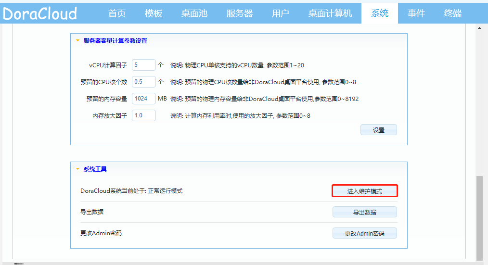
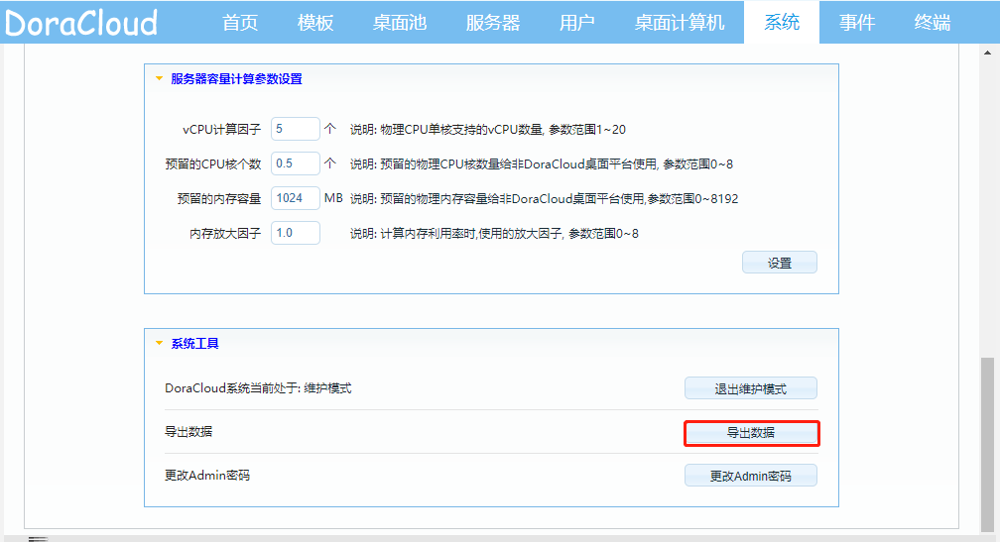
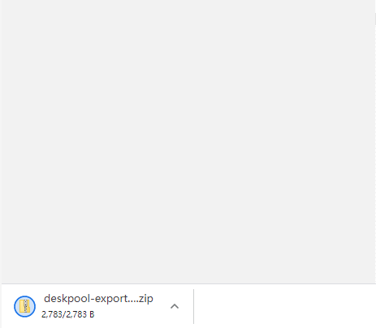
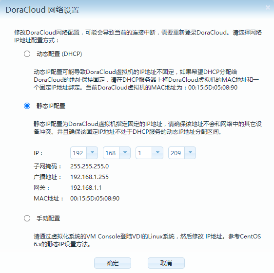
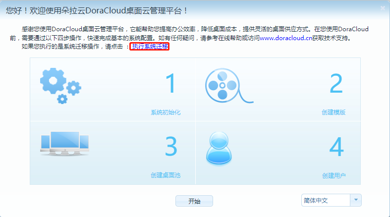
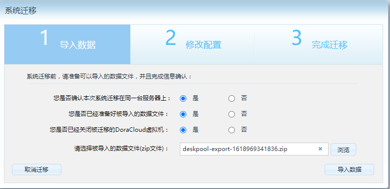
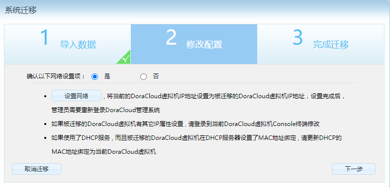
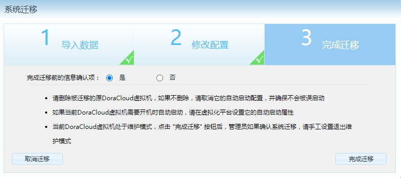
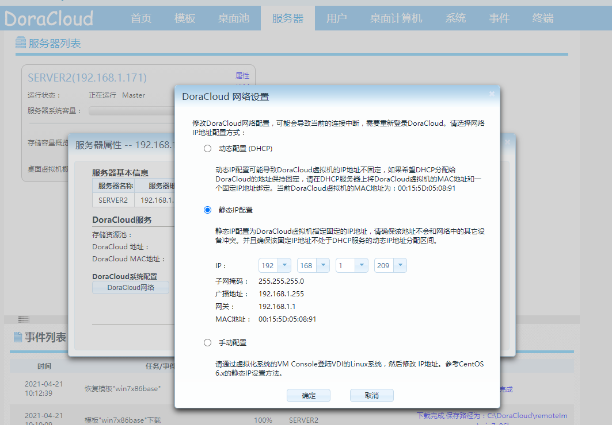
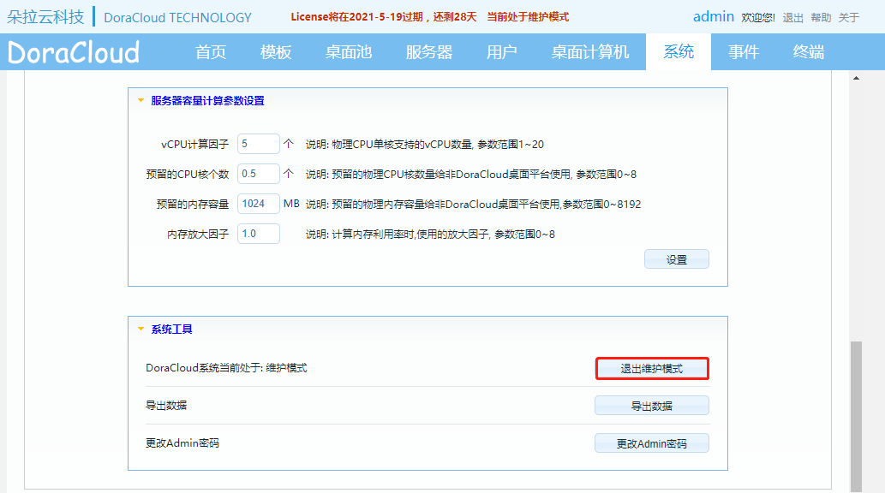

---
title: "KB0004.如何进行DoraCloud版本升级？"
linkTitle: "KB0004.如何进行DoraCloud版本升级？"
date: 2019-12-20
weight: 4
description: >
   KB0004.如何进行DoraCloud版本升级？
---

升级过程为：
##### 1）.现有版本，进入维护模式，导出系统数据。 

 
 
 

##### 2）.记录现当前版本DoraCloud VM 的IP地址，子网掩码、网关、DNS信息，将VM关机。

 

##### 3）.安装新版本DoraCloud，在向导的第一步，选择“系统迁移”，选择之前导出的数据导入。

 

##### 4）.根据向导提示，完成向导。

 
 
 

##### 5）.然后设置 DoraCloud VM的IP地址为固定IP。

 

##### 6）.退出维护模式。

 

