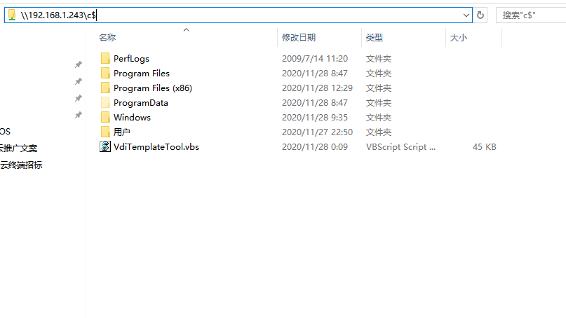

---
title: "KB0005.如何把数据拷贝到桌面虚拟机内？"
linkTitle: "KB0005.如何把数据拷贝到桌面虚拟机内？"
date: 2019-12-20
weight: 5
description: >
   如何把数据拷贝到桌面虚拟机内？
---

### KB0005.如何把数据拷贝到桌面虚拟机内？ {#KB0005}
##### 第一步.在同一个网络内找一台PC机，把需要拷贝的文件放到这台PC机里。
##### 第二步.开启网络共享文件夹，最后在文件夹输入需要需要拷贝的地址\\192.168.1.243\C$
 

