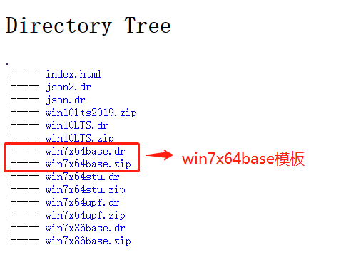
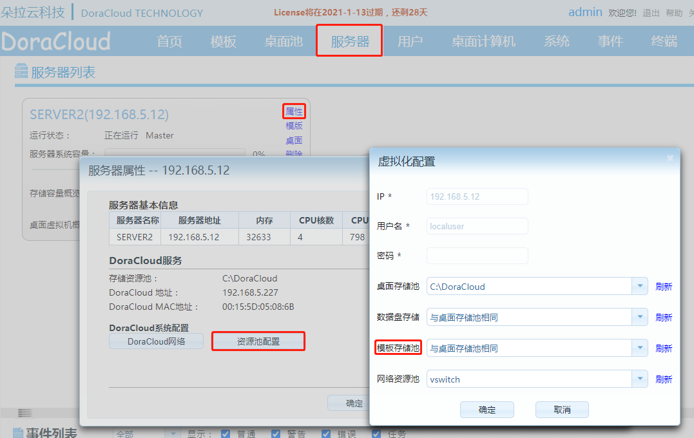
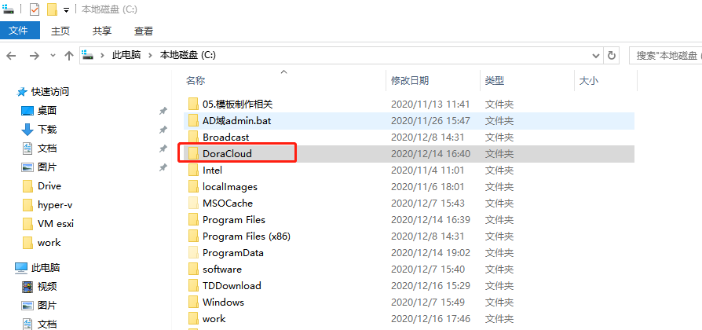
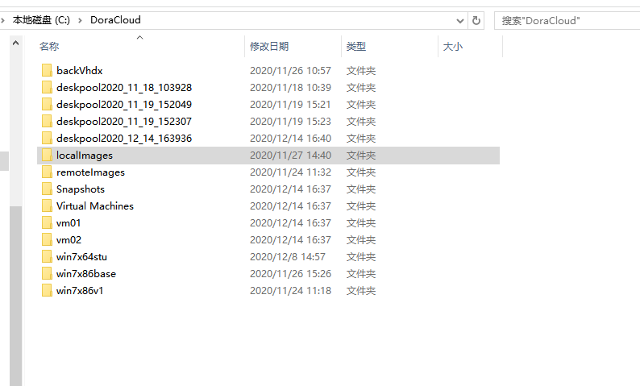
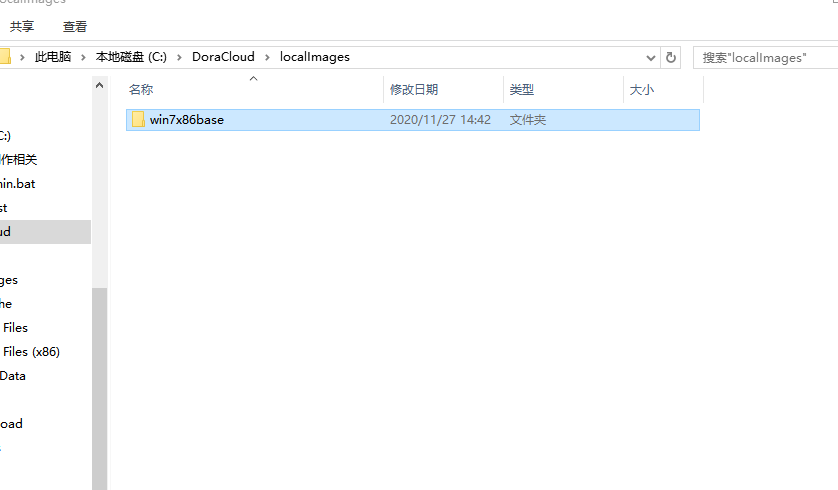
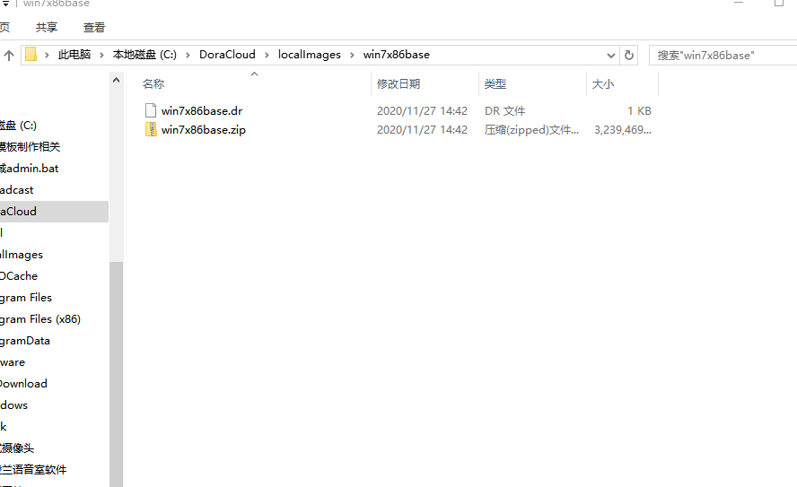
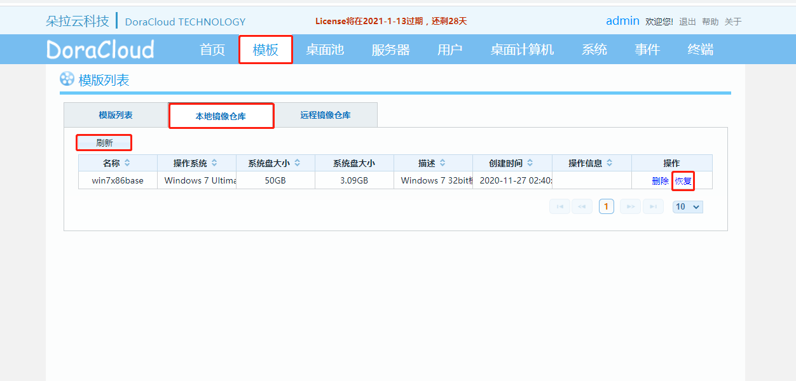
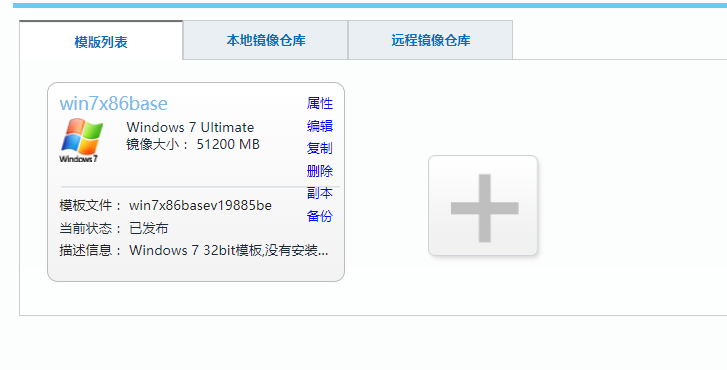

---
title: "KB0007.无法联网的情况下如何下载和恢复模板"
linkTitle: "KB0007.无法联网的情况下如何下载和恢复模板"
date: 2019-12-20
weight: 7
description: >
   无法联网的情况下如何下载和恢复模板
---

 **第一步、首先我们先找一个有网络的环境下载好模板拷贝到U盘里。（两个都需要下载）** 

- 模板下载地址：[模板下载地址][URL_board]

 

我们以windowsx64base为例进行模板的下载与恢复。

1.win7x64base.zip下载地址:[windows x64base.zip下载地址][URL_windows_x64base_zip]

2.win7x64base.dr下载地址:[windows x64base.dr下载地址][URL_windows_x64base_dr]

  **第二步、拷贝模板** 

1.把U盘插入需要模板的服务器，首先查看模板存储池的位置，图中模板位置是在C盘。
 

2.找到模板存储位置DoraCloud

 

3.然后先建立一个【localImages】的目录，在里面继续建立一个【win7x86base】的目录，最后把刚下载好的win7x64base.zip和win7x64base.dr拷贝进去

 

 

 

4.进入DoraCloud管理后台点击【模板】选择【本地镜像仓库】点击【刷新】，本地windowsx64base模板就会显示出来，最后点击恢复，等待进度条加载成功，模板就恢复好了。

 

 

[URL_board]: http://vdi.doracloud.cn:9000/repo/
[URL_windows_x64base_zip]: http://vdi.doracloud.cn:9000/repo/hyperv/win7x64base.zip
[URL_windows_x64base_dr]: http://vdi.doracloud.cn:9000/repo/hyperv/win7x64base.dr
