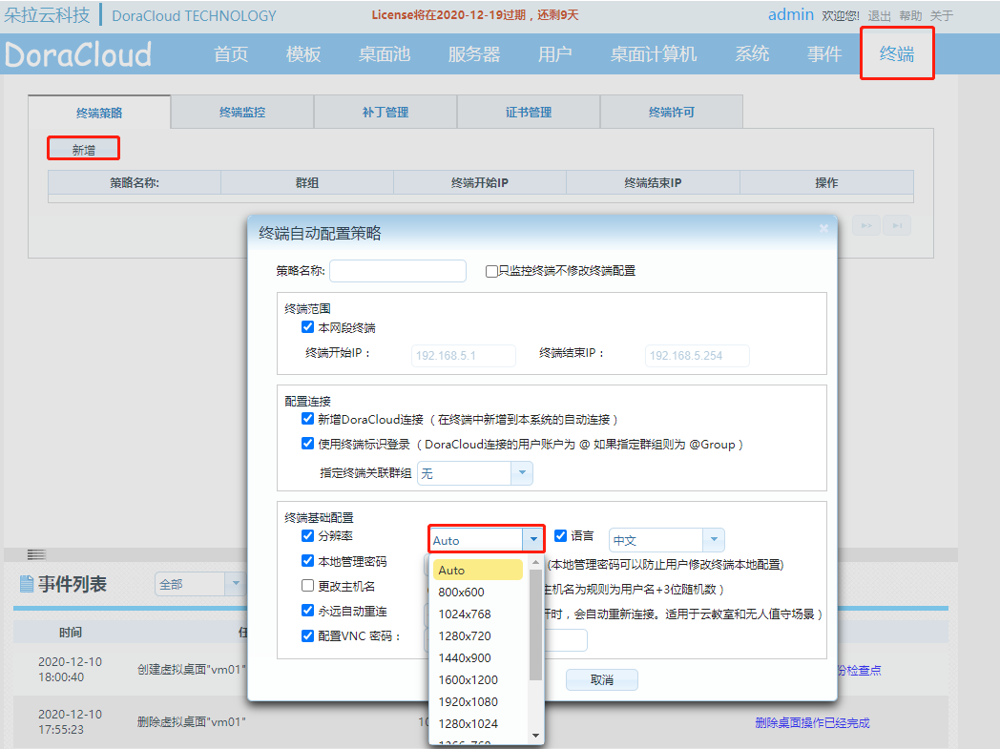

---
title: "KB0008.修改终端机桌面的分辨率"
linkTitle: "KB0008.修改终端机桌面的分辨率"
date: 2019-12-20
weight: 8
description: >
   KB0008.修改终端机桌面的分辨率
---

修改终端机桌面的分辨率，先进入DoraCloud的管理后台，找到【终端】，点击新增，然后我们找到分辨率选择合适的进行设置。

 

