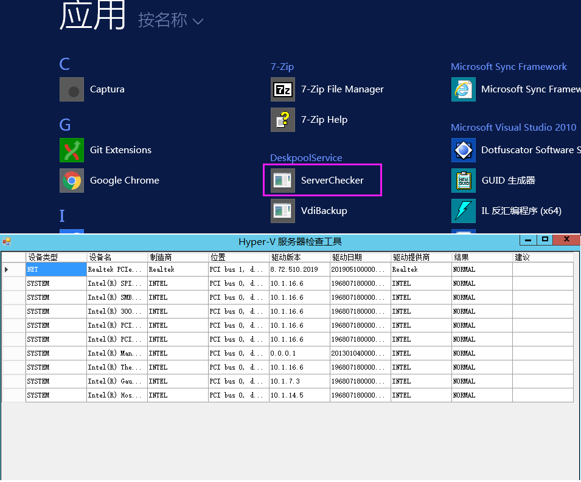
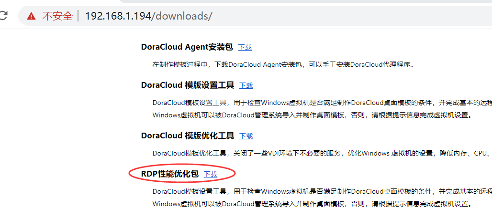

---
title: "KB0009.DoraCloud桌面云播放视频卡顿"
linkTitle: "KB0009.DoraCloud桌面云播放视频卡顿"
date: 2019-12-20
weight: 9
description: >
   KB0009.DoraCloud桌面云播放视频卡顿
---

可能原因1：Hyper-V虚拟化平台下，没有安装硬件原厂网卡驱动和主板驱动。
Windows安装时，一般会加载微软默认的网卡和主板驱动。默认驱动只能保证系统的基本工作，可能存在网络丢包，CPU性能差的问题。从而导致云终端连接桌面虚拟机播放视频出现卡顿。 
问题的检测方法为，在Windows Server中运行 ServerChecker，可以直接命令行输入 serverchecker，或者通过 应用程序图标启动。 
ServerChecker会给出驱动程序的检查结果。黄色部分的驱动，是需要重新安装驱动的。 

 

可能原因2：桌面模板没有安装RDP加速包。 
朵拉云官方提供的模板都已经安装了RDP加速包。如果您是自己制作的模板，有可能没有安装RDP加速包，导致视频播放性能差。 
RDP加速包的下载地址为  http://<doracloud IP>/downloads/ 。
安装RDP加速包时，请使用管理员角色安装。 

 

