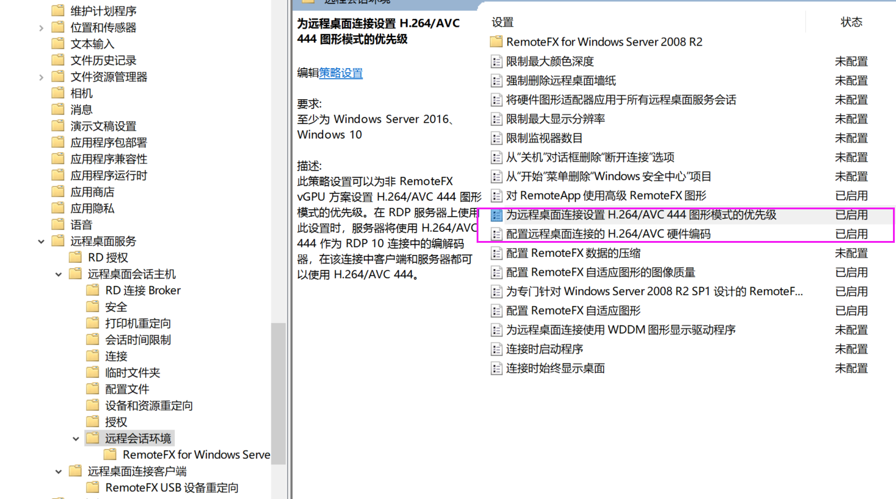
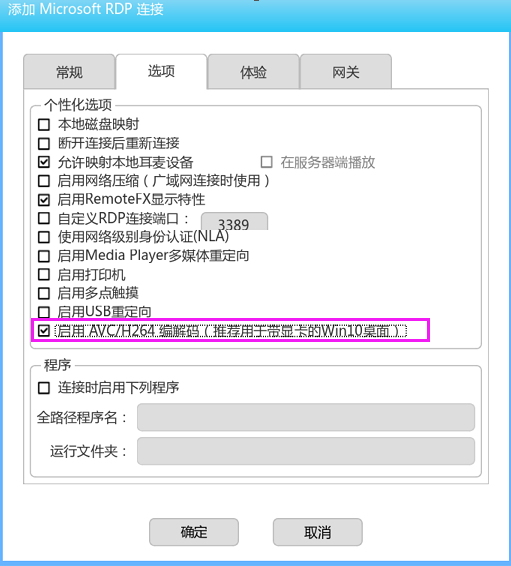
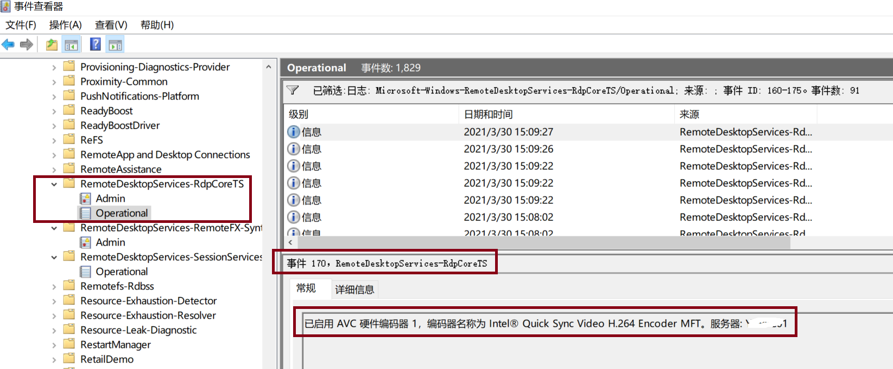

---
title: "KB0010.Windows 10开启远程桌面H264/AVC硬件编码"
linkTitle: "KB0010.Windows 10开启远程桌面H264/AVC硬件编码"
date: 2019-12-20
weight: 10
description: >
   Windows 10开启远程桌面H264/AVC硬件编码
---

RDP10支持H264/AVC硬件编码。采用硬件编码时，可以使用GPU（集成显卡或者独立显卡)的硬件H264编码能力对屏幕进行编码，该模式可以降低远程桌面协议时的CPU占用，降低操作延时，提供更好的远程桌面体验。
开启H264/AVC硬件编码的方法为

打开组测略管理器（gpedit.msc)，找到 【计算机设置】【管理模板】【Windows组件】【远程桌面服务】【远程会话环境】。
然后启用【为远程桌面连接设置H264/AVC 444 图形模式的优先级】、【配置远程桌面连接的H264/AVC 硬件编码】

如图所示
 

为了启用H264/AVC444，在客户端（DoraOS或者朵拉云云终端）的RDP连接设置中，需要勾选  【启用AVC/H264编码】。

 

在启用AVC/H264硬件编码后，远程桌面连接的视频体验会较好。

确认AVC/H264硬件编码生效的方式有两种：

方法1：在windows主机的任务管理器中查看 GPU的编码器的占用率。 如果GPU编码的占用率不是0，说明启用了硬件编码。

方法2：查看Windows的时间日志。
在 【应用和程序服务日志】【Windows】【RemoteDesktopServices RdpCoreTS】目录下，查看 162、170的日志。
162表示启用了 AVC 444编码，170显示了所使用的H264编码器。

 

