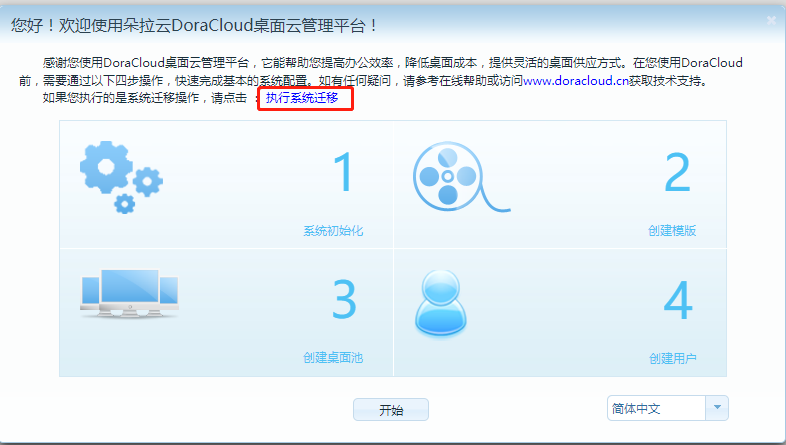

---
title: "KB0012. DoraCloud系统无法启动，如何进行恢复？"
linkTitle: "KB0012. DoraCloud系统无法启动，如何进行恢复？"
date: 2019-12-20
weight: 12
description: >
   DoraCloud系统无法启动，如何进行恢复？
---

DoraCloud系统运行在Linux虚拟机内。如果遇到异常断电，重启，有可能导致 DoraCloud 系统的数据库损坏，DoraCloud的 Web 管理后台，无法进入.

这种情况下，可以进行数据库的恢复。DoraCloud会在每天凌晨备份的数据库。会将数据库导出到一个配置文件中。大约会保存1-2周的每日数据库。备份的目录在 DoraCloud VM Linux 系统的 ~\backup 目录下。

1）.登陆 Linux VM， 用户名 root， 缺省密码 dora@cloud，将 jy 目录备份。

 

2）.回到Windows 界面，将 ~\backup 目录下的文件拷贝到Windows 机器。 

 

3）. 再回到 Linux VM，将Linux 重启，输入管理后台IP地址，系统进入初始化状态，然后选择一个备份数据进行恢复.

 

4）.最后退出维护模式。

     

