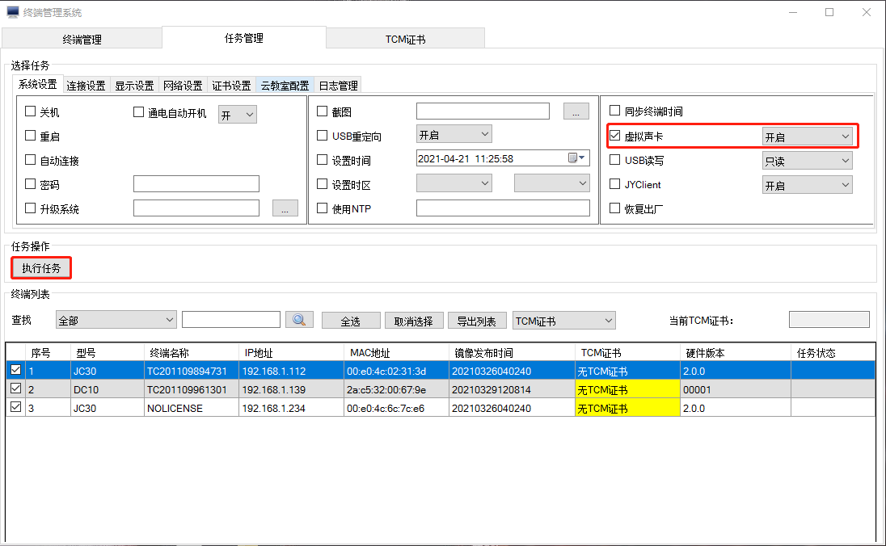
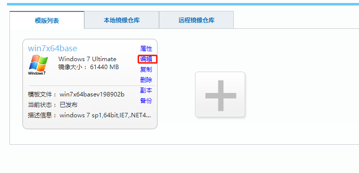
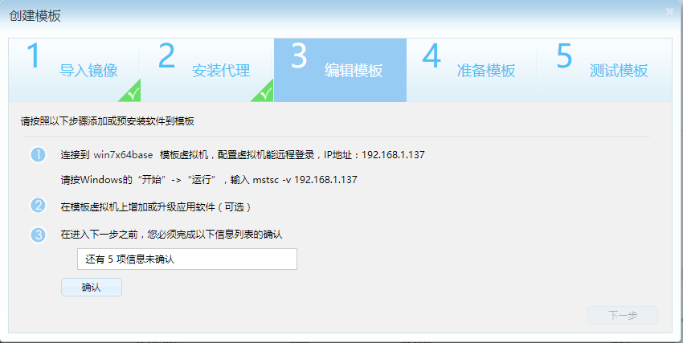
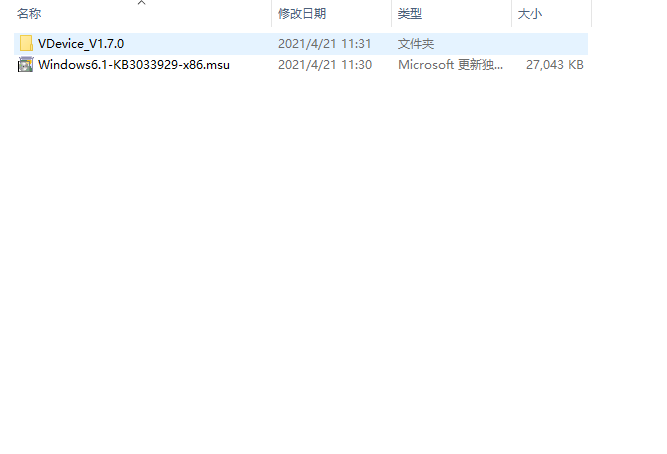
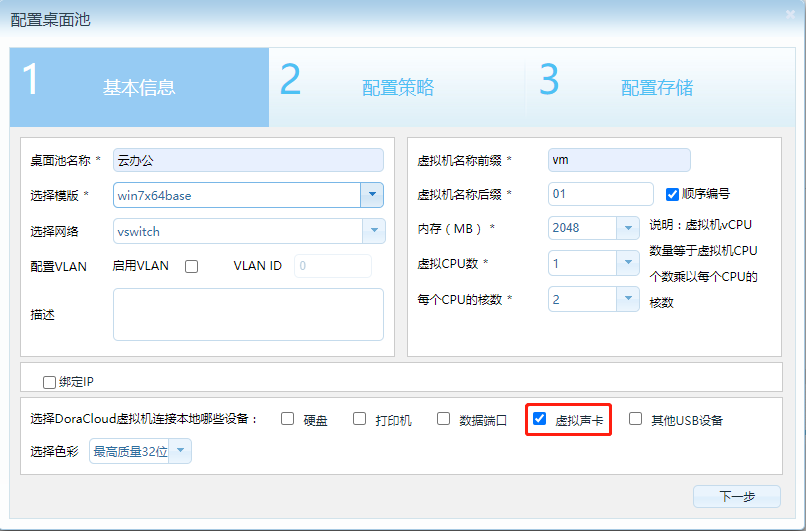

---
title: "KB0013. DoraCloud如何使用虚拟声卡？"
linkTitle: "KB0013. DoraCloud如何使用虚拟声卡？"
date: 2019-12-20
weight: 13
description: >
   DoraCloud如何使用虚拟声卡？
---

如果遇到应用程序无法兼容音频重定向的情况，可以考虑启用虚拟声卡。

虚拟声卡（Virtual Voice）需要专用的通道来传送声音。 需要在Windows 内安装虚拟声卡驱动，并且终端和VM必须在同一个IP网络内。无法穿越防火墙和RDP网关。

启用虚拟声卡有如下要求：

1）终端开启“虚拟声卡”的开关,开机完毕批量重启虚拟机。 

2）编辑模板在Windows内安装虚拟声卡驱动（首先安装补丁KB3033929,再安装虚拟声卡驱动）。 

 **虚拟声卡驱动：联系厂家获取** 

3）DoraCloud桌面池勾选虚拟声卡,网络层面要求终端和桌面虚拟机的IP可以互通.

