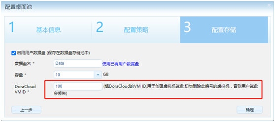
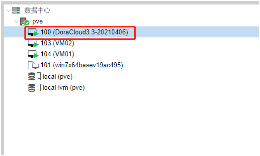
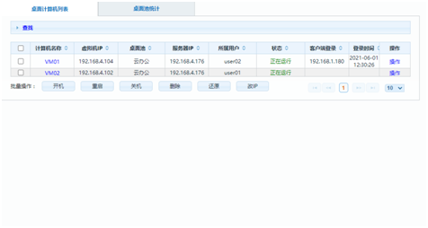
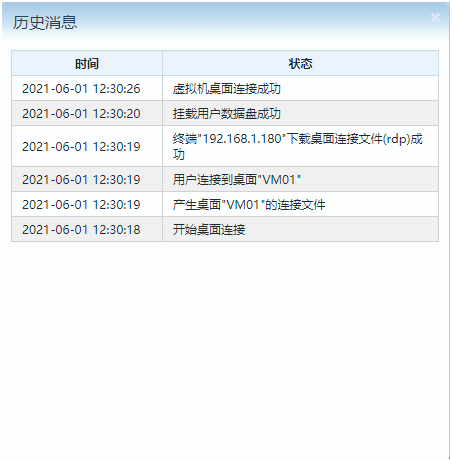
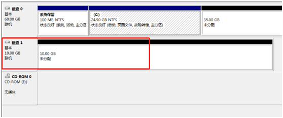
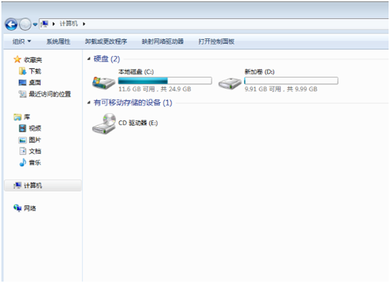
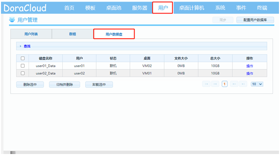

---
title: "KB0014.Proxmox下如何创建数据盘？"
linkTitle: "KB0014.Proxmox下如何创建数据盘？"
date: 2019-12-20
weight: 14
description: >
   Proxmox下如何创建数据盘？
---

1.填写DoraCloud VM的ID，在DoraCloud上创建虚拟磁盘，在用户登录时，会自动将虚拟磁盘分配给用户，DoraCloud虚拟机切勿删除，否则用户磁盘会丢失。

2.等待虚拟机创建成功之后登录，登录完成会显示挂载数据盘成功。

3.检查虚拟机挂载的数据盘是否正常，因为磁盘是动态分配，因此我们要登录虚拟机才能检查数据盘，登录成功，打开磁盘管理，可以看到数据盘创建成功。

4.如图所示，朵拉云管理后台中也可以查看用户数据盘状态。

