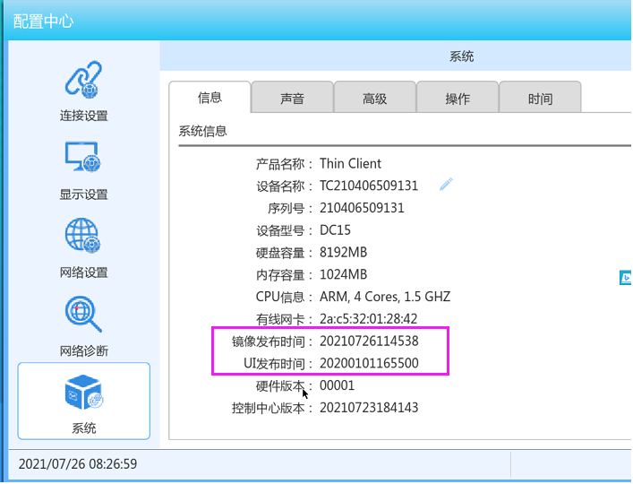
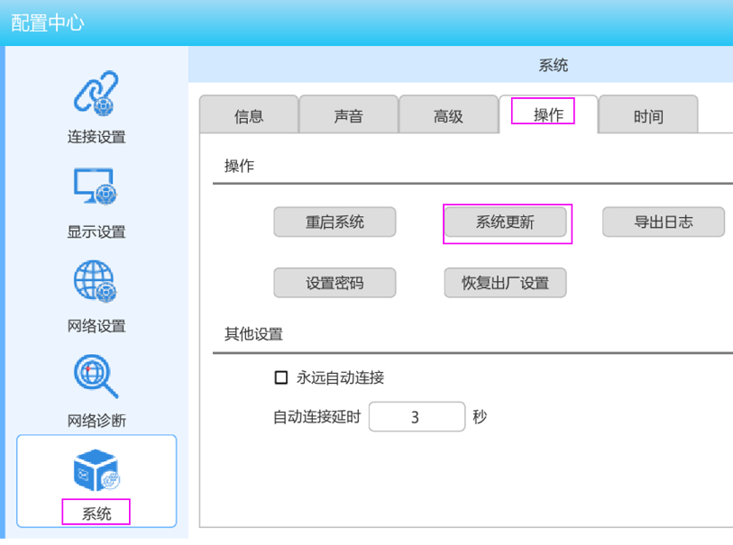
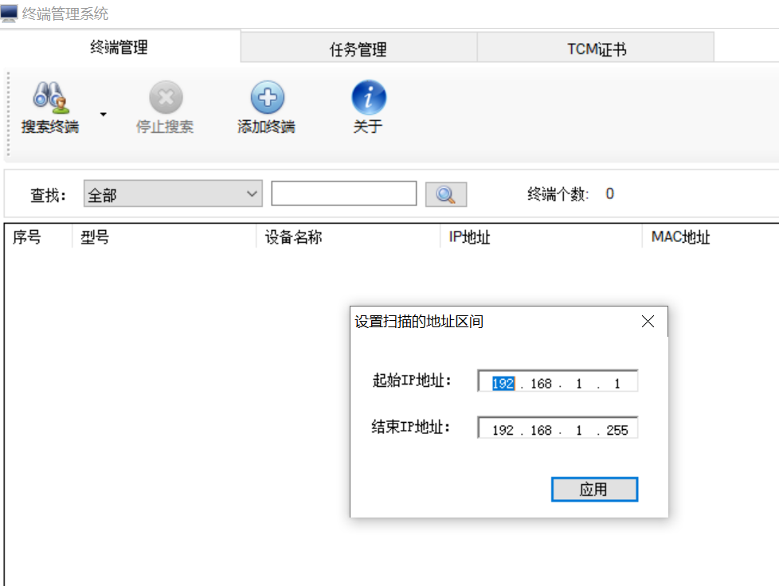
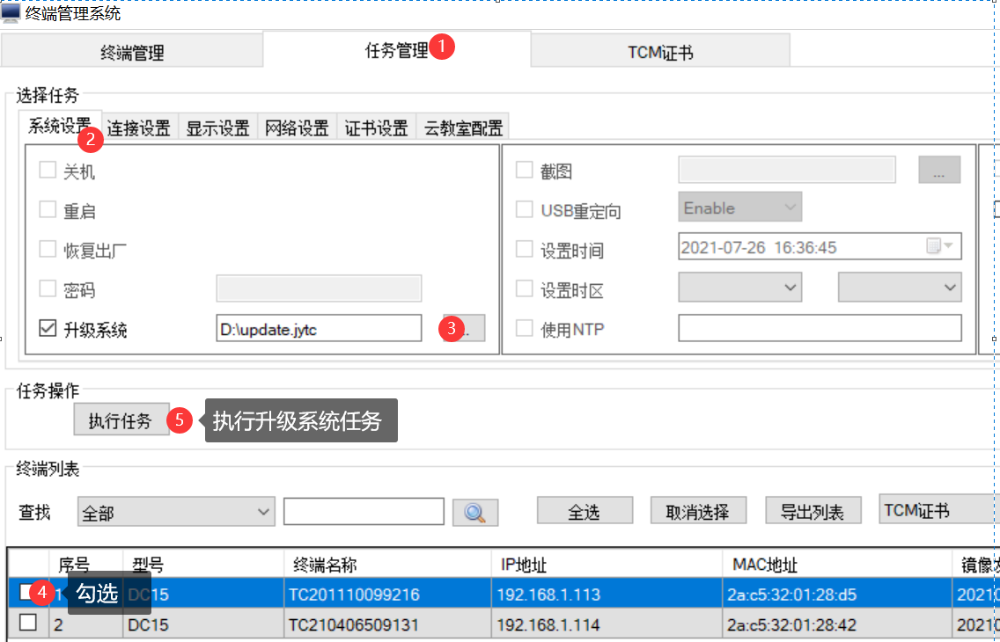

---
title: "KB0016. 云终端如何加载补丁程序？"
linkTitle: "KB0015. 云终端如何加载补丁程序？"
date: 2019-12-20
weight: 10
description: >
   云终端如何加载补丁程序？
---

朵拉云科技的云终端有两种方法可以加载补丁。

 **方法1：通过U盘升级补丁** 

第一阶段，升级准备：

1) 下载相应主机的补丁包（名称为update.jytc）；

2) 准备 U盘，并且格式化为FAT32格式，如果U盘已经格式化，请确认U盘为FAT或者FAT32格式；

3) 将 update.jytc 拷贝到U盘的根目录。

4) 启动主机，进入<系统设置>界面，查看“系统信息”中的“镜像发布时间”，记住升级前的版本信息。

第二阶段，系统升级：

5) 把U盘插入主机的USB接口中，如果主机USB接口不足，请外接USB HUB，扩展USB端口；

6) 进入<系统设置>界面，点击【系统更新】，在确认出对话框中点击【确认】；

7) 系统给出提示“系统正在升级，请耐心等待...” 大约几分钟后，系统完成升级并重新启动；

8) 待主机重启后，进入<系统设置>界面，查看“系统信息”下的“镜像发布时间”，如果比之前记录版本新，说明系统升级成功。

 注意，在升级过程中，请勿对主机进行断电、复位等操作。否则会导致系统无法启动。

 **方法2：通过TCmanager加载补丁** 
1）下载TCmanager，并安装在一台Windows 计算机上. 

[https://www.doracloud.cn/downloads/11-cn.html](https://www.doracloud.cn/downloads/11-cn.html)

2）启动TCmanager，设置终端的IP地址范围，搜索终端。

3）选择“任务管理”、“系统设置”、“升级系统”，选择需要加载的补丁文件，然后勾选需要升级的终端，然后按“执行任务”。

4) 重新搜索终端，查看终端的固件日期是否发生变化。

