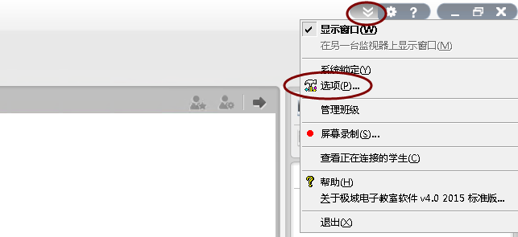
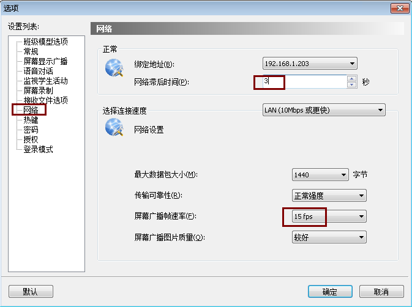

在云桌面环境下，极域的电子教学软件的缺省配置占用的网络带宽较高。可能会带来卡顿，延时大，黑屏等问题。  我们可以对极域电子教学软件教师端的程序进行配置，降低广播的带宽，实现更好的体验。配置方法如下：

1、启动极域电子教学软件 教师程序。

2、在程序的右上方，打开下拉菜单，进入“选项”。

3、在选项中，选择“网络”。在屏幕广播帧数率中，选择 “15fps”；把网络滞后时间配置成 3秒。 点击确定，保存配置。

4、重新进行屏幕广播，观察学生机显示的延时。