### DoraCloud简介
DoraCloud桌面虚拟化方案主要为中小规模的桌面云系统而优化设计，充分考虑了中小企业的现状，以及实施桌面虚拟化中遇到的困难。DoraCloud桌面云解决方案以DoraCloud桌面虚拟化管理系统为核心，基于开放架构，具有多平台、一体化、分布式、多协议的特点，适用于教育培训、政企办公、3D设计、信息安全等多种应用场景。整体方案由DoraCloud桌面虚拟化系统、多种虚拟化平台、多种云终端构成。方案的总体结构如下图：

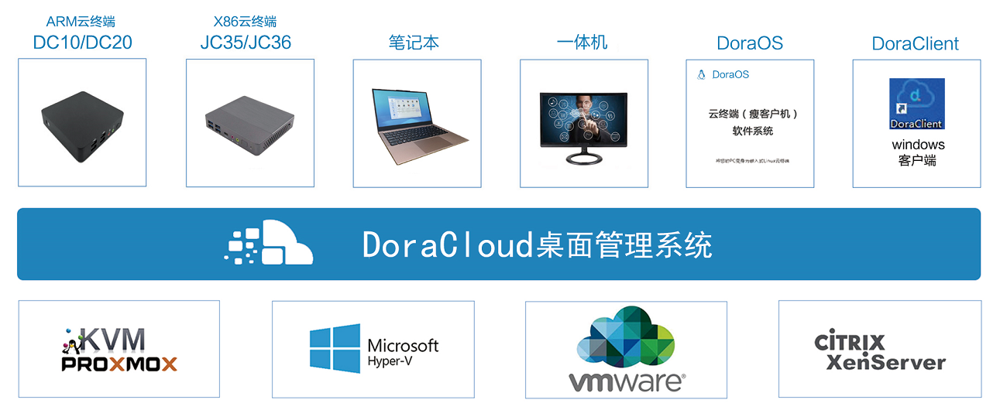

### DoraCloud特点
DoraCloud桌面云方案在充分了解中小企业桌面云应用的需求基础上，吸取传统桌面云方案的在中小企业应用中的经验和教训，采用了创新的设计理念。构建了DoraCloud桌面云方案的独特亮点和优势。

#### 多平台（Multiple Hypervisor）
服务器虚拟化（Hypervisor）是桌面虚拟化系统（VDI）的关键组件之一。服务器虚拟化的稳定性、兼容性，直接影响到了桌面云虚拟化业务的稳定性、兼容性。DoraCloud桌面虚拟化系统支持业界主流的虚拟化系统，包括Hyper-V、VMware、XenServer、Proxmox（KVM）。这些虚拟化系统具有良好的稳定性和兼容性，易于部署和维护，在企业内有广泛的用户群体。  
DoraCloud支持多种虚拟化平台，有助于集成商和用户选择自己熟悉虚拟化和硬件基础设施，有助于实现与现有企业IT基础设施的集成。降低部署的难度和维护的成本。这些主流的虚拟化系统本身有自己的生态系统，提供了良好的配套方案，比如存储连接方案，容灾和备份方案，运维和网管方案。

#### 一体化（All-in-One）
DoraCloud虚拟桌面管理方案采用一体化（All-in-One）设计，管理系统运行在一个Linux系统中，并以虚拟机镜像的形式发布。DoraCloud管理系统集成了桌面云系统所需的多种功能模块，包括会话管理、负载均衡、数据库、镜像管理等。系统部署时，只需要部署单一的DoraCloud功能组件即可。不需要像传统的VDI那样部署多个功能组件。

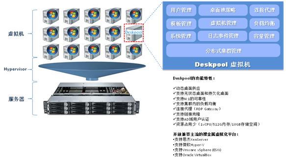

DoraCloud还支持与服务器硬件打包成一体机交付给客户。DoraCloud的一体机的特点在于集成商可以自主选择服务器硬件和虚拟化系统，实现客户现场的开箱即用。集成商可以根据自己的项目经验，构建适合自身解决方案特点的桌面云一体机。  
DoraCloud的一体化设计，简化了系统的部署，节省了商业的操作系统和数据库的授权费用，让维护更简单。允许集成商自主定制符合自身方案特色的桌面一体机，实现快速的交付。

#### 分布式（Distributed）
DoraCloud集群采用对称集群（Symmetric Clustering）架构，所有的节点都是活动的，所有节点都参与桌面会话请求的处理过程。节点故障时，集群中的其他节点接管工作负载，并继续处理桌面会话。集群的节点之间处于负载均衡的状态。集群中的节点可以共享工作负荷，提升整个集群的性能和伸缩性。



DoraCloud的对称集群架构为系统的部署、运行、维护带来了一系列的优势。  
部署简单：第一个节点安装时，创建集群，后续节点加入集群即可。每个节点部署的软件一样。  
负载均衡：集群的节点之间共同分担桌面会话的负荷。  
故障备份：一个节点故障，集群其他节点会接管工作负荷。灵活的实现N+1、N+M的冗余备份。  
线性伸缩：增加集群的节点，即可扩容系统的整体容量。  
统一管理：连接集群的任何一个节点，即可对整个集群进行统一管理。  

#### 多协议（Multiple Protocol）
DoraCloud管理系统支持多种桌面协议：RDP、SPICE、PCoIP。具体能支持哪种协议与虚拟化平台相关。使用Proxmox虚拟化时，可以支持SPICE、RDP。使用VMware虚拟化时，可以支持PCoIP、RDP。使用Hyper-V、XenServer平台时，支持RDP协议。

#### 丰富的云终端
DoraCloud桌面云提供了丰富的配套云终端。包括ARM云终端JC10、x86云终端JC30、云终端一体机JC30AIO。另外，通过朵拉云瘦客户机软件系统JYOS，可以把现有的旧PC改造成瘦客户机。DoraCloud虚拟桌面管理系统内置了对于云终端的自动发现和配置，可以实现即插即用。凭借配套的终端管理系统，可以实现都云终端的集中管理。实现远程开关机、配置、升级、监控等功能。提高终端的维护和管理效率。

##### DC20云终端	
**性能强大，内涵丰富**  
采用ARM高端Cortex A55四核64位处理器，主频高达2.0GHz，支持1G/2G DDR4内存及8G/16G存储。支持4K分辨率（3840*2160)，内置千兆网口。  
**绿色节能，环保静音**  
无风扇设计，为您提供无噪音安静办公和教学环境。型功耗仅有5W，超低功耗产品，绿色节能，大大降低电量消耗  
**即插即用，便捷管理**  
软硬件一体化设计，支持即插即用，无须配置，安装即可使用。部署方便，替换简单，硬件零管理维护量。  
**远程唤醒，简单开机**  
提供全新远程唤醒功能，可远程开启终端设备。上课简单，下课轻松。  
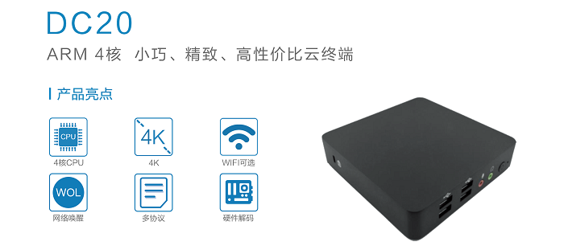  

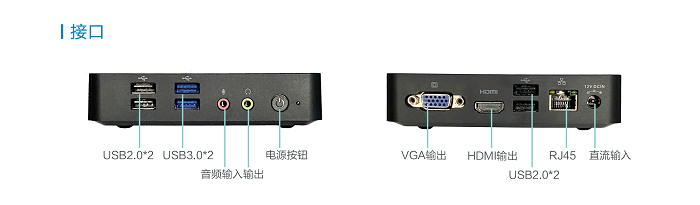  

适用场景：中小学云教室、培训机构、会议室、电子考场办公

##### JC30云终端
**双模工作，强大灵活** 
采用Intel 处理器，支持工作做桌面云模式和本地模式。满足多种教学、考试、语音、实训多种使用场景。  
**绿色节能，环保静音**  
无风扇设计，为您提供无噪音安静办公和教学环境。型功耗10W，超低功耗产品，绿色节能，大大降低电量消耗  
**双屏高清**  
支持支持双屏高清显示。  
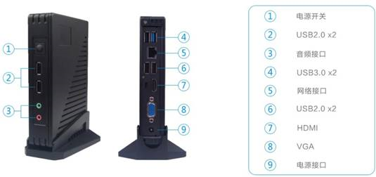  
适用场景：大学，职校，考场，语音教室

##### JC35云终端
**双模工作，强大灵活** 
采用Intel 处理器，支持工作做桌面云模式和本地模式。满足多种教学、考试、语音、实训多种使用场景。  
**绿色节能，环保静音**  
无风扇设计，为您提供无噪音安静办公和教学环境。型功耗10W，超低功耗产品，绿色节能，大大降低电量消耗  
**双屏高清**  
支持支持双屏高清显示。  
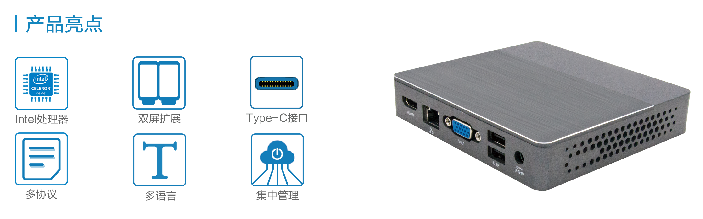  
适用场景：大学，职校，考场，语音教室

##### JC36云终端
**双模工作，强大灵活** 
采用Intel 处理器，支持工作做桌面云模式和本地模式。满足多种教学、考试、语音、实训多种使用场景。  
**绿色节能，环保静音**  
无风扇设计，为您提供无噪音安静办公和教学环境。型功耗10W，超低功耗产品，绿色节能，大大降低电量消耗  
**双屏高清**  
支持支持双屏高清显示。  
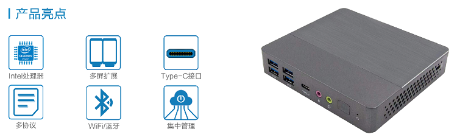  
适用场景：大学，职校，考场，语音教室

#### JC30AIO 云终端一体机

  

#### DoraBook 云笔电
**极致轻薄**
轻便机身总重量1.1Kg，机身厚度1.1cm，移动方便，不受工位限制。
**性能卓越**
采用Intel N4120(四核)，采用14nm工艺，具有领先的CPU性能，更高的媒体能力，增强的图形引擎。适用于办公、3D设计等桌面云场景。
**协议丰富**
支持RDP8.1、RDP10、PCOIP、ICA/HDX、HDP、SPICE、VNC协议。
**便捷管理**
软硬件一体化设计，无须配置，开机即用。部署方便，替换简单，硬件零管理维护量。集成管理工具TCManager。

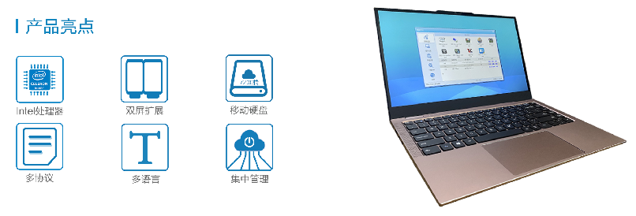  

### DoraCloud典型部署
DoraCloud支持不同的组网场景，包括单机部署、高可用集群部署、超融合部署、多节点集群部署。灵活的部署方式能够适应不同应用场景的组网需求。
#### 单机部署方案

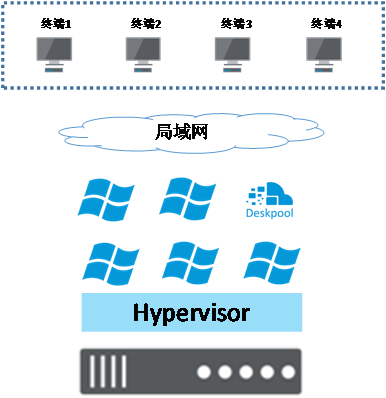  
该方案适合于小规模单服务器的部署。该方案的特点是，部署快捷，维护简单。适用于小微企业办公、学校的云教室、呼叫中心等场合。一般建议单服务器用户不超过60。
单机方案适用于以下虚拟化平台：
- Hyper-V Server 2012R2、Hyper-V Server 2016、Hyper-V Server 2019
- Windows Server 2012R2、Windows Server 2016、Windows Server 2019
- VMware vSphere 6.0、6.5、6.7
- Proxmox 5.3 以上
- XenServer 6.2

#### 高可用集群部署方案
 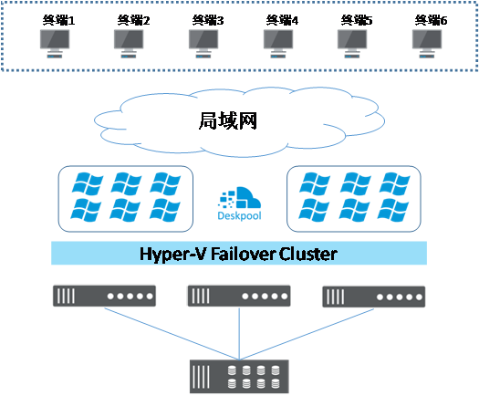   
该方案需要配置共享存储。在虚拟化系统中配置高可用群集，形成虚拟化资源池。资源池内的虚拟机可以在不同的服务器上热迁移。当一台服务器故障时，集群的HA机制可以将虚拟机在其他节点上启动。DoraCloud和桌面虚拟机都依赖于虚拟化的HA机制来保证可靠性。
该方案适合于企业办公，以及其他对于数据可靠性要求较高的场合。服务器按照N+1配置，预留一台服务器作为冗余。
该方案适用于以下虚拟化平台：
- Hyper-V Server 2012R2、Hyper-V Server 2016
- Windows Server 2012R2、Windows Server 2016、Windows Server 2019
- VMware vSphere 6.0、6.5、6.7
- Proxmox 5.3 以上

#### 超融合部署方案
 
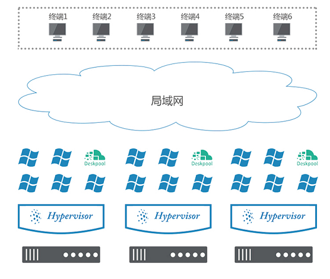   
超融合方案采用分布式存储系统，通过运行在服务器上的分布式存储软件把服务器内的SSD、HDD资源聚合成一个逻辑上统一的存储池，然后提供给虚拟化系统。超融合方案可以节省昂贵的共享存储的费用，具有更好的可靠性、可扩展性。
DoraCloud的超融合部署方案支持以下几种配置：
1、VMware vSphere，启用VSAN实现分布式存储。
2、Windows Server 2016 数据中心版本，启用 Storage Space Direct（S2D）实现分布式存储。
3、采用Proxmox虚拟化，启用Ceph构建分布式存储。
采用超融合部署时，建议服务器通过10GE的以太网连接。
采用超融合方案部署时，虚拟化系统也支持高可用集群。能够实现虚拟桌面和DoraCloud管理节点的高可用。

#### 对等集群部署方案
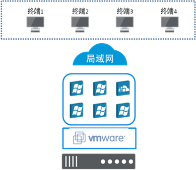   
管理节点的集群方案可以将套单机部署的桌面云系统聚合成一个逻辑上统一的桌面云系统，实现资源的跨节点分配和调用。采用该部署方案时，DoraCloud管理系统实现了跨节点的高可用性。管理员登录任何一个管理节点，都可以对整体系统进行操作和管理。桌面用户从任何一个管理节点都可以连接到自己的虚拟桌面。当一台服务器故障时，其他的服务器上运行的桌面云服务不受影响。
管理节点集群方案适合于公有桌面池的方案。在服务器故障后，用户可从其他的服务器获得新的桌面，从而保障桌面业务的连续性。专用桌面需要在服务器本地保存用户的个人数据。在服务器故障后，专用桌面池的桌面将无法为用户提供服务，直到服务器恢复。

