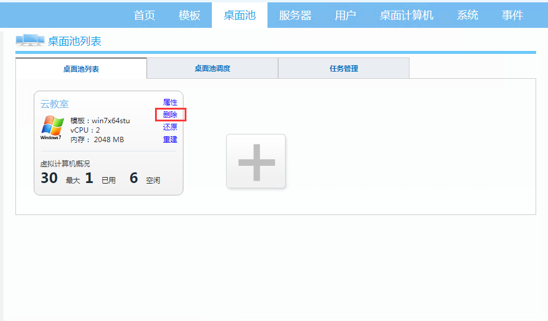

### 1. 概述

#### 1.1 关于本文档

本文是CloudDesk的管理员操作手册。用于管理员日常维护操作的参考。

如果需要测试和体验CloudDesk，可以参考《CloudDesk快速部署指导书》、《CloudDesk云桌面办公部署指导书》、《CloudDesk云教室部署指导书》。

如果如果涉及到启用AD特性、对等集群、桌面云网关，请参考相关特性的操作指导书。

#### 1.2 CloudDesk简介

CloudDesk桌面虚拟化方案主要为中小规模的桌面云系统而优化设计，充分考虑了中小企业的现状，以及实施桌面虚拟化中遇到的困难。CloudDesk桌面云解决方案以CloudDesk桌面虚拟化管理系统为核心，基于开放架构，具有多平台、一体化、分布式、多协议的特点，适用于教育培训、政企办公、3D设计、信息安全等多种应用场景。整体方案由CloudDesk桌面虚拟化系统、多种虚拟化平台、多种云终端构成。方案的总体结构如下图： 

#### 1.3 CloudDesk特点

CloudDesk桌面云方案在充分了解中小企业桌面云应用的需求基础上，吸取传统桌面云方案的在中小企业应用中的经验和教训，采用了创新的设计理念。构建了CloudDesk桌面云方案的独特亮点和优势。

##### 1.3.1 多平台（Multiple Hypervisor）

服务器虚拟化（Hypervisor）是桌面虚拟化系统（VDI）的关键组件之一。服务器虚拟化的稳定性、兼容性，直接影响到了桌面云虚拟化业务的稳定性、兼容性。CloudDesk桌面虚拟化系统支持业界主流的虚拟化系统，包括Hyper-V、VMware、XenServer、Proxmox（KVM）。这些虚拟化系统具有良好的稳定性和兼容性，易于部署和维护，在企业内有广泛的用户群体。

CloudDesk支持多种虚拟化平台，有助于集成商和用户选择自己熟悉虚拟化和硬件基础设施，有助于实现与现有企业IT基础设施的集成。降低部署的难度和维护的成本。这些主流的虚拟化系统本身有自己的生态系统，提供了良好的配套方案，比如存储连接方案，容灾和备份方案，运维和网管方案。

##### 1.3.2 一体化（All-in-One）

CloudDesk虚拟桌面管理方案采用一体化（All-in-One）设计，管理系统运行在一个Linux系统中，并以虚拟机镜像的形式发布。CloudDesk管理系统集成了桌面云系统所需的多种功能模块，包括会话管理、负载均衡、数据库、镜像管理等。系统部署时，只需要部署单一的CloudDesk功能组件即可。不需要像传统的VDI那样部署多个功能组件。
 

CloudDesk还支持与服务器硬件打包成一体机交付给客户。CloudDesk的一体机的特点在于集成商可以自主选择服务器硬件和虚拟化系统，实现客户现场的开箱即用。集成商可以根据自己的项目经验，构建适合自身解决方案特点的桌面云一体机。
CloudDesk的一体化设计，简化了系统的部署，节省了商业的操作系统和数据库的授权费用，让维护更简单。允许集成商自主定制符合自身方案特色的桌面一体机，实现快速的交付。

##### 1.3.3 分布式（Distributed）

CloudDesk集群采用对称集群（Symmetric Clustering）架构，所有的节点都是活动的，所有节点都参与桌面会话请求的处理过程。节点故障时，集群中的其他节点接管工作负载，并继续处理桌面会话。集群的节点之间处于负载均衡的状态。集群中的节点可以共享工作负荷，提升整个集群的性能和伸缩性。

CloudDesk的对称集群架构为系统的部署、运行、维护带来了一系列的优势。

部署简单：第一个节点安装时，创建集群，后续节点加入集群即可。每个节点部署的软件一样。

负载均衡：集群的节点之间共同分担桌面会话的负荷。

故障备份：一个节点故障，集群其他节点会接管工作负荷。灵活的实现N+1、N+M的冗余备份。

线性伸缩：增加集群的节点，即可扩容系统的整体容量。

统一管理：连接集群的任何一个节点，即可对整个集群进行统一管理。

##### 1.3.4 多协议（Multiple Protocol）

CloudDesk管理系统支持多种桌面协议：RDP、SPICE、PCoIP。具体能支持哪种协议与虚拟化平台相关。使用Proxmox虚拟化时，可以支持SPICE、RDP。使用VMware虚拟化时，可以支持PCoIP、RDP。使用Hyper-V、XenServer平台时，支持RDP协议。

### 2. 登陆CloudDesk系统

#### 2.1 CloudDesk的组网

CloudDesk在单机部署，或者高可用集群部署模式下。只需要部署一个 CloudDesk 管理系统。浏览器登录该管理系统，即可对CloudDesk进行管理。

CloudDesk在对等集群模式下，每个服务器会部署一个 CloudDesk 管理系统。 登录任何一个管理节点，均可对系统进行管理。

#### 2.2 浏览器需求

CloudDesk 推荐如下浏览器访问：

- Chrome浏览器。
- Firefox浏览器
- Edge浏览器

#### 2.3 CloudDesk管理系统地址
在虚拟化平台上，打开CloudDesk的管理系统虚拟机，可以看到管理系统的访问地址。如下图：

在浏览器中，输入CloudDesk管理系统的地址，即可登录管理系统。 缺省的账号是 admin  CloudDesk

### 3. 模板管理

CloudDesk的模板是指安装了桌面操作系统、桌面应用软件和CloudDesk桌面代理程序的虚拟机镜像。模板也称为：虚拟机母盘镜像（Golden Image）。CloudDesk模板继承了“原始虚拟机镜像”的操作系统和镜像大小。CloudDesk管理系统根据模板为桌面池批量创建桌面。通过更新模板内的操作系统或者应用程序，可以实现虚拟桌面的统一升级、统一发布应用。实现高效的桌面管理。

CloudDesk模板的制作过程涉及到操作系统和应用程序的安装和配置，是一个非常繁琐和耗时的过程，需要不断的实践和验证。在CloudDesk模板管理的实践中，我们建议先制作一个仅仅包含操作系统的基础模板，然后复制基础模板得到一个桌面模板，然后安装应用程序，用于桌面发布。
在制作包含若干应用的复杂的模板时，我们建议分步骤制作模板。比如软件A、B可能会有冲突，可以先制作模板V1，包含软件A，再复制模板V1到V2，安装软件B。这样如果遇到问题，可以退回到V1重新安装。

#### 3.1 查看模板
点击菜单中的模板，可以查看当前CloudDesk系统的所有模板，如下图所示:

  

点击模板列表的属性可以查看，可以查看模板属性。  
 

#### 3.2 创建模板
CloudDesk创建模板的过程分两种：

1. 标准流程：是指从原始Windows镜像开始，分步完成“导入镜像”、“安装代理”、“编辑模板”、“准备模板”和“测试模板”五个步骤后，生成CloudDesk模板。

2. 快速流程：是指基于备份的CloudDesk模板，快速生成模板，只需要“导入镜像”和“测试镜像”两个步骤，就可以快速生成CloudDesk模板。快速流程一般在CloudDesk系统整机重新安装时采用，避免管理员重新制作桌面模板。

**CloudDesk创建模板标准流程：**

1、启动创建模板：点击模板列表中的【+】启动创建模板流程。

2、导入镜像： 选择“从导入虚拟机镜像开始制作CloudDesk模板”。 选择对应服务器、虚拟机并填写新模板名称、描述。如果对应的虚拟机不能被导入，请根据提示信息完成虚拟机设置，再点击刷新，查看虚拟机状态，直至虚拟机成为可以被导入虚拟机。注意：选择的虚拟机默认已经具备模板制作的先决条件，如虚拟机是从头开始，请参考专题任务->创建桌面模板。

点击"导入"，在弹窗中输入 Windows 虚拟机的管理员账户跟密码

系统开始复制虚拟机，并自动安装 Agent。

 

3、编辑桌面模板：安装所需的应用程序。在当前的操作计算机上，通过 mstsc -v ipaddress ，可以访问当前的模板虚拟机，完成应用程序的安装。 
 

以下信息只是一个 CheckList。请逐一确认。然后按下一步，开始准备模板。

4、准备模板：选择“专用和公用模板”，使得模板能够用于 专用桌面池 和 公用桌面池，点击“准备模板”。 

 
 

5、测试和保存模板：模板准备完成后，系统会自动创建一个测试桌面。 你可以连接该桌面，测试模板是否正常以及软件是否已经安装。 然后选择保存模板。  如果创建的测试桌面不正确，或者还需要对模板进行修改，可以选择“上一步”，重新编辑模板。
   

  
**CloudDesk创建快速流程：** 

1、启动创建模板。点击模板列表中的【+】启动创建模板流程。

2、导入镜像。选择“直接导入CloudDesk模版”。 选择模板对应的服务器跟对应模板。如下图：

点击导入，会自动导入模板并显示导入模板进度，如下图：

3、测试和保存模板: 模板导入成功完成后，系统会自动创建一个测试桌面。 你可以连接该桌面测试模板是否正常。然后选择保存模板。 
 
   

#### 3.3 编辑模板

模板编辑主要是用于在现有的模板基础上给模板增加软件或删除软件。每次模板编辑会产生一个版本，该版本仅包含本次编辑的增量部分。所以为了性能不应该编辑过多次数，一般最多10次左右，如果超出可以点击复制，“复制”操作会合并编辑产生的版本文件到一个新的模板文件里。  

1、启动模板编辑流程：在模板列表中选择要编辑的模板，点击“编辑”，会弹出确认框点击确认后自动进入编辑模板桌面。 
 

 
2、编辑桌面模板：此状态分3步，按下图所示。
 

通过 mstsc -v ipaddress ，可以RDP协议远程连接模板虚拟机，完成应用程序的安装。

注意，连接的时候，需要虚拟机的windows本地账号进行认证。缺省的账号为 administrator 123456。

以下信息只是一个 CheckList。请逐一确认。然后按下一步，开始准备模板。

3、准备模板：选择“专用和公用模板”，使得模板能够用于 专用桌面池 和 公用桌面池，点击“准备模板”。     
    

4、测试和保存模板模板：模板准备完成后，系统会自动创建一个测试桌面。 你可以连接该桌面测试一下模板是否正常。然后选择保存模板。 如果创建的测试桌面不正确，或者还需要对模板进行修改，可以选择“上一步”，重新编辑模板。  

#### 3.4 复制模板

从原始的虚拟机创建模板的过程是比较复杂的。在模板管理实践中，通常会先创建一个仅仅包含操作系统的基础模板。然后复制基础模板到一个新模板，在新模板中安装应用软件。
另外一种情况是一个模板编辑过若干次后，产生了较多版本，影响效率。通过将现有模板复制一次，可以实现模板的多个版本的合并。

1、在模板列表中选择要复制的模板，点击“复制”。 
   

2、弹窗中填写新模板的名称,点击"确定”,会弹出进度条，等待进度条完成。

 
3、编辑桌面模板，安装所需的应用程序。 

在当前的操作计算机上，通过 mstsc -v ipaddress ，通过远程访问完成应用程序的安装。
 

注意，连接的时候，需要虚拟机的windows本地账号进行认证。缺省的账号为 administrator 123456。

以下信息只是一个 CheckList。请逐一确认。然后按下一步，开始准备模板。
 
  

4、准备模板，点击“准备模板”。 

5、测试和保存模板，模板准备完成后，系统会自动创建一个测试桌面。 你可以连接该桌面测试一下模板是否正常。  然后选择保存模板。 如果创建的测试桌面不正确，或者还需要对模板进行修改，可以选择“上一步”，重新编辑模板。  

#### 3.5 删除模板

1、在模板列表中选择要删除的模板，点击“删除”，弹窗中确认。  

#### 3.6 副本管理

在对等集群环境中，当模板在某台服务器创建完成后，CloudDesk会自动把创建完成模板拷贝到集群的其他服务器上，从而保证集群中的每台服务器都存在相同模板，副本管理主要是针对进群，如果不是集群环境不应该对副本进行操作。 
   

注：移除操作只删除数据记录，不会删除服务器上的模板文件； 删除操作将同时删除服务器上的模板文件，此操作应该谨慎。

### 4. 桌面池管理
#### 4.1 桌面池概念

桌面池是CloudDesk进行桌面自动化管理的基本单位，是桌面虚拟机的分组容器，桌面池内的桌面虚拟机拥有相同的属性，包括：相同的模板、相同的桌面类型、相同的vCPU、vGPU和内存的配置规格、相同命名规则、相同外设开关策略、相同的初始配置、相同的桌面回收策略、使用相同的虚拟网络资源。  

#### 4.2 桌面池属性
进入桌面池列表中选择要查看的桌面池，点击“属性” 可以查看到桌面池属性,桌面池属性主要涉及基本信息、配置策略、配置存储三部分。

##### 4.2.1 基本信息：  

基本信息包括: 

  * 桌面池名称： 全局唯一的桌面池名称。
  * 选择模板： 为桌面池选择CloudDesk桌面模板，桌面池中的所有桌面将基于该模板来创建。   
  * 选择网络资源： 缺省使用系统初始化时配置的网络资源，用户也可以为每个桌面池指定特定的网络资源。注意：由于CloudDesk虚拟机需要与每个桌面虚拟机进行通信。在为每个桌面池指定特定网络资源时，请确保该网络与CloudDesk虚拟机所在的网络能够互通。  
  * 描述： 桌面池的描述信息。   
  * 虚拟机名称前缀： 虚拟机名称由前缀和后缀两部分组成，在此处输入桌面池中所有桌面虚拟机的前缀名称。  
  * 虚拟机名称后缀： CloudDesk桌面池内的桌面虚拟机后缀名称由数字编号组成，按顺序递增，此处输入起始编号。例如：名称前缀填写“Test”，后缀填写“01”，那么第一个被创建的桌面虚拟机将被命名为Test01，第二个桌面虚拟机将被命名为Test02，以此类推。  
   内存：是指桌面池内每个桌面虚拟机被创建时，分配的内存资源。    
  * 虚拟机CPU个数： 是指桌面池内每个桌面虚拟机被创建时，分配的CPU资源数量。     
  * 每个CPU的核数： 是指分配给每个桌面虚拟机的CPU的核数，虚拟机的vCPU数目等于“虚拟机CPU个数”乘以“每个CPU的核数”。  
  * 外设重定向： 外设重定向包括两类，RDP资源重定向（硬盘、打印机、数据端口、智能卡）和CloudDesk USB设备重定向（其它USB设备）。  
  * 启用RemoteFX： 共享GPU选项，当选择的模板配置了RemoteFX 3D视频适配器时，会出现该选项。选择启动RemoteFX，桌面池内的虚拟机都会配置RemoetFX 3D视频适配器，除非GPU资源分配完。  
  * 选择色彩： 两种色深选择：16位和32位，桌面池内所有桌面采用该色深参数；如果选择了启用RemoteFX，色深自动被设置为32位。    
  * 绑定IP： 可以对要创建的虚拟机进行静态IP设置，前提条件是需要勾选“顺序编号”。 

##### 4.2.2 配置策略

  桌面池的配置策略包括：

   * 最大创建虚拟机数： 是指该桌面池最大的桌面虚拟机配额，系统在自动化发放桌面时，确保该桌面池的桌面虚拟机总数不超过该值。桌面池实际能创建的最大桌面虚拟机数量，还受系统容量和存储容量限制。    
   * 预创建虚拟机数： 是指在系统资源允许的前提下，为该桌面池维护的未分配的桌面虚拟机数量，该数值不能大于“最大创建虚拟机数”。    
   * 桌面池类型： 设置桌面池内桌面虚拟机的类型，公用桌面池内的桌面全部是公用桌面，主要用于教学等需要定时还原的场景；专用桌面池内的桌面全部是专用桌面，主要是用于办公等固定的场景。  
   对于公用桌面池，还可以配置桌面虚拟机的回收策略和再分配策略：  
   * 注销时回收： 指用户注销Windows登录时，回收虚拟桌面。关机和重启时，也会触发注销事件，导致系统回收桌面。    
   * 手工回收： 指用户注销Windows登录时，系统不自动回收虚拟桌面，只能管理员通过手工删除桌面的方式进行回收。    
   * 服务器关机时回收： 服务器关机时，回收虚拟机桌面。    
   * 允许再分配未使用的桌面： 指桌面池的空闲桌面不足时，系统可以将处于“未登录”状态的桌面分配给其他用户。    
   * 允许计划调度： 可以对桌面池的虚拟机进行定时还原操作。  
   * 保留给当前用户: 虚拟机还原时，不清除与分配用户的关系。  
   * 强制后缀匹配： 根据用户的后缀匹配相同后缀的虚拟机。 
   

##### 4.2.3 基本存储

桌面池的配置存储，为桌面池虚拟机配置用户数据盘（D盘）。用户 数据盘在分配用户的时候创建，归用户所有。也可以配置已有的用户数据盘。分配桌面的时候，会自动挂载见下图。

  
  
#### 4.3 创建桌面池

在桌面池列表中点击【+】号图标，启动创建桌面池流程。具体参数设置可以根据“4.2 桌面池属性设置”。

   

#### 4.4 修改桌面池

在桌面池列表中，选择要修改的桌面池，点击“属性”。具体参数设置可以根据“4.2 桌面池属性设置”。

   

#### 4.5 删除桌面池

点击桌面池大图标上的【删除】按钮，CloudDesk启动桌面池删除任务，如果桌面池内还有虚拟机，系统会提示管理员，不能删除该桌面池。
   
  

#### 4.6 桌面池还原

还原只适用于公用桌面池，并只会清除系统文件，一般为C盘数据。点击桌面池大图标上的【还原】按钮，CloudDesk启动桌面池还原任务，桌面池内所有虚拟机还原到创建时的状态，适用于清除所有虚拟机的用户数据，保持所有虚拟机的“创建时”状态。 
 

#### 4.7 桌面池重建

重建只适用于公用桌面池，点击桌面池大图标上的【重建】按钮，CloudDesk启动桌面池重建任务，如果桌面池内还有虚拟机被删除，重新创建虚拟机，适用于桌面池的模板发生变化或需要更改桌面池模板，更新所有虚拟机的场景。如下图： 
 
 
 
#### 4.8 桌面池调度

桌面池主要是针对公用桌面中需要定时还原的桌面进行定时还原，如果是专有桌面，则不支持此操作。  

1、选择要定时还原的桌面池，在桌面池“配置策略”中勾选“允许桌面池调度”。
    

   
2、在“桌面池调度”中“新增调度表”。 

3、设置课程表，选择新增或修改的调度，点击周几，可以选择要还原的桌面池，并设置开始结束时间。注：开始-结束是指这段时间内需要使用虚拟机，此时间段不会还原，这段时间之外如果虚拟机使用过就会自动还原到初始状态。
  
 

#### 4.9 桌面池任务管理

任务管理可以对桌面进行定时开关机以及重启，可以指定周期，桌面池，什么时间进行开关机、重启动作。  
  

### 5. 服务器管理
#### 5.1 服务器属性

如果是对等进群，服务器列表会显示多个服务器，如果是单机版则只有一台服务器。 
   
 

服务器大图标展示信息：
  
   * 服务器主机名称： 显示服务器的主机名称，该名称和虚拟化管理平台的服务器名称一致。    
   * 服务器状态： 显示服务器当前运行状态，有“正在运行”或者“离线”，“Master”。   
   * 服务器系统容量： 显示服务器的计算资源占用情况，CloudDesk会综合分析服务器的CPU和内存资源的占用情况，评估当前系统容量的使用比例。管理    员可以在系统页面调整系统容量的计算因子。注意：由于CloudDesk采用链接克隆的方式创建虚拟机，存储容量的消耗和虚拟机的数量没有正比关系，在计算系统容量消耗时，不会参考存储资源的容量。  
   * 服务器存储容量信息： 显示服务器的存储资源占用情况。  
   * 虚拟桌面池概览： 统计了服务器内部桌面虚拟机总数、已启动桌面虚拟机数量以及正在启动的桌面虚拟机数量。  

选择服务器点击“属性”按钮，会弹出服务器属性窗口，用户可以通过该窗口了解服务器的基本信息、CloudDesk服务信息，还可以对CloudDesk执行配置和操作操作，见下图：  

 

   * 服务器基本信息包括： 名称、内存、服务器IP、CPU、主频、虚拟化版本。  
   * CloudDesk服务： 存储配置、网络配置、CloudDesk地址、状态、CloudDesk MAC地址、CloudDesk版本。    
   * CloudDesk系统配置： 可以对CloudDesk网络跟 服务器存储进行设置。  
   * CloudDesk服务控制： 重启CloudDesk的服务进程、关闭服务进程、重启CloudDesk虚拟机、恢复出厂设置操作。 
  
#### 5.2 CloudDesk系统配置

CloudDesk系统配置主要有CloudDesk的网络设置跟资源池配置两个动作。

##### 5.2.1 CloudDesk的网络设置

点击服务器属性中的“CloudDesk网络”对CloudDesk的IP进行修改，确定后CloudDesk会自动重启，重启后输入修改的IP地址，重新登陆管理系统。 
 
 

##### 5.2.2 资源池配置

点击服务器属性中的“资源池配置”可以对服务器的资源进行修改,如桌面存储池、数据盘存储池，模板存储池，网络资源池等。

#### 5.3 CloudDesk服务控制

CloudDesk服务器控制主要操作有：

* 关闭服务器进程： 执行此操作后，CloudDesk管理系统就停止服务。  
* 重启虚拟机： CloudDesk管理系统就自动重启。  
* 恢复出厂设置： CloudDesk管理系统将自动清除数据库信息，注此操作不会清除模板文件，只针对CloudDesk中存储的数据信息。  
* 离开集群： 主要是针对集群中，此操作后，选中的服务器将作为一个单机的服务器存在，集群中改服务器的桌面信息将自动清除。    
  

#### 5.4 查看服务器的桌面

选择服务器列表中要查看的服务器，点击“桌面”，会弹出该服务器上的所有虚拟机桌面以及桌面池信息。 

 

#### 5.5 查看服务器的模板

选择服务器列表中要查看的服务器，点击“模板”，会弹出该服务器上的所有模板列表。

 

#### 5.6 对等集群管理（TBD）

### 6. 用户和终端管理
#### 6.1 配置用户数据库

CloudDesk提供两种用户管理模式：本地数据库模式和域用户数据库模式：

##### 6.1.1 本地数据库模式

**本地数据库模式：**是指使用CloudDesk本地数据库存储用户账户信息，用户登录CloudDesk时，由CloudDesk认证用户身份的合法性。  
如下图所示在用户管理中点击“配置用户数据库”，弹窗中选择“使用CloudDesk本地群组数据库”即可启用本地数据库模式。
  

##### 6.1.2 域用户数据库模式配置

**域用户数据库模式：**是指使用域用户管理服务器进行用户认证，CloudDesk系统本身不对用户身份认证，用户登录CloudDesk时，CloudDesk首先检查本地数据库中是否有相应的用户信息，如果有就向域服务器发起认证请求，等服务器返回认证结果。 如下图所示，在用户管理中点击“配置用户数据库”，弹窗中“选择使用Microsoft Active Directory 域用户数据库”，输入服务器IP地址、域名称、域管理员用户、域管理员密码即可启用域用户数据库模式配置。
  
  

#### 6.2 群组管理

群组具有桌面池权限，属于群组的用户在连接桌面池时会自动根据群组的桌面池选择自动分配桌面。群组的存在相对于单个用户而言能更能方便的批量切换桌面池。所以我们一般把要分配相同桌面池虚拟机的用户归属于同一个群组。

##### 6.2.1 新增群组
点击群组页面的【新增】按钮,添加群组

 

注:

  * 群组名称： CloudDesk本地数据库内的群组名称（不可以为空）
  * 选择桌面池： 为群组选择桌面池。如果群组配置多个桌面池，群组的每个用户可以从每个桌面池中申请一个桌面虚拟机。
  * 认证方式: 支持三种模式。用户名+密码、ID、ID+用户名+密码。其中的选择ID认证时，可以使用ID或者用户账号登陆。选择ID+用户名+密码时，                       系统会同时对ID和账号认证。该模式可以限定用户只能从特定的终端登录，提供更高的安全性。 云教室中，推荐采用ID认证，简化云终端的配置和管理。并勾选“自动绑定终端标识”、“禁止用户修改密码”。         
  * 调度模式： 自由选课跟指定桌面池主要是用于一个用户分配多个桌面而服务器资源（内存、CPU）不足以启动所有桌面的场景，主要是用于一个电子教室可能需要多个模板（如不同课程模板不同）的情况。选择自由选课时， 用户可以在分配的桌面中不停切换，未选择的桌面将自动进入关机备用。选择指定桌面池时，是由管理员给属于此群组的用户指定桌面池中，其他桌面池的桌面进入关机备用。  
  * 自动绑定终端标识: 用户在终端上登录时，会自动把终端的ID保存用户里面。如果认证方式为ID、ID+用户名+密码，必须勾选此项。   
  * 禁止用户修改密码： 勾选此项后，使用用户不能在页面上修改密码。  
  * 生成教室端页面: 点击此项会自动生成一个连接，教师可以根据无需登录直接在此页面上对此群组进行修改。  
  * 描述： 群组的描述信息，用户描述群组的详细信息

##### 6.2.2 群组单操作

在群组列表重的“操作”列，提供了【编辑】、【禁用】、【删除】跟【清除记录】按钮，可以用于编辑，禁止和删除对应的群组,清除记录主要是针对调度模式自由选课时用户指定桌面池的记录。

。

#### 6.3 用户管理
#### 6.3.1 查找用户

在用户列表的上方，点击【查找】按钮，会展开条件查询窗口，管理员可以输入查询条件。
   

#### 6.3.1 新增用户

点击用户表上方的【新增】按钮，将弹出新增用户界面。
 

用户详细页面包括：
  
  * 用户名：登录CloudDesk桌面系统的用户名  
  * 密码：登录CloudDesk桌面系统的密码  
  * 姓氏：标识用户真实身份  
  * 名称：用户名称  
  * 所属群组：指定用户的群组。用户可以不属于任何群组，也可以配置多个群组，如果为用户指定了群组，用户会继承群组的属性，包括群组的桌面池属性。  
  * 选择桌面池：为用户选择桌面池。用户的桌面池信息可以继承群组的配置，也可以单独为用户选择桌面池。如果一个用户配置多个桌面池，用户可以从每个桌面池中申请一个桌面虚拟机，此项注意如果单独指定后续无法批量更改。
  * 终端ID：可以给用户指定终端,用于绑定用户跟终端的关系
#### 6.3.1 批量新增用户

点击用户表上方的【批量新增】按钮，将弹出新增用户界面。

 

批量新增属性包括：

  * 用户名： 用户名前缀
  * 后缀： 用户名开始后缀
  * 数量： 批量新增用户个数
  * 所属群组： 指定用户的群组。用户可以不属于任何群组，也可以配置多个群组，如果为用户指定了群组，用户会继承群组的属性，包括群组的桌面池属性。  
  * 选择桌面池： 为用户选择桌面池。用户的桌面池信息可以继承群组的配置，也可以单独为用户选择桌面池。如果一个用户配置多个桌面池，用户可以从每个桌面池中申请一个桌面虚拟机，此项注意如果单独指定后续无法批量更改。

#### 6.3.1 用户导入

点击用户表上方的【批量导入】按钮，将弹出导入用户界面，格式可以点击弹窗中的帮助。 

#### 6.3.1 单个用户操作

在用户表的“操作”列，提供了【编辑】、【禁用】和【删除】按钮，可以用于对单个用户进行编辑，禁止和删除操作。当点击禁止时，用户将无法登录。

#### 6.3.1 用户批量操作

选择多个用户，点击用户表下方的【删除】、【禁用】、【启用】和【终端解绑】按钮,可以对用户进行批量操作，点击【终端解绑】按钮会清除用户登录时绑定的终端ID信息。

#### 6.4 用户数据盘管理
##### 6.4.1 用户数据盘查找

在用户磁盘的点击“查找”，可根据用户名跟桌面查询

##### 6.4.2 用户数据盘单操作

点击用户数据盘列表【操作】，会显示能操作的操作：  

  * 永久删除：将删除用户数据盘。
  * 归档并删除：将数据盘备份会再删除用户数据盘。
  * 卸载:解除磁盘跟虚拟机的绑定，从而使用户数据盘进入脱机状态，此操作只针对联机的用户数据盘。

##### 6.4.3 用户数据盘批量操作

选择多个要操作的用户数据盘、点击列表下方的操作，弹窗确定即可。

* 删除选中： 将删除用户数据盘。  
* 归档并删除： 将数据盘备份会再删除用户数据盘 。
* 卸载选中： 解除磁盘跟虚拟机的绑定，从而使用户数据盘进入脱机状态，此操作只针对联机的用户数据盘。 

#### 6.5 终端管理

终端管理主要是用于云教室的场景，通过终端管理，管理系统会把配置自动下发到终端而无需在终端手动改配置。

点击列表上方的新增，进入新增环节，详细页面如下。

 

#### 6.6 云教室配置范例

#### 6.7 云办公配置范例

#### 6.8 使用AD用户数据库
##### 6.8.1	配置用户数据库  
登录CloudDesk 选择”用户”->“配置用户数据库”→选择“使用Microsfot Active Directory”选项，输入“域名称”，域管理员用户密码，新增域服务器IP地址。如下图 

##### 6.8.2	新增群组  
选择 “用户”->”群组”->”新增”->”查找群组”->输入群组名称->”查找”，选择域创建的安全组点击“添加”。如下图

 
##### 6.8.3	新增用户  
 选择“用户”->”用户列表”->”批量新增”->“查找用户”->输入用户前缀 ，点击查询，选中创建的域用户点击“添加”。如下图 

 
##### 6.8.4	同步域用户  

当配置了有效的域认证服务器时，【同步】按钮变为有效。点击【同步】按钮，CloudDesk会将本地存储的用户信息和域服务器同步，如果用户信息在域服务器上发生改变，CloudDesk会更新本地的用户信息；如果域用户在服务器上被删除，CloudDesk也会清理相应的本地存储的用户信息。在域用户数据库模式下，CloudDesk不存储用户的登录密码信息。

在用户表和群组表格的“操作”列，提供了【编辑】和【删除】按钮，可以用于编辑和删除对应的用户或群组。如下图

  **注意：**

    删除用户是指删除CloudDesk本地缓存的域用户数据信息，不会删除域服务器上的用户账户，用户删除后，原先分配给该用户的虚拟机的分配状态为“无效”。  
    删除群组是指删除CloudDesk本地缓存的域群组数据信息，不会删除域服务器上的群组。

### 7．桌面计算机管理

点击“桌面计算机”进入桌面计算机列表页面，如下图：

 
桌面计算机列表中状态说明：
   
   * 准备启动： 创建桌面虚拟机的任务已经排队，等待执行。  
   * 正在创建： 正在采用克隆或者复制方式创建桌面虚拟机。  
   * 正在开机： 虚拟化管理系统（Hypervisor）正在对桌面虚拟机执行开机操作。  
   * 启动网络： 虚拟机内的Windows操作系统正在启动中，等待网络可用。    
   * 启动服务： 网络已经可用，等待RDP服务端口启用。如果是新创建桌面虚拟机，还要执行准备操作，包括：修改计算机名、加入域操作，都是在该状态下执行的。  
   * 正在运行： 桌面虚拟机进入运行状态，可以远程登录。  
   * 正在重启： 对桌面虚拟机进行重启动操作，可能正在重启，也可能重启任务被排队，等待重启。   
   * 准备关机： 对桌面虚拟机执行关机操作，可能正在关机，也可能是关机任务被排队，等待执行。  
   * 已关机： 桌面虚拟机已经关机。  
   * 服务中断： 桌面虚拟机的服务中断，需要管理员手工处理。  
   * 正在删除： 桌面虚拟机被标记为删除。删除任务正在排队，或者正在执行。  

#### 7.1 条件查询

桌面计算机列表支持条件查询，点击【查找】展开如下图所示的条件查询窗口，多个查询条件可以同时选择，CloudDesk会查询出满足全部查询条件的桌面计算机。

 
#### 7.2 桌面池统计

桌面池统计页面以表格的形式列举了CloudDesk系统中各桌面池的桌面虚拟机统计信息，在表头第一行，显示了全部桌面池的总的统计结果，管理员可以通过该列表，迅速了解当前桌面计算机的使用情况。其中：
  
  * 最大可创建： 指桌面池的“最大创建虚拟机数”属性值。  
  * 预创建： 指桌面池的“预创建虚拟机数”属性值。  
  * 已登录： 指已经启动并且被分配，当前时刻用户远程登录了的桌面虚拟机数量。  
  * 未登录： 指已经被分配，但当前没有用户登录的桌面虚拟机数量。  
  * 空闲： 指已经启动，当前没有被分配到的桌面虚拟机数量。  
  * 正在启动： 指正在创建的桌面虚拟机，包括新创建的桌面虚拟机和正在启动的空闲桌面虚拟机。  
  * 其它： 指当前处于不能使用状态的虚拟机，例如正在删除的虚拟机，服务中断的虚拟机等。
  

 
#### 7.3 桌面计算机的操作
管理系统支持对单个进行开机、关机、重启、删除、还原、连接、还原等操作（不同状态的虚拟机显示操作不同），选中要进行操作的虚拟机，点击“操作”，见下图：

 
注：如果虚拟机属于专用桌面，删除需要谨慎，删除虚拟机后虚拟机系统文件丢失。

个别操作说明：

  * 连接： 弹窗输入windows管理员用户、密码会自动生成一个rdp连接文件、点击下载文件进入虚拟机里面。  
  * 还原: 此操作会把桌面虚拟机还原到初始状态。
  * 
#### 7.3 桌面计算机批量操作

管理系统支持对多个操作进行批量操作，选择要操作的计算机，点击列表下方要进行的操作，弹窗点确定即可，下图以批量重启为例。

   
注：如果选中的虚拟机中有一台不支持进行的操作，“操作”会自动变成灰色。

### 8．系统功能
#### 8.1 系统设置

系统设置子页面如下图所示，提供一系列的CloudDesk全局参数配置功能和系统级操作功能，主要包括：常规设置、集群管理、VNC设置、服务器容量计算参数设置、系统工具。

##### 8.1.1常规设置

常规设置功能区可设置：

  * 设置系统时间： 点击对应右侧的【设置】按钮保存新的日期和时间，CloudDesk会按新的日期和时间记录日志和时间。
  * 服务器最大负载：指服务器容量的最大负载，缺省为80%，CloudDesk在服务器的CPU或内存占用率负载达到该阀值时，停止启动桌面虚拟机
  * 最大并发启动桌面数：指CloudDesk最多一次向虚拟化平台提交的启动虚拟机请求的数量，默认10个。
  * 用户连接保持时间：用户登录后登录页面退出保持时间，0为无限。
  

##### 8.1.2 集群管理

集群管理中主要是针对集群设置浮动IP，设置页面如下图，设置完成后，通过浮动IP访问的服务器会一直是主节点，如果主节点在集群节点中漂移，浮动IP也会跟着漂移。
 

##### 8.1.3 VNC设置

VNC设置功能区如下图所示，管理员可以设置VNC相关的功能（当前只适用于XenServer平台）:
 
  * 桌面窗口截图功能： 用户登录时是否启动截取桌面缩略图功能，参考等5章桌面用户登录了解桌面缩略图功能。    
  * 窗口截图刷新频率： 当启动了桌面窗口截图功能时，设定窗口截图的刷新频率，缺省5秒刷新一次。  
  * 桌面自助维护功能： 是否允许用户通过VNC接入桌面虚拟机，设置了桌面自助维护功能，用户可以通过VNC远程连接桌面虚拟机。  
  * VNC端口号：CloudDesk提供VNC服务器端口，对外提供桌面虚拟机的VNC接入功能，缺省为8081。  
  

注意： VNC功能是提供给终端用户，在通过远程桌面协议不能登录桌面虚拟机时，临时接入桌面虚拟机进行桌面维护的手段，例如查看远程桌面接入的功能是否被关闭，系统长时间不能启动或关机时，查看进度等。管理员需要了解，当大量的终端同时启动使用VNC连接，会对CloudDesk服务造成性能压力。  

##### 8.1.4 服务器容量计算参数设置

服务器容量计算参数设置功能区如下图所示，管理员可以设置CloudDesk系统中服务器容量的计算参数，主要是CPU和内存容量的计算参数：

  * vCPU计算因子： 设置服务器物理CPU的单核支持的vCPU数量，如果物理CPU有超线程特性，就可以提供上限的处理能力；预留的CPU核个数：在计算系统总容量时，需要预留的CPU资源，缺省0.5个物理CPU核；  
  * 预留的内存容量： 在计算系统总容量时，需要预留的内存资源，缺省1024M字节：  
  * 内存放大因子： 服务器物理内存与虚拟机内存的折算系数（虚拟内存/物理内存）。该参数当前建议设置为1。 
  
  

注意，服务器容量的计算方法为： 
 

 服务器实际负载会在服务器的大图标上显示出来，同时CloudDesk管理系统会确保服务器实际负载小于等于“服务器最大负载”。如果实际负载接近最大负载，CloudDesk会停止创建或启动新的桌面虚拟机。 服务器实际负载计算举例：

比如服务器的配置为 12个CPU，96GB内存。系统创建了2个虚拟机，规格为2个vCPU，2GB内存。容量计算参数采用系统缺省值。

单个虚拟机的资源占比：MAX（2/（96-1）, 2/{（12-0.5）*5}） = 0.0348

服务器的负载为：0.0348X 2 = 0.0696

服务器的容量约为：7%  

##### 8.1.5 系统工具
设置维护模式：设置系统进入维护模式，系统处于维护模式时，会停止执行后台的调度任务。  
导出数据：用于导出系统配置数据，用于系统升级或迁移。  
更改Admin密码：修改admin管理员登录密码。  
 
 
#### 8.2 日志管理
日志管理子页面如下图所示，提供了导出系统调试信息的功能：
导出系统调试信息：系统默认保存30天的调试信息，支持按事件段导出调试信息，调试信息是当系统运行出现异常时，辅助维护人员排除故障的事件信息，导出的是csv格式的文本文件。  
 

#### 8.3 License管理
License管理子页面如下图所示，包含了三个功能区：License文件信息、获取License文件、更新License文件。 

License文件信息区域显示了当前系统License信息，CloudDesk安装后缺省带有试用版License授权，试用版授权不会对系统的功能做任何限制；用户在试用授权到期前，可以更新到商业授权。  
如果当前使用了商业版License，管理员可以点击“删除License”按钮，系统会把当前商业License替换成试用版License。  
注意：CloudDesk的商业License授权会和服务器硬件特征码绑定，如果用户更换了服务器硬件平台，可以先删除原商业License，启用试用版授权，在试用授权到期前重新申请商业授权。

##### 8.3.1 获取License文件
 展开获取License文件页可以查看到license信息。

##### 8.3.2 更新Licesne
更新License文件功能，用户按以下步骤更新License：
  
1)  加载License：点击【浏览】按钮，选择有效的License文件；  
2)  更新License：点击【更新License】，CloudDesk将上一步加载的License文件替换系统现有的License。  

#### 8.4 桌面云网关

如CloudDesk桌面管理系统可以结合CloudDesk的桌面网关产品，实施跨网络的远程桌面安全访问。详情说明请参考《CloudDesk桌面云网关指南》。

#### 8.5 升级和补丁

如下图 所示，CloudDesk桌面管理系统可以通过补丁包的形式，对系统进行缺陷修复。管理员通过上传补丁文件，系统自动完成补丁升级并且重启CloudDesk虚拟机。

### 9．事件管理
#### 9.1 事件查询

CloudDesk支持按条件显示指定类型的事件，如下图所示，指定按事件主体类型显示，包括：桌面、模板和服务器3种类型；也可以指定按事件级别显示，包括：普通、错误、警告和任务4种级别。

#### 9.2 事件详情

选中要查看的事件，点击状态内容，会弹出事件详情。  

#### 9.3 事件导出

点击事件列表下方的导出，弹窗中输入起止时间可以导出事件内容

### 10 集群的操作

详情请参考 [配置对等集群](/docs/tasks/symmetric-clustering/). 

### 11 AD

详情请参考 [启用AD域管理](/docs/tasks/active-directory/). 

### 12 网关

详情请参考 [配置桌面云网关](/docs/tasks/gateway/). 

### 13 补丁升级
如下图 所示，CloudDesk桌面管理系统可以通过补丁包的形式，对系统进行缺陷修复。管理员通过上传补丁文件，系统自动完成补丁升级并且重启CloudDesk虚拟机。 

### 14 授权
授权主要是分为两步

第一步：获取本地特征码，发送给厂商。在“系统”->"License管理中"->"展开获取License文件",复制本地特征码给厂商，如下图：
  

第二步：更新厂商提供的licnese文件，用户按以下步骤更新License

1)  加载License：点击【浏览】按钮，选择有效的License文件；  
2)  更新License：点击【更新License】，CloudDesk将上一步加载的License文件替换系统现有的License。 

### 15 备份恢复
#### 15.1     模板备份

模板备份是指备份CloudDesk的桌面模板镜像文件；备份模板的步骤包括：

  第一步，在模板属性窗口中，获取模板文件的名称。  
  第二步，在虚拟化管理系统中，导出相应的模板，并保存。请参考XenCenter、VMWare vSphere Client和Hyper-V Manager了解各种虚拟化平台的导出模板操作。

#### 15.2      模板导入

模板导入，是指管理员重新安装CloudDesk虚拟桌面系统（包括重新安装虚拟化平台）时， 利用备份的模板镜像文件，快速制作CloudDesk模板；模板导入的步骤包括：

第一步，在虚拟化管理系统中，导入备份的CloudDesk模板文件。请参考XenCenter、VMWare vSphere Client和Hyper-V Manager了解各种虚拟化平台的模板导入操作

第二步，请参考本手册关于CloudDesk创建模板快速流程的相关说明，执行快速模板制作流程。

#### 15.3     导出数据

导出数据是指将CloudDesk当前的数据库数据，以文件的形式保存，一般用于系统迁移前的数据准备，参考本手册第7章了解系统迁移。导出系统数据的步骤如下：
  
第一步：在一台PC主机运行浏览器，打开CloudDesk的系统管理页面。  
第二步：在系统工具栏，点击【进入维护模式】按钮，让系统进入维护模式。   
第三步：在系统工具栏，点击【导出数据】按钮，将数据文件保存到PC主机。    
第四步：在系统工具栏，点击【退出维护模式】按钮，让系统回到工作模式。 

 

### 16系统迁移

系统迁移是指原CloudDesk虚拟机的管理功能，需要被新的CloudDesk虚拟机替换的时候，实施的维护任务。系统迁移是指同一台服务器上两个CloudDesk虚拟机之间的管理功能迁移，不支持跨服务器的CloudDesk虚拟机之间的迁移。

管理员按照以下步骤实施系统迁移：  

1)   参考本手册15.3节所述，在原CloudDesk系统，执行“导出数据”操作，得到系统数据文件。
2)   启动新（版本）的CloudDesk虚拟机，在系统初始化导航窗口，点击【执行系统迁移】，进入系统迁移任务导航。
 

3) 系统迁移包含四个步骤： 
 
   1、导入数据：管理员需要根据提示完成信息确认，选择需要导入的数据文件。该数据文件是从原CloudDesk系统上导出的，包含被导出时刻的系统配置数据、状态数据、日志和事件数据。

   注意：如果系统提示导入数据失败，请检查CloudDesk版本的兼容性，数据文件的完整性。

   2、修改配置：主要是完成新的CloudDesk虚拟机的网络配置，确保和被迁移的原CloudDesk虚拟机保持一致，包括IP地址、网络高级配置以及DHCP的MAC地址绑定等。

 
 
   注意：当前CloudDesk系统的IP地址被修改后，管理员需要使用新的IP地址，重新登录 CloudDesk，会回到修改配置阶段。完成其它信息项确认后，点击【下一步】。

   3、完成迁移：提示用户为了确保迁移后的系统能正常运行，需要完成的各项任务：对于原CloudDesk虚拟机需要确保它不会被重新启用；新的CloudDesk虚拟机需要退出维护模式才能正常提供服务。

   注意：在系统迁移过程中，点击导航窗口的【取消迁移】，当前CloudDesk虚拟机回到未初始化状态。

   4、退出维护模式: 在系统-》系统设置-》系统工具中，点击【退出维护模式】进入工作状态。

 
