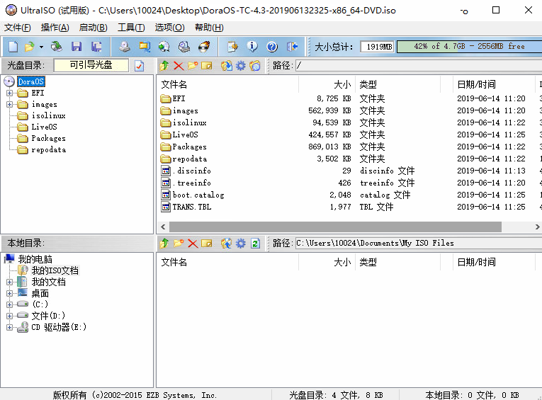

### 1. DoraOS简介
DoraOS是朵拉云科技开发的瘦客户机软件系统。DoraOS支持ARM和x86处理器架构，朵拉云的云终端预装了DoraOS瘦客户机软件系统。DoraOS也提供x86架构的独立安装的版本，支持将x86电脑转化为专业的瘦客户机系统。

DoraOS支持Deskpool、RDP、SPICE、oVirt、Citrix Receiver、VMware View、华为HDP等桌面连接。 DoraOS支持的常见的x86处理器包括：1037U、J1900、J1800、J3160、I3/I5/I7…等。

DoraOS的x86版本基于CentOS 7开发。由于CentOS停止支持，最新的DoraOS版本（信创版）基于OpenEuler版本开发，满足信创要求。

#### 1.1 DoraOS的用户界面 
DoraOS的主界面为配置中心(Control Center)。用于管理员对云终端进行管理和配置。

DoraOS还设计了连接窗口，供终端用户使用。避免用户修改终端配置。 

启用连接窗口的方法是：进入【显示设置】，勾选【启动用户连接窗口】。然后关闭配置中心，这时会出现连接窗口。

在【系统】【操作】【设置密码】中，设置管理员密码。

当管理员设置了管理密码后，云终端的使用者只能访问连接窗口，进行桌面连接和终端关机操作。如果需要进入配置中心，需要输入管理员密码。

#### 1.2 DoraOS支持的连接类型

DoraOS支持的连接类型参见如下界面截图：

DoraOS的信创版本的配置中心界面如下，可以看到增加了对天翼云电脑、移动云电脑的支持。

#### 1.3 DoraOS的版本和授权

DoraOS 包括免费版本和标准版本。

 **DoraOS免费版本** ：仅仅支持RDP和VNC协议。不支持USB重定向。不开放管理终端管理接口，不支持配套的管理软件。  

 **DoraOS标准版** ：支持全部协议。 支持配套的管理软件。

### 2. DoraOS安装
#### 2.1 下载DoraOS安装文件

进入朵拉云官网，或者联系朵拉云技术人员，购买或使用下载DoraOS系统。

[https://www.doracloud.cn/downloads/doraos.html](https://www.doracloud.cn/downloads/doraos.html)

最新的信创版本DoraOS
[https://www.doracloud.cn/downloads/doraos_xc.html](https://www.doracloud.cn/downloads/doraos_xc.html)

#### 2.2 制作DoraOS启动U盘

1）使用UltraISO制作启动盘

2)单机文件文件，打开，选择刚刚下载的DoraOS系统：

3)点击启动，下拉菜单中点击写入硬盘镜像：

#### 2.3 安装DoraOS瘦客户机系统

1)将做好的启动盘，设置好BIOS启动方式（注意不要用UEFI模式启动），首先看到的是这样的，直接回车继续下一步

2)进入配置页面，需要选择磁盘，对磁盘进行分区。鼠标点击红色箭头位置，进入磁盘分区

3)磁盘选择，系统安装会对磁盘格式化，注意选择好磁盘。

a：选择磁盘

b：选择手动分区（自动分区是左边选项，选择自动分区的话可以跳过第2.3步建立分区步骤）

c：选择Done

4)建立分区

选择标准分区

5)添加启动分区/boot 1G 和根分区 / 6G

 **注意：如果系统为UEFI模式启动，建议的分区方案为  /boot/efi  200MB，/boot 1G， 根分区 / 6G 。** 

6)点击 Accept change

7)点击begin installation 继续完成安装

8)配置完成，第三步是安装软件，需要等待20分钟左右。

9)系统安装完成后需要手动重启。

系统重启后可以免费试用30天，如需要激活系统请联系深圳市朵拉云科技有限公司www.doracloud.cn获取激活码。看到下图信息，说明DoraOS系统安装成功。

### 3.DoraOS 的使用
#### 3.1 DoraOS的激活
安装完成后，点击小齿轮图标后，在左侧列表点击 "系统"-"操作"-"注册"

在弹出的激活窗口输入激活码即可完成激活，如图

#### 3.2 修改语言和分辨率

在显示设置中分辨率调整为 "Auto" 选项，语言选择 "中文" 模式。

#### 3.3 配置网络和诊断

在网络设置中配置网络。

网络配置完成后，在网络诊断中，测试配置的网络，保证跟服务器的是可以ping通的。

#### 3.4 配置桌面连接

##### 3.4.1 配置Deskpool连接

点击【添加 Deskpool 连接】，可以设置一个 Deskpool 连接，如下图所示：

连接名称：唯一标识该连接，不能重名。

服务器地址：远端 Deskpool 服务器的 URL 或者 IP 地址。

用户名：Deskpool 桌面虚拟化平台用户账户。

密码：Deskpool 桌面虚拟化平台用户的登录密码。

补充说明：

在 Deskpool 登录界面或者用户界面，按 F6 可以返回到配置中心界面。

连接到远程 Windows 桌面后，可以按 Shift+F12 快捷键断开连接，回到Deskpool 用户界面。

##### 3.4.2 配置RDP连接

点击【添加 Microsoft RDP 连接】，可以设置一个 RDP 连接，如下图所示：

连接名称：唯一标识该连接，不能重名。

服务器地址：远端的 Windows 主机或虚拟机的 IP 地址。

用户名：远端 Windows 主机的用户账户。

密码：远端 Windows 主机的登录密码。

域名：如果是域用户账户，填写域信息。

补充说明：

远端 Windows 主机需要开启远程桌面功能，如果远端 Windows 主机开启了网

络身份认证的远程桌面，需要在“选项”中选择对应的设置。

每个 RDP 连接，都可以通过“选项”和“体验”页面设置多种连接特性。

连接到远程 Windows 桌面后，可以按 Shift+F12 快捷键断开连接。

部分型号支持 Microsoft RDS 连接类型，请参考微软的 RDS 产品说明。

##### 3.4.3 配置VMware连接

点击【新增 VMware View 连接】，可以设置一个 VMware View 连接

连接名称：唯一标识该连接，不能重名。

服务器地址：VMware View 登录服务器 URL 或 IP 地址。

用户名：VMware View 桌面虚拟化平台的用户名。

密码：VMware View 桌面虚拟化平台的用户登录密码。

桌面：VMware 用户登录成功后，自动连接的桌面的名称。

补充说明：

在 VMware View 客户端，点击“关闭”菜单，可以返回到配置中心界面。

连接到远程Windows桌面后，可以Windows桌面的开始菜单选择“断开连接”，返回 VMware View 客户端界面。

VMware View 客户端的详细使用说明请参考思 VMware 方材料。

##### 3.4.4 配置Citrix连接

点击【新增 Citrix Receiver 连接】，可以设置一个 Citrix HDX 连接

连接名称：唯一标识该连接，不能重名。

网址：远端 Citrix 登录服务器的 URL 或者 IP 地址。

用户名：Citrix 桌面虚拟化平台的用户名。

密码：Citrix 桌面虚拟化平台的用户登录密码。

补充说明：

在 Citrix 登录界面或者用户界面，按 F6 可以返回到配置中心界面。

连接到远程Windows桌面后，可以Windows桌面的开始菜单选择“断开连接”，返回 Citrix 桌面虚拟化平台的用户界面。

Citrix Receiver 是思杰虚拟桌面解决方案的客户端，详细使用说明请参考思杰官方材料。

##### 3.4.5 配置华为HDP连接
点击【添加 HDP Client 连接】，可以设置一个 HDP Client 连接

连接名称：唯一标识该连接，不能重名。

网址：远端  HDP 登录服务器的 URL 或者 IP 地址。

用户名：HDP 桌面虚拟化平台的用户名。

密码：HDP 桌面虚拟化平台的用户登录密码。

补充说明：

在 HDP 登录界面或者用户界面，按 F6 可以返回到配置中心界面。

连接到远程 Windows 桌面后，可以按 Shift+F12 快捷键断开连接，回到Deskpool 用户界面。

#### 3.5 系统重启、关机、开机

按 Shift+F12 快捷键断开连接，回到Deskpool 用户界面，右侧电源按钮，点击提示“重启”、“关机”。

#### 3.6 系统参数和配置

#### 3.6.1 系统参数信息

右侧菜单，点击系统，可查看系统参数信息，包含硬件信息，和系统信息。

#### 2.6.2 系统亮度

在"系统"菜单，选择"显示器"，可调节显示器的亮度。

#### 3.6.3 音量和麦克风

在"系统"菜单，选择"声音"，可调节显示器的亮度。

#### 3.6.4 设置管理密码

设置管理密码，以及登录界面 输入管理密码。

#### 3.6.5 系统日志

#### 3.6.6 恢复出厂设置

#### 3.6.7 修改系统时间

### 4.DoraOS常见问题

#### 4.1 找不到可用的资源

在此情况下，请检查服务器的桌面池中是否资源有空闲的桌面。

#### 4.2 找不到服务器

检查网线是否插好，确认网线正确连接后。检查服务器地址，网关等是否输入正确

