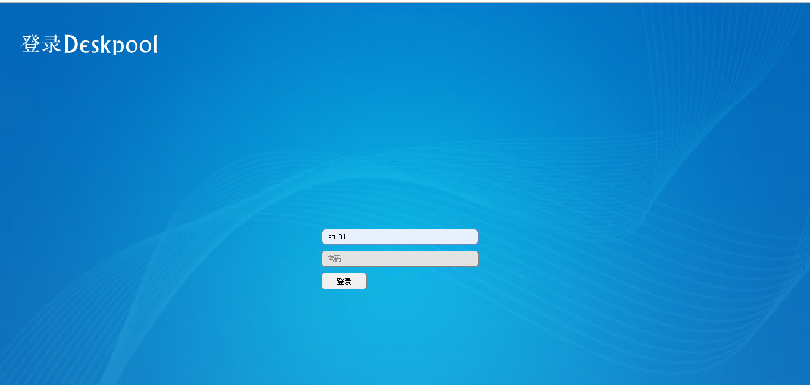
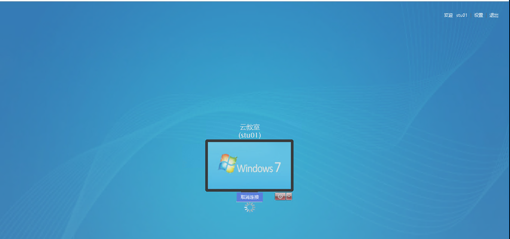
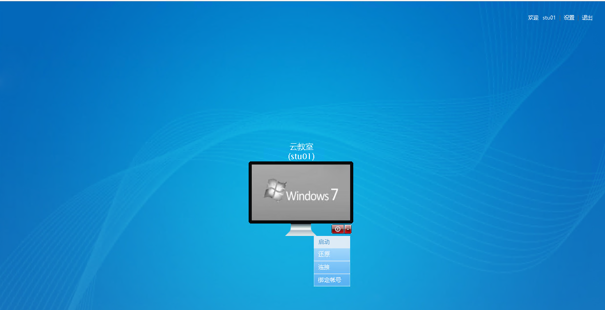
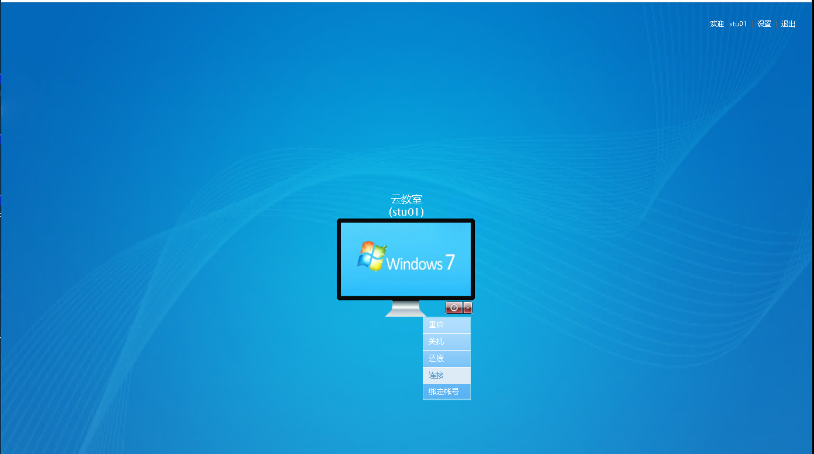
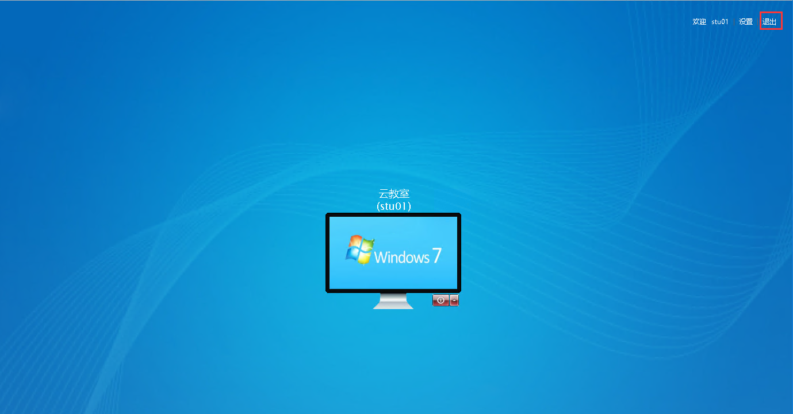

### 1. 概述
此手册主要是针对桌面用户。

### 2.桌面用户登录
在登录页面输入桌面用户、密码，进入桌面页面,会显示用户所有分配的桌面，且桌面计算图标上方显示所属桌面池跟计算机名称（如果用户已分配到该桌面的桌面，如果未分配），如果是终端且用户左右一个桌面会自动进入虚拟机桌面里。

### 3.桌面操作
用户选中桌面下方的菜单可以对桌面进行开机、关机、重启、还原等动作，注意虚拟机状态不同显示的操作不同。

操作包括：  
   * 开机: 点击【启动】菜单，系统会对虚拟机执行开机动作。  
   * 还原：此动作只针对公共桌面，执行此动作虚拟机会回滚到桌面初始状态。  
   * 连接：点击【连接】或计算机图标，如果是终端，则会自动进入虚拟机，如果是浏览器会下载一个RDP文件，点击下载文件，进入虚拟机里。 
   * 绑定账号：可以绑定windows系统的用户密码。注意：用户名、密码、域信息是windows系统的里信息。  
   * 关机：此操作会关闭虚拟机
   * 重启：此操作会重启虚拟机

虚拟机下不同操作操作下截图：

1、虚拟机下关机状态:

2、虚拟机运行状态:

### 4.退出
点击右上角的【退出】，系统会自动退出到登录页面。
