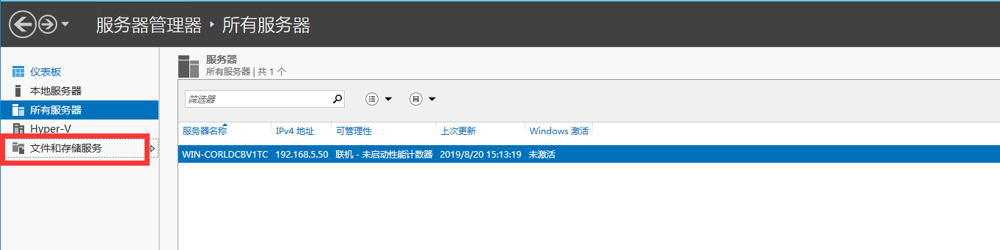

### 1.前言   
本手册用于指导管理员实施Deskpool使用域用户管理的快速安装部署手册，管理员需要具备基本的Deskpool和Windows操作系统安装维护经验，拥有AD域管理使用经验，对于理解本手册内容有很大帮。  
本手册只适用于已有域环境的操作，且域控制器与DNS服务都能正常运行。

### 2.Deskpool与Active Directory
deskpool支持与Active Directory域用户管理的无缝集成。  
当需要使用域管理服务，Deskpool可以无缝的集成AD域管理服务，用户登录Deskpool虚拟桌面系统和虚拟桌面，只需一次AD域用户认。

### 3.实施准备
3.1	Deskpool能正常运行，模板工作正常。  
3.2	已有Active Directory域环境，且域控制器与DNS服务都能正常运行。  
**注：**如需搭建Deskpool模板，请参考《Deskpool创建Windows7模板快速部署手册》  
&nbsp;&nbsp;&nbsp;&nbsp;&nbsp;&nbsp;&nbsp;Active Directory域环境搭建，请查找参考相关文档

### 4.创建域用户以及安全组
4.1	创建组织单位  
登录AD域，选择”域名”->”新建”->”组织单位”。（本文组织单位为云办公，可根据实际情况设置组织结构,可设置多级）

  
4.2	创建安全组  
选择新建的组织单位 “云办公”->”新建”->”组” （本文为vdiuser ）

 
4.3	创建域用户  
选择4.2新建的组织单位 ”云办公”->”新建”->”用户” （用户名根据实际情况配置，本文以office01-office03为例 新建用户后设置密码时记得勾选“密码永不过期”）如下图：  
 
 

4.4	新建用户添加到组  
选择新建用户->“添加到组”（vdiuser）  
  

### 5.同步Deskpool域用户数据
5.1	配置用户数据库  
登录Deskpool 选择”用户”->“配置用户数据库”→选择“使用Microsfot Active Directory”选项，输入“域名称”，域管理员用户密码，新增域服务器IP地址。如下图  

5.2	新增群组  
选择 “用户”->”群组”->”新增”->”查找群组”->输入群组名称->”查找”，选择域创建的安全组点击“添加”。如下图

 
5.3	新增用户  
 选择“用户”->”用户列表”->”批量新增”->“查找用户”->输入用户前缀 ，点击查询，选中创建的域用户点击“添加”。如下图  

 
5.4	同步域用户  
当配置了有效的域认证服务器时，【同步】按钮变为有效。点击【同步】按钮，Deskpool会将本地存储的用户信息和域服务器同步，如果用户信息在域服务器上发生改变，Deskpool会更新本地的用户信息；如果域用户在服务器上被删除，Deskpool也会清理相应的本地存储的用户信息。在域用户数据库模式下，Deskpool不存储用户的登录密码信息。
在用户表和群组表格的“操作”列，提供了【编辑】和【删除】按钮，可以用于编辑和删除对应的用户或群组。如下图

  **注意：**  
    删除用户是指删除Deskpool本地缓存的域用户数据信息，不会删除域服务器上的用户账户，用户删除后，原先分配给该用户的虚拟机的分配状态为“无效”。  
    删除群组是指删除Deskpool本地缓存的域群组数据信息，不会删除域服务器上的群组。

### 6.模板加入域
6.1	编辑模板或新增模板  
进入Deskpool管理界面  
a)如果已有模板 ，选择要加入域的模”→编辑→创建临时副本→点击确定继续。如下图  
 

b)如果不存在模板点击“+”新增模板 ，创建新模板  
  

6.2	远程登录模板虚拟机
使用提示的地址，远程登录连接到模板虚拟机。如下图
  

6.3	配置虚拟机DNS  
如果DHCP分配的DNS不是指向 AD，需要在模板中把DNS配置为AD的IP地址。否则创建虚拟机后加入AD会失败。如果DHCP分配的DNS已经指向AD，则不需进行该配置，使用DHCP配置的DNS即可。
控制面板→网络和Internet→网络和共享中心→选定网卡→右键“属性”输入首选DNS服务器的IP。如下图
  
 
6.4	将模板虚拟机加入域  
“控制面板”→“系统和安全”→“系统”→“计算机名”→点击“更改”→隶属于“域”输入域名，然后单击下一步继续，输入拥有域管理员权限的帐户和密码，确认加入域。如下图
  
 
6.5	本地用户添加域组  
重启系统后，登录模板虚拟机，右键“计算机”→“管理”进入计算机管理，选择“本地用户和组”→“组”选择“Administrators”属性添加“vdiuser”。vdiuser为4.2创建的组
   

**注意：**  
一般情况，您可以将域服务器的“vdiuser”组加入到模板计算机的本地“Administrator”群组。如果希望做到更加精细的远程桌面域用户管理，管理员可以将特定的域用户群组（或者域用户）添加到模板计算机的本地“Administrators”群组（或者“Remote Desktop Users”群组）。

6.6	在Windows AD 服务器配置组策略   
1、按WIN+R键 ，输入“gpmc.msc ”进入“组策略管理”  

 
2、进入到 域 - <域名>，选择云办公->”“在这个域中创建GPO并在此处链接”（名称云办公组策略，可根据自己情况命名  ）  
 

3、选择新建的组策略（云办公）编辑  
 
 

4、在组策略编辑器内，选择 “用户配置”->“策略”->“Windows设置”-> “脚本（登录/注销）”，然后双击“登录”，再点击“添加”, 选择“浏览”  
 
 

点击上方的 地址栏，拷贝出路径。
  

5、在拷贝的路径下，新增 admin.bat 文件，内容如下：（请注意把 DomainName 用实际的Domain名字替换）  
net localgroup "Administrators" /add "DomainName\\%username%"  
net localgroup "Administrators" /delete "DomainName\\vdiuser"
上述脚本表示 把当前登录用户 加入本机的 Administrators 组内。 同时把 vdiuser 从Administrators 内删除。  
前面的编辑模板把vdiuser 组增加到了本地管理员组，此脚本将vdiuser组从Administrators组中删除了。  

6、回到浏览路径的页面，选择 admin.bat 打开，确认。如下。
  

再回到 “组策略管理”可以在“用户配置（已启用）”下方看到 登录时需要指定的批处理脚本。 
  

6.7	完成模板虚拟机编辑  
确认所有信息后，单击“下一步”继续，完成模板虚拟机编辑。  
 
 
选择“专用和公用桌面”点击准备模板后续按提示操作，一直到模板创建完成。   
 

6.8	配置桌面池并创建桌面  
  

加入指定OU ，如果组织机构有多级，可以写多个OU（级别最小的在最前面。如公司->华南分部为OU=华南分部,OU=公司,dc=域名前缀,dc=域名后缀）。注分隔符号为英文逗号。  
  

 
桌面创建完成（桌面进入正在运行） “桌面计算机”-> “桌面计算机列表”  

 
群组分配桌面 点击“用户”->“群组”选择群组点击编辑  

 
### 7.验证
1、	虚拟机是否跟OU设置的位置一致  
进入AD服务器，按WIN+R 输入dsa.msc 查看虚拟机是否跟OU设置一致  

 
2、	域用户是否可以登录  
使用新增的域用户登录，是否能进入虚拟机  
 

### 8.配置文件夹重定向
8.1配置文件共享服务器  
a）搭建一个Windows Server 2012R2的服务器。  
b）服务器加入AD  
c）启用文件和存储服务，操作步骤如下：  
 1-在“服务器管理器”中，点击”添加角色和功能”进入向导，默认点击下一步一直到服务器角色  
 

2-进入“服务器角色”选择，勾选存储服务器跟文件服务器（下图中红色勾选），完成后点击下一步，如下图  
 

3、后续操作一直为默认操作。一直到到结束，如下图，完成后后重启服务器。  
  

d）使用服务器管理器创建SMB文件共享。操作如下  
1-在“服务器管理器”的左侧，点击“文件和存储服务”。  
 

2-单击“任务”，然后单击“新建共享”以打开“新建共享向导”。    
 

3-选择SMB共享- 应用程序，然后单击下一步。  
   
 
4-选择“键入自定义路径”，本文为c:\share 。如下图：  
 
 
5-指定新共享的名称（名称后加$ 本文共享名称为share），然后单击“下一步”。  
 
 
6-在“其他设置”页面中点击“下一步”  
7-在“权限”项中，点击“自定义权限”。  
  

8-点击“添加”，单击“选择主体”。
  
 

9-在 输入要选择的对象名称 下 输入”vdiuser” 点击检查名称，按照提示输入域账号信息，检查无误点击“确定”（注：vdiuser为AD创建的组）  
   

10-基本权限中设置成完全控制，点击确定  
  
 
 
10-在确认中点击“创建”如下图  
 

11 创建完成后 “打开共享” ，记住共享目录
 
  
 
e）验证文件夹重定向权限配置正确  
8.2 在AD服务器配置文件夹重定向  
  1-进入AD服务器，按Win+R键输入“gpmc”进入组策略管理  
  2-进入到 域 - <域名>，选择云办公->”“在这个域中创建GPO并在此处链接“  
  
   

3-选择创建的“文件重定向组策略” 点击 “编辑”  
   

4-给桌面、文档配置重定向，此文以桌面为例，文档操作跟桌面类似。（文档同理配置）  
a)	“用户配置”->“策略”->“windows设置”->”文件夹重定向”->”桌面” 点属性。如下图  
  

b)	选择“基本-将每个人的文件夹重定向同一个位置”根目录为8.1创建的共享文件路径，点击确定  
  

5）文档按照上面的一样设置，也可以增加其他地方的文件重定向。

8.3 验证文件夹重定向。  
1、登录桌面，在 桌面和我的文档创建文件夹，打开文件查看路径为共享目录下。下图为桌面创建文件夹。
 

2、用office02登录，进入office01的共享目录下，删除、打开office01创建的文件均提示无权限。  
  
 
3、在桌面和我的文档， c盘根目录存放文件。 然后删除桌面重新登录。  
桌面和我的文档的内容还在。 C盘根目录文件不存在。  

### 9.常见问题

1、	创建桌面出现“服务中断”  
&nbsp;&nbsp;&nbsp;&nbsp;&nbsp;&nbsp;原因：桌面加入域失败，有以下三种可能 
&nbsp;&nbsp;&nbsp;&nbsp;&nbsp;&nbsp;&nbsp;&nbsp;a、模板未执行加入域操作，如果未执行第6步，请按照第6步  
&nbsp;&nbsp;&nbsp;&nbsp;&nbsp;&nbsp;&nbsp;&nbsp;b、域服务器断开 检测域服务器是否正常  
&nbsp;&nbsp;&nbsp;&nbsp;&nbsp;&nbsp;&nbsp;&nbsp;c、桌面池OU设置错误 特别上分隔符,应该上英文逗号  
2、连接桌面虚拟机，提示没有登录权限 .  
&nbsp;&nbsp;&nbsp;&nbsp;&nbsp;原因:  
&nbsp;&nbsp;&nbsp;&nbsp;&nbsp;&nbsp;&nbsp;&nbsp;a、Deskpool用户跟域用户不一致   
&nbsp;&nbsp;&nbsp;&nbsp;&nbsp;&nbsp;&nbsp;&nbsp;b、域用户未加入安全组  
