本文描述在 DoraCloud for proxmox 平台下，安装 kylin和uos虚拟机，并制作桌面模板的过程。完成整个文档的操作需要30分钟。

如果您仅仅需要一个DoraCloud的桌面模板，用于测试DoraCloud的功能，建议您根据参考《DoraCloud快速部署指导书》，完成DoraCloud的安装，以及演示环境的搭建。

DoraCloud提供在线模板库功能，可以在线下载本文制作的模板。

### 准备工作

1.镜像文件

Kylin安装镜像：Kylin-Desktop-V10-SP1-HWE-Release-2303-X86_64.iso

UOS安装镜像：uos-desktop-20-professional-1060-amd64.iso 

2.proxmox服务器已经完成虚拟化系统的安装，以及DoraCloud的初始配置

### Kylin

### 步骤一、安装Kylin虚拟机

1. pve新建kylin虚拟机，选择bios安装，具体如图所示

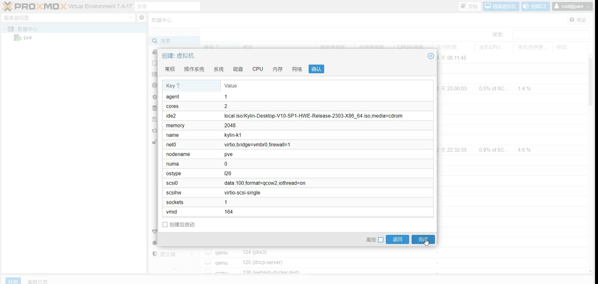

2. 增加usb设备，音频设备，调整显示模式，具体如果所示


3. 全盘安装kylin选择lvm模式，方便后续虚拟机扩容

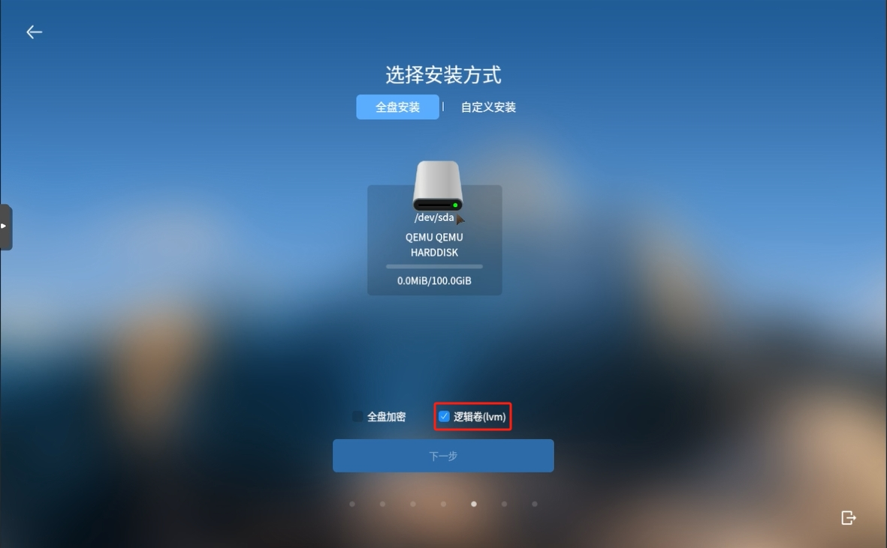

4. 配置账户信息，临时配置8位密码，等安装完成再改


5. 完成安装


### 步骤二、配置Kylin系统

1. 自定义密码策略，修改密码，建议设置为123456，后续由管理平台统一管控

1.1 打开安全中心，自定义密码策略


1.2 打开设置，修改密码


2. 配置防火墙和安全策略

2.1 启用专用网络，关闭公用网络，高级配置，添加一条全通过的策略,关闭联网控制，此操作是为了保证云桌面服务正常运行


3. 关闭所有应用保护，此操作是为了保证云桌面服务正常运行

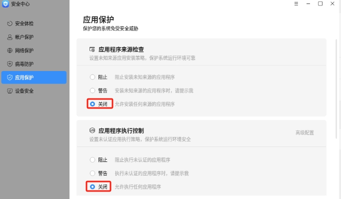


4. 关闭设备安全，此操作是为了保证云桌面服务正常运行

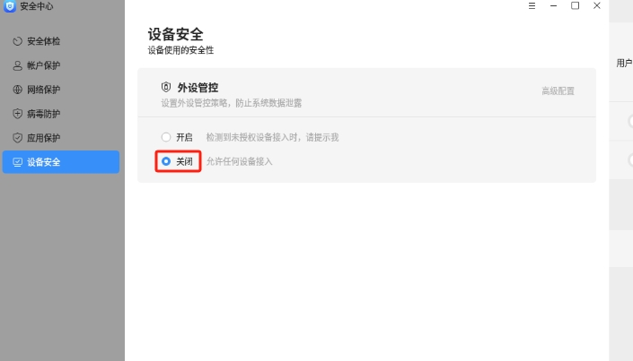

5. 联网安装云桌面服务需要的包，启动所需服务

```
#更新系统
sudo apt update

#安装qemu-guest-agent服务包
sudo apt install qemu-guest-agent

#安装rdp服务包
sudo apt install xrdp

#安装spice服务包
sudo apt intall spice-vdagent

#安装ssh服务包（选做）
sudo apt install openssh-server

#安装cloud-init服务包，用于快速配置系统user，ip和hostname信息
sudo apt install cloud-init

#配置开机自启xrdp和ssh服务

sudo systemctl enable xrdp
sudo systemctl enable ssh  #选做

#配置ssh登录（选做）
#编辑/etc/ssh/sshd_config，配置PermitRootLogin yes
```

6. #配置账户连接权限

```
#虚拟机环境，银河麒麟远程登录会新开一个工作区,导致产生了两个桌面
#原因：kylin-mate桌面工作区设置和云桌面rdp策略不兼容
#解决办法：修改管理权限
sudo echo "greeter-show-manual-login=true" >> /usr/share/lightdm/lightdm.conf.d/95-ukui-greeter.conf

#银河麒麟开机提示色彩管理配置弹窗
sudo sed -i "8c User=administrator" /lib/systemd/system/colord.service
```

7. 关闭虚拟机，添加cloud-init硬件

添加cloud-init硬件后，即可快速配置系统user，ip和hostname信息

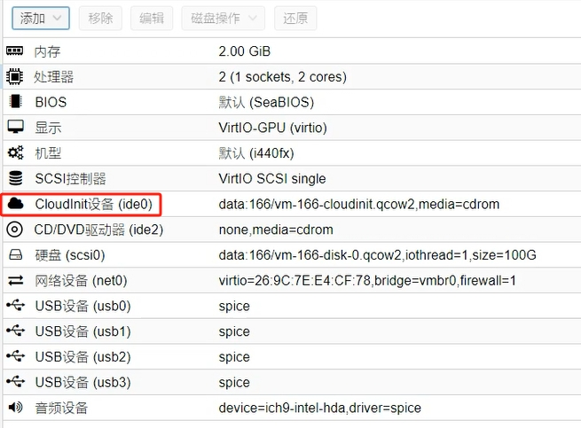

### 步骤三、虚拟机导入为模板

1.管理系统启动linux系统支持

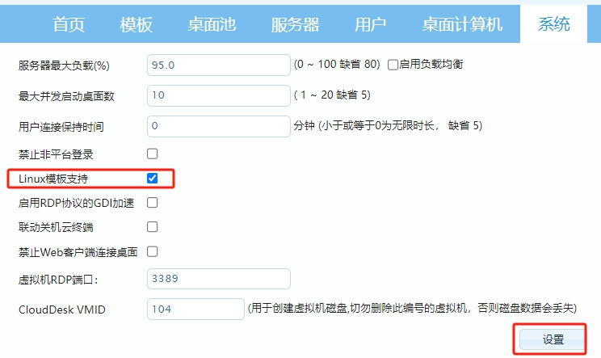

2.创建模板，虚拟机开机后，根据向导完成模板制作


### 步骤四、kylin 磁盘扩容

1. 虚拟机关闭状态下，在proxmox中调整磁盘大小

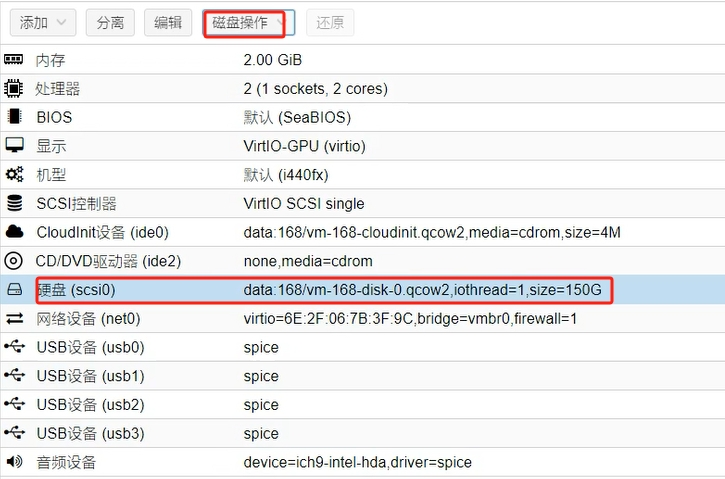

2. 开机后，使用终端扩容

2.1 查看分区情况，发现sda磁盘已扩容，但是系统本身并未自动扩容

```
administrator@pc:~$ sudo lsblk
NAME               MAJ:MIN RM  SIZE RO TYPE MOUNTPOINT
sda                  8:0    0  150G  0 disk
├─sda1               8:1    0    2G  0 part /boot
├─sda2               8:2    0    1K  0 part
└─sda5               8:5    0   98G  0 part
  ├─kylin--vg-root 253:0    0 57.4G  0 lvm  /
  ├─kylin--vg-data 253:1    0 38.3G  0 lvm  /data
  └─kylin--vg-swap 253:2    0  2.3G  0 lvm  [SWAP]
sr0                 11:0    1    4M  0 rom
sr1                 11:1    1 1024M  0 rom
```

2.2 新建分区，此处不能使用fdisk，只能使用cfdisk

```
administrator@pc:~$ sudo cfdisk  /dev/sda
```

2.3 创建物理卷

```
administrator@pc:~$ sudo pvcreate /dev/sda3
  Physical volume "/dev/sda3" successfully created.
```

2.4 扩容vg卷

```
administrator@pc:~$ sudo vgextend  kylin-vg /dev/sda3  #此处kylin-vg为安装系统时新建lvm时vg卷组名称，可通过lsdisplay查看具体信息，也可通过lsblk查看
  Volume group "kylin-vg" successfully extended
```

2.5 查看vg扩容情况

```
administrator@pc:~$ sudo vgs
  VG       #PV #LV #SN Attr   VSize    VFree
  kylin-vg   2   3   0 wz--n- <147.99g <50.00g
```

2.6 将data逻辑卷增加49G，因为数值换算原因，无法实际增加50G（此处也可以给根分区扩容，按照需求选）

```
administrator@pc:~$ sudo  lvextend -L +49G /dev/kylin-vg/root
  Size of logical volume kylin-vg/root changed from 57.41 GiB (14697 extents) to 106.41 GiB (27241 extents).
  Logical volume kylin-vg/root successfully resized.
```

2.7 查看文件系统格式，使用不同的扩容命令，此处是ext4

```
administrator@pc:~$ sudo blkid
/dev/mapper/kylin--vg-root: LABEL="SYSROOT" UUID="0716acbc-349d-4acb-904d-990e48327aa4" TYPE="ext4"
/dev/sr0: BLOCK_SIZE="2048" UUID="2023-12-25-11-54-48-00" LABEL="cidata" TYPE="iso9660"
/dev/sda1: LABEL="SYSBOOT" UUID="30a31150-b812-4da2-b7d2-22e4aef7d45e" TYPE="ext4" PARTUUID="8a81ce02-01"
/dev/sda5: UUID="4UIVfp-USBW-xP74-QHbe-bYdh-1tMt-CBHbsI" TYPE="LVM2_member" PARTUUID="8a81ce02-05"
/dev/mapper/kylin--vg-data: LABEL="DATA" UUID="875eccf5-0e88-45f8-a537-6b6d1767e681" TYPE="ext4"
/dev/mapper/kylin--vg-swap: LABEL="SWAP" UUID="46d9c09d-bee1-4200-ae4e-bdc894b9ed44" TYPE="swap"
/dev/sda3: UUID="rewdBZ-mC5B-LbZF-NePe-3TG1-764Z-9OGpWX" TYPE="LVM2_member" PARTUUID="8a81ce02-03"

#注意ext4文件系统使用resize2fs命令
#注意xfs文件系统使用xfs_growfs命令
```

2.8 给系统分区扩容

```
administrator@pc:~$ sudo resize2fs /dev/kylin-vg/root
resize2fs 1.45.5 (07-Jan-2020)
/dev/kylin-vg/root 上的文件系统已被挂载于 /；需要进行在线调整大小
old_desc_blocks = 8, new_desc_blocks = 14
/dev/kylin-vg/root 上的文件系统现在为 27894784 个块（每块 4k）。
```

2.9 查看扩容结果

```
administrator@pc:~$ lsblk
NAME               MAJ:MIN RM   SIZE RO TYPE MOUNTPOINT
sda                  8:0    0   150G  0 disk
├─sda1               8:1    0     2G  0 part /boot
├─sda2               8:2    0     1K  0 part
├─sda3               8:3    0    50G  0 part
│ └─kylin--vg-root 253:0    0 106.4G  0 lvm  /
└─sda5               8:5    0    98G  0 part
  ├─kylin--vg-root 253:0    0 106.4G  0 lvm  /
  ├─kylin--vg-data 253:1    0  38.3G  0 lvm  /data
  └─kylin--vg-swap 253:2    0   2.3G  0 lvm  [SWAP]
sr0                 11:0    1     4M  0 rom
sr1                 11:1    1  1024M  0 rom
```

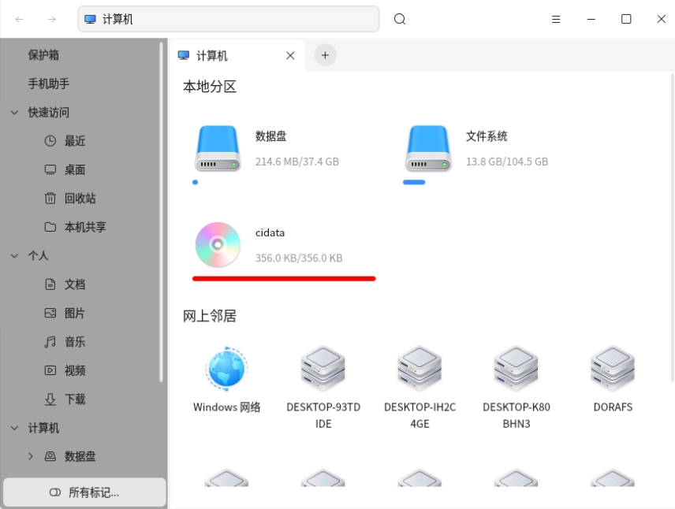

### UOS

### 步骤一、安装UOS虚拟机

1. pve新建uos虚拟机，选择bios安装，具体如图所示


2. 增加usb设备，音频设备，调整显示模式，具体如果所示

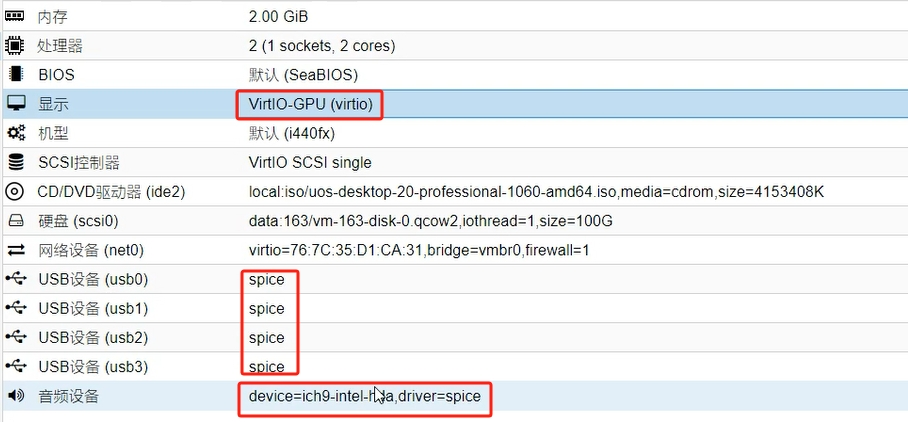

3. 全盘安装uos选择lvm扩容模式，方便后续虚拟机扩容


4. 取消初始化备份


5. 完成安装


### 步骤二、配置UOS系统

1. 登录开发者模式，获取管理员权限

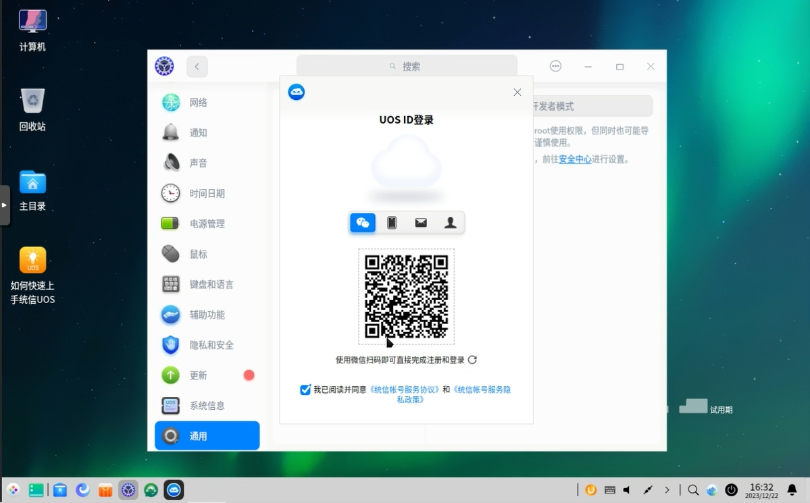

2. 配置防火墙和安全策略

2.1 防火墙添加自定义规则


2.2 应用安全策略修改


3. 联网安装云桌面服务需要的包，启动所需服务

```
#更新系统
sudo apt update

#安装qemu-guest-agent服务包
sudo apt install qemu-guest-agent

#安装rdp服务包
sudo apt install xrdp

#安装spice服务包
sudo apt intall spice-vdagent

#安装ssh服务包（选做）
sudo apt install openssh-server

#安装cloud-init服务包，用于快速配置系统user，ip和hostname信息
sudo apt install cloud-init

#配置开机自启xrdp和ssh服务

sudo systemctl enable xrdp
sudo systemctl enable ssh  #选做

#配置ssh登录（选做）
#编辑/etc/ssh/sshd_config，配置PermitRootLogin yes
```

4. 配置ssh登录（选做）

```
#编辑/etc/ssh/sshd_config，配置PermitRootLogin yes
PermitRootLogin yes
```

5. 编辑账户权限

```
#提示弹框“系统策略阻止网络连接的控制”
#编辑/usr/share/polkit-1/actions/org.freedesktop.NetworkManager.policy第556行的auth_admin改为 yes
```

6. 关闭虚拟机，添加cloud-init硬件


### 步骤三、虚拟机导入为模板

1.管理系统启动linux系统支持


2.创建模板，虚拟机开机后，根据向导完成模板制作


### 步骤四、uos磁盘扩容


1. 关闭状态下调整磁盘大小

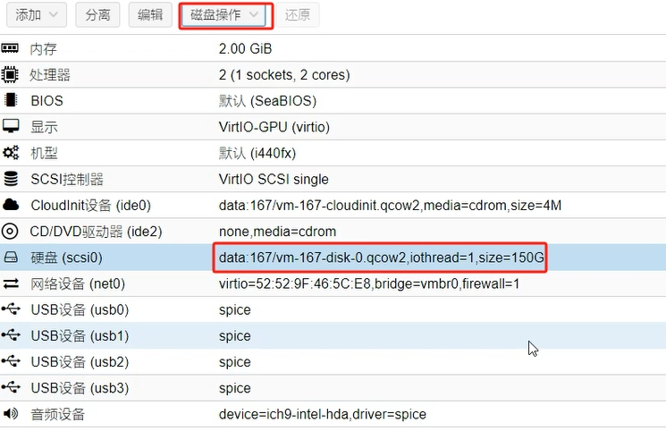


2. 开机后，使用终端扩容

2.1 查看分区情况，发现sda磁盘已扩容，但是系统本身并未自动扩容

```

administrator@pc:~$ sudo lsblk
NAME                 MAJ:MIN RM  SIZE RO TYPE MOUNTPOINT
sda                    8:0    0  150G  0 disk
├─sda1                 8:1    0  1.5G  0 part /boot
└─sda2                 8:2    0 98.5G  0 part
  ├─group1-SWAP      254:0    0    2G  0 lvm  [SWAP]
  ├─group1-Roota     254:1    0   15G  0 lvm  /
  ├─group1-Backup    254:2    0   12G  0 lvm  /recovery
  ├─group1-Rootb     254:3    0   15G  0 lvm
  └─group1-_dde_data 254:4    0 54.5G  0 lvm  /data
sr0                   11:0    1    4M  0 rom
sr1                   11:1    1 1024M  0 rom
```

2.2 新建分区

```
administrator@pc:~$ sudo fdisk /dev/sda

Welcome to fdisk (util-linux 2.33.1).
Changes will remain in memory only, until you decide to write them.
Be careful before using the write command.


Command (m for help): p  ##查看当前分区
Disk /dev/sda: 150 GiB, 161061273600 bytes, 314572800 sectors
Disk model: QEMU HARDDISK
Units: sectors of 1 * 512 = 512 bytes
Sector size (logical/physical): 512 bytes / 512 bytes
I/O size (minimum/optimal): 512 bytes / 512 bytes
Disklabel type: dos
Disk identifier: 0x61c5c2a3

Device     Boot   Start       End   Sectors  Size Id Type
/dev/sda1          2048   3147775   3145728  1.5G 83 Linux
/dev/sda2       3147776 209713152 206565377 98.5G 83 Linux

Command (m for help): n  #新建分区
Partition type
   p   primary (2 primary, 0 extended, 2 free)
   e   extended (container for logical partitions)
Select (default p):  #回车，默认新建主分区

Using default response p.
Partition number (3,4, default 3):  #回车，默认第三分区
First sector (209713153-314572799, default 209715200):  #回车
Last sector, +/-sectors or +/-size{K,M,G,T,P} (209715200-314572799, default 314572799):  #回车

Created a new partition 3 of type 'Linux' and of size 50 GiB.

Command (m for help): w  #写入当前操作
The partition table has been altered.
Syncing disks.
```

13.3 创建物理卷

```
administrator@pc:~$ sudo pvcreate /dev/sda3
  Physical volume "/dev/sda3" successfully created.
```

2.4 扩容vg卷

```
administrator@pc:~$ sudo vgextend  group1 /dev/sda3 #此处group1为安装系统时新建lvm时vg卷组名称，可通过lsdisplay查看具体信息，也可通过lsblk查看
  Volume group "group1" successfully extended
```
2.5 查看vg扩容情况

```
administrator@pc:~$ sudo vgs
  VG     #PV #LV #SN Attr   VSize   VFree
  group1   2   5   0 wz--n- 148.49g <50.00g
```

2.6 将root逻辑卷增加49G，因为数值换算原因，无法实际增加50G（此处也可以给data数据盘扩容，按照需求选）

```
administrator@pc:~$ sudo lvextend  -L +49G /dev/group1/Roota  #此处的Roota为根目录的逻辑卷名称，可通过lsblk查看。如果扩容数据盘，则为_dde_data
  Size of logical volume group1/Roota changed from 15.00 GiB (3840 extents) to 64.00 GiB (16384 extents).
  Logical volume group1/Roota successfully resized.

```

2.7 查看文件系统格式，使用不同的扩容命令，此处是ext4

```
administrator@pc:~$ sudo blkid
/dev/sda1: LABEL="Boot" UUID="5d6267f5-760b-4928-be68-3f582fdc8ebe" TYPE="ext4" PARTUUID="61c5c2a3-01"
/dev/sda2: UUID="h3Q712-0Ji2-tIyK-tr70-qH2U-zj8s-qRyqbD" TYPE="LVM2_member" PARTUUID="61c5c2a3-02"
/dev/sr0: UUID="2023-12-25-10-48-15-00" LABEL="cidata" TYPE="iso9660"
/dev/mapper/group1-SWAP: LABEL="SWAP" UUID="45256fd9-d004-47cd-8dc3-2a986787840a" TYPE="swap"
/dev/mapper/group1-Roota: LABEL="Roota" UUID="50a7f088-7284-4e19-a48f-02e3c6e09844" TYPE="ext4" ## exit文件系统
/dev/mapper/group1-Backup: LABEL="Backup" UUID="22b7f007-ad69-4cbe-b378-7d3d0690f9f0" TYPE="ext4"
/dev/mapper/group1-Rootb: LABEL="Rootb" UUID="d63a5fe7-86e4-4076-86c5-2f21d27713a2" TYPE="ext4"
/dev/mapper/group1-_dde_data: LABEL="_dde_data" UUID="c989624d-2b70-4f8e-9e7d-5a14425890fb" TYPE="ext4"
/dev/sda3: UUID="uKK4c4-9o3M-3kvj-9n43-Ds8v-0rkl-tmMuT7" TYPE="LVM2_member" PARTUUID="61c5c2a3-03"


#注意ext4文件系统使用resize2fs命令
#注意xfs文件系统使用xfs_growfs命令
```

2.8 给系统分区扩容

```
administrator@pc:~$ sudo resize2fs /dev/group1/Roota
resize2fs 1.44.5 (15-Dec-2018)
Filesystem at /dev/group1/Roota is mounted on /; on-line resizing required
old_desc_blocks = 2, new_desc_blocks = 8
The filesystem on /dev/group1/Roota is now 16777216 (4k) blocks long.
```

2.9 查看扩容结果

```
administrator@pc:~$ lsblk
NAME                 MAJ:MIN RM  SIZE RO TYPE MOUNTPOINT
sda                    8:0    0  150G  0 disk
├─sda1                 8:1    0  1.5G  0 part /boot
├─sda2                 8:2    0 98.5G  0 part
│ ├─group1-SWAP      254:0    0    2G  0 lvm  [SWAP]
│ ├─group1-Roota     254:1    0   64G  0 lvm  /
│ ├─group1-Backup    254:2    0   12G  0 lvm  /recovery
│ ├─group1-Rootb     254:3    0   15G  0 lvm
│ └─group1-_dde_data 254:4    0 54.5G  0 lvm  /data
└─sda3                 8:3    0   50G  0 part
  └─group1-Roota     254:1    0   64G  0 lvm  /
sr0                   11:0    1    4M  0 rom  /media/administrator/cidata
sr1                   11:1    1 1024M  0 rom
```

