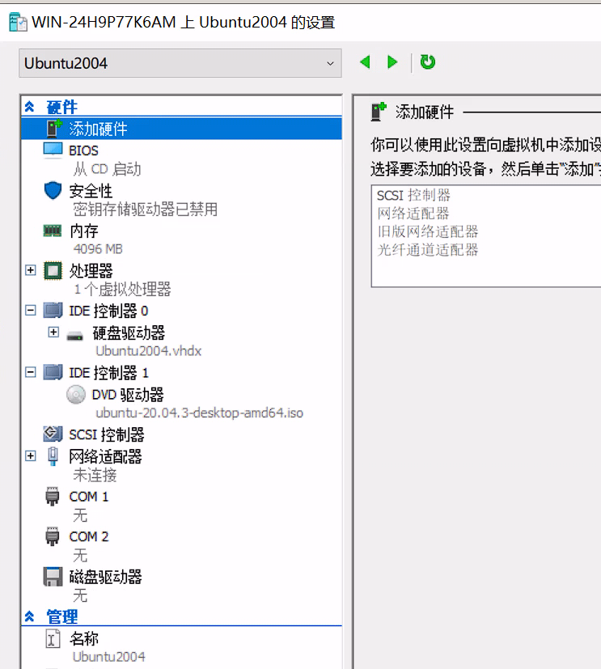
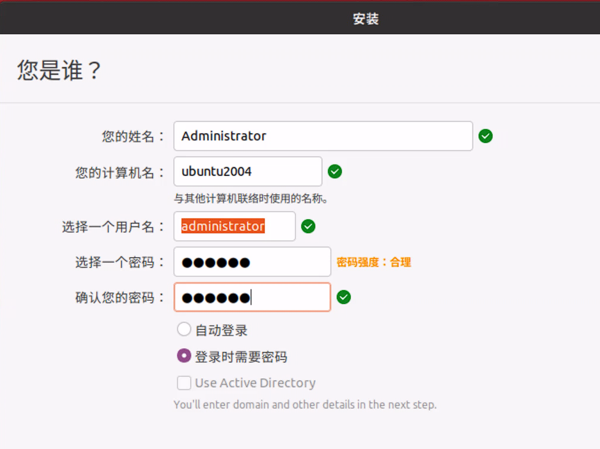
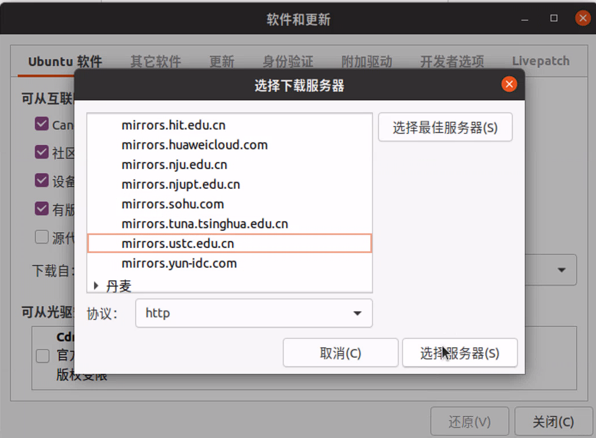
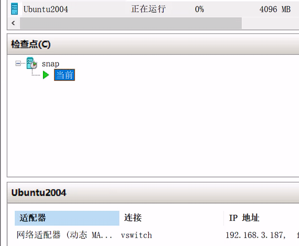
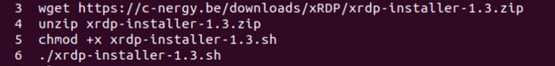
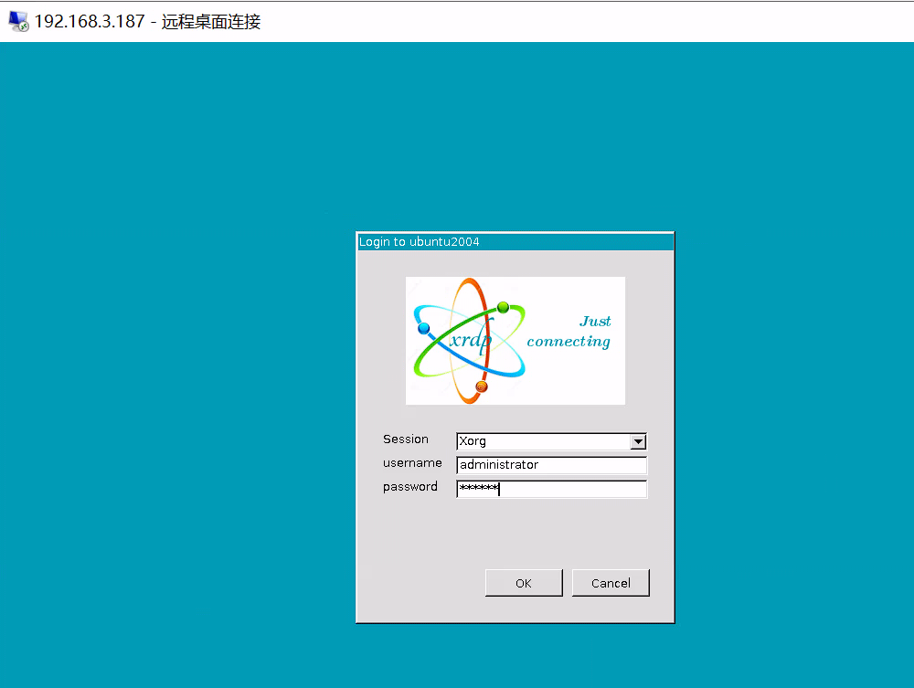
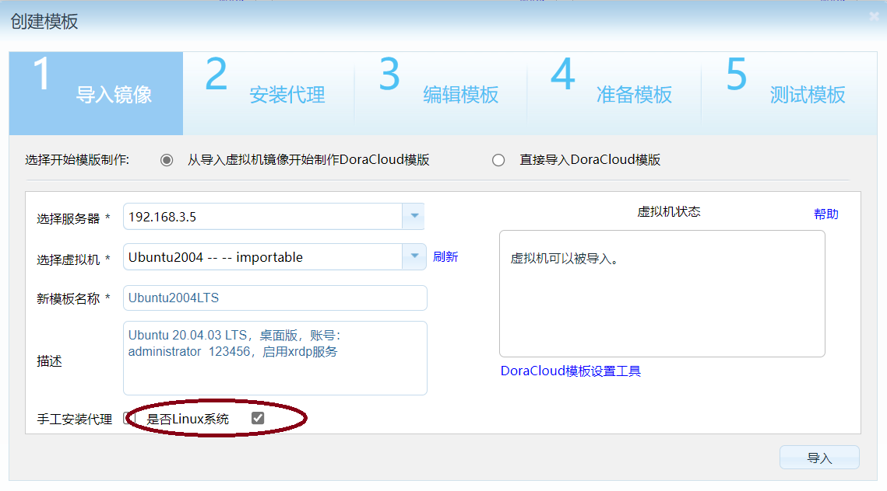

本文描述在 DoraCloud for Hyper-V 平台下，安装 Ubuntu 20.04.3虚拟机，并制作桌面模板的过程。完成整个文档的操作需要30分钟。

如果您仅仅需要一个DoraCloud的桌面模板，用于测试DoraCloud的功能，建议您根据参考《DoraCloud快速部署指导书》，完成DoraCloud的安装，以及演示环境的搭建。

DoraCloud提供在线模板库功能，可以在线下载本文制作的Ubuntu模板。

### 准备工作 

1、Ubuntu 20.04.03 版本ISO   ubuntu-20.04.3-desktop-amd64.iso  
 
2、服务器已经完成虚拟化系统的安装，以及DoraCloud的初始配置。  

### 步聚一、在Hyper-V管理器界面中，创建Ubuntu虚拟机{#Step1}

1、Hyper-V 中新建虚拟机，选择第1代，内存4G，硬盘127G，网络未连接，ISO选择 ubuntu-20.04.3-desktop-amd64.iso ，下图属性供参考


2、启用虚拟机，安装Ubuntu 20.04，选择中文界面，shanghai时区，本地账号设置为 administrator 123456  。 安装完毕后重启动。


### 步聚二、修改Ubuntu的软件安装源，并安装集成服务{#Step2}

1、修改虚拟机的虚拟网卡设置，允许外网访问，登录Ubuntu图形界面后，修改Ubuntu的源为中科大源。然后终端中执行命令更新源。 如果不修改源，后续操作执行会非常慢。
先通过图形界面，修改软件和更新的源


然后通过命令更新
```
sudo apt-get update
```

2、在Ubuntu 虚拟机中安装 Hyper-V的集成服务

```
sudo apt-get install linux-azure
```

安装Hyper-V集成服务后，在Hyper-V管理器中查看Ubuntu虚拟机的IP地址。



### 步聚三、在Ubuntu中安装xrdp服务，便于通过rdp协议访问{#Step3}

1、在Ubuntu 虚拟机中，通过 xrdp-installer-1.3.zip的脚本，安装 xrdp 组件。


```
wget https://c-nergy.be/downloads/xRDP/xrdp-installer-1.3.zip
unzip xrdp-installer-1.3.zip
chmod +x xrdp-install-1.3.sh
./xrdp-installer-1.3.sh
```

上述xrdp-installer的脚本会自动做一些配置。此外，这个脚本还有一些其他功能，其Help命令显示的功能，供参考。

```
--help or -h          => will display a basic help menu
--sound or -s         => will enable sound redirection 
--loginscreen or -l   => will customize the xRDP login screen 
--remove or -r        => will remove the xrdp package 
--custom or -c        => will perform a custom installation (i.e. compiled from sources)
```


2、重启一下虚拟机。不要本地登录虚拟机。 然后在windows中，用 mstsc 登录虚拟机。
mstsc -v 192.168.3.187  

确认可以正常登录，登录界面如下。 输入账号 administrator  123456，即可登录Ubuntu 桌面。
如果本地登录了虚拟机，再用rdp登录虚拟机，会出现黑屏问题。

### 步聚四、通过DoraCloud管理后台的模板制作向导，制作模板 {#Step4}


1、进入DoraCloud管理系统，在【系统】-》【系统设置】菜单中，勾选 Linux 桌面支持。

2、在DoraCloud管理系统，模板菜单中导入模板，选择 Ubuntu20.04的虚拟机。在【是否Linux系统】上打勾。

然后根据向导完成模板制作。

根据上述教程制作的模板已经上传模板库。 

 **仓库地址** ： `http://repo.deskpool.com:9000/repo`

 **模板名称** ： Ubuntu2004LTS

 **发布日期** ： 2021-11-07

说明一下，勾选【是否Linux系统】后，DoraCloud会采用简单流程对模板进行处理，不会对模板的主机名、IP地址进行修改。根据模板创建的桌面会具有相同的主机名，并且无法配置静态IP。这方面需要注意这方面。

