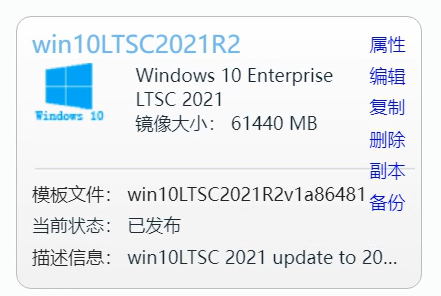

模板制作是桌面云部署时的一项重要工作。模板的质量直接影响到虚拟桌面业务运行的稳定性、安全性和用户体验。制作模板需要完成如下一些工作：

1. 安装Windows桌面操作系统。
2. 安装虚拟化平台相关的半虚拟化驱动。
3. 完成Windows桌面的初始账号和用户偏好设置。
4. 对Windows系统进行优化，使之适合桌面云环境。
5. 安装桌面云相关的Agent程序。

如果手工完成上述的工作，一方面需要部署人员有丰富的经验积累，另一方面需要耗费大量的时间。比如花费几个工作日甚至一周的时间进行模板的制作、测试和优化。

朵拉云一方面推出了在线模板仓库功能，可以提供成熟的模板供用户下载。另一方面也推出了模板制作工具（DoraCloud Template Tools），便于用户便捷的制作Windows的模板。
https://www.doracloud.cn/downloads/DoraCloud_Template_Tools-cn.html

### 准备

以DoraCloud for Hyper-V为例，需要如下软硬件系统：

- 一套 DoraCloud for Hyper-V 环境。

包括服务器硬件，Windows Server 2019，按照好的DoraCloud系统。

- Windows 10镜像。

选用 Windows 10 LTSC 2021的ISO。为了避免安装后进行在线更新，我们对ISO进行了预处理，已经集成了最新的Windows更新。

- 模板制作工具 DoraCloud_Template_Tools.ISO。

### 操作步骤

下面的操作步骤是模板库 win10LTSC2021R2的创建过程。模板库的模板一般使用 administrator 123456作为缺省账号。 DoraCloud_Template_Tools.ISO中的脚本会自动启动 

administrator账号并把密码设置成 123456。 下面的模板制作过程会先在安装 windows 是，手工创建一个 test 用户账号，然后执行模板制作工具。接下来登录administrator 账号，然后删除test账号。接下来通过DoraCloud后台制作这个模板。 

如果您自己制作模板，可以直接在运行DoraCloud_Template_Tools中的StartPrepareImage.bat。你可以选择启用 administrator，也可以直接使用您当前的账号作为模板的缺省账号。

由于模板工具会缺省创建administrator账号（密码123456)，在你使用当前账号时，记得禁用 administrator账号。

DoraCloud模板制作过程包括【导入】【安装代理】【编辑模板】【准备模板】【测试模板】几个过程。

第一步的【导入】是对待制作的模板的虚拟机进行复制。比如对 win10LTSC2021base这个虚拟机制作模板时，DoraCloud会在【导入】这个操作中对win10LTSC2021base进行复制。因此制作模板过程不会破坏当前的虚拟机。

【安装代理】这一步时安装 DeskpoolAgent。模板工具运行时，已经自动安装好了DeskpoolAgent以及RDP加速包。

【编辑模板】这一环节可以为增加需要的应用软件。我们建议先制作一个干净的基础模板（仅仅包括桌面系统），然后根据不同业务需求，复制这个基础的模板安装软件。并且软件需要采用步步为营的方式安装。

#### 1、创建Windows10的虚拟机，并使用模板工具进行相关设置

##### 1）创建一个Windows 10 LTSC 2021的虚拟机

在Hyper-V中，创建一个虚拟机win10LTSC2021base，安装 Windows 10 LTSC 2021。

##### 2）创建本地账号 test 123456

选择创建本地账号， 不要使用在线账号。在安装界面的左下方选择【改为域加入】，然后创建本地账号 test 123456

  

##### 3）执行模板制作工具的启动程序 StartPrepareImage.bat

安装完毕 Windows后，将 DoraCloud_Template_Tools.iso 插入虚拟光驱，打开StartPrepareImage.bat程序运行。

  

运行完毕后，重启虚拟机。

模板制作工具会自动创建一个 administrator 123456的账号。

##### 4）删除 test 账号

重启后，以administrator 123456登录桌面，删除 test 账号

  

然后删除 test 123456账号。

  

同时对桌面图标进行设置，把常见的图标显示在桌面上。

  

#### 2、进入DoraCloud桌面云管理系统，根据向导制作模板。

##### 1）选择导入虚拟机 win10LTSC2021base 进行模板的制作

选择创建模板，选择前面创建的虚拟机 win10LTSC2021base。填写【模板名称】、【描述】，然后导入

  

  

##### 2）进行模板的编辑，然后启动模板制作（准备模板操作）

在编辑模板状态，可以远程登录桌面模板，增加应用程序，然后点击确认，对5条信息进行确认。进入模板准备操作中。

  

  

##### 3）完成模板制作，进行模板测试

系统进行模板制作，并模拟一次模板的创建过程，产生一个测试虚拟机。

  

见到下图，模板基本制作成功了。提示你测试根据模板创建的虚拟桌面。如果你测试发现有遗漏，可以选择【上一步】，重新编辑模板。
  

##### 4）选择【保存模板】，模板制作成功。

到这里模板就创建成功了。可以在模板菜单中看到已经创建的模板。该模板就是在在线模板库中win10LTSC2021R2的制作过程。耗时大约30分钟。
  

### 模板的使用

用户自己创建的模板，可以进行备份。以便于后续其他项目的部署。Hyper-V环境下，对模板执行备份操作，会在【模板存储池】 localImages目录下，产生模板的备份文件。
比如上述模板，选择备份操作后，产生的模板备份文件位于如下位置：

您可以将模板备份文件拷贝到其他DoraCloud桌面云环境的 相同目录下。注意，需要目录win10LTSC2021R2也拷贝过去。不能直接把两个文件放在 localImages目录下。

然后可在 DoraCloud的本地模板库中进行恢复。如下图所示，在另一个环境的DoraCloud管理后台，选择【本地镜像仓库】【刷新】，即可看到模板文件。然后可以选择恢复。

如果您是通过远程镜像仓库下载的模板，模板文件位于  DoraCloud\RemoteImages\win10LTSC2021R2目录下。

DoraCloud的远程镜像仓库是一个web server。如果您希望建立自己的镜像仓库，可以咨询技术支持。