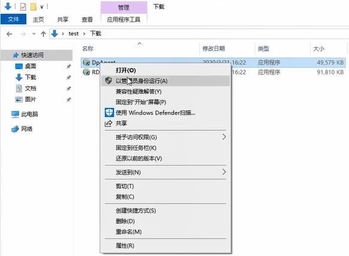

本文描述在 Deskpool for Hyper-V 平台下，安装 Windows 10 虚拟机，并制作桌面模板的过程。完成整个文档的操作需要30分钟。

如果您仅仅需要一个Deskpool的桌面模板，用于测试Deskpool的功能，建议您根据参考《Deskpool快速部署指导书》，完成Deskpool的安装，以及演示环境的搭建。演示环境内包含有供测试的Windows的模板。

### 准备工作：

1、Windows 10 LTS 2019 的安装光盘 ISO文件。 
`ed2k://|file|cn_windows_10_enterprise_ltsc_2019_x64_dvd_9c09ff24.iso|4478906368|E7C526499308841A4A6D116C857DB669|/`
 
2、服务器已经完成虚拟化系统的安装，以及Deskpool的初始配置。  

### 步聚一、创建Windows 虚拟机： 

1、启动Hyper-V 管理器，创建一个新的虚拟机 win10x64base，选择 Windows 10的ISO作为可启动的安装盘。

  


2、Windows 10支持第二代Hyper-V虚拟机，可以选择第二代。修改虚拟磁盘的空间。建议设置成100GB。 

 

 

3、选择 Windows 10的ISO映像文件。

 

### 步聚二、完成 Windows 10 的系统安装。
安装Windows10系统有一些注意事项和技巧。

1、在选择磁盘分区的时候，建议选择20GB。之所以不选择全部磁盘空间，是为了防止虚拟磁盘文件膨胀的太快。等后续应用程序安装完毕后，在扩充Windows系统的磁盘空间。

 

2、在创建账号时，选择“改为域加入”，接下来，输入【用户名】，【密码】，以及安全问题。 为了测试，我们把用户名设置为：test，密码 123456

 

 

3、Windows 10需要激活后再制作模板。

请用KMS方式激活。不要用激活工具激活。

可以参考如下激活方法：

首先以管理员身份运行命令提示符

快捷键 WIN+X 然后弹出的菜单选择 命令提示符（管理员）

然后输入如下命令：

```
slmgr.vbs -xpr
slmgr -ipk M7XTQ-FN8P6-TTKYV-9D4CC-J462D
slmgr -skms kms.03k.org
slmgr -ato
```

如果是Windows 10 Pro版本，可以用如下命令激活
```
slmgr.vbs /upk
slmgr /ipk W269N-WFGWX-YVC9B-4J6C9-T83GX
slmgr /skms zh.us.to
slmgr /ato
```

如果是Windows 10 21H1版本，可以用如下命令激活
```
slmgr /ipk W269N-WFGWX-YVC9B-4J6C9-T83GX
slmgr /skms kms.03k.org
slmgr /ato
```


### 步聚三、安装RDP加速包和桌面云代理程序

Windows 10内置了Hyper-V集成服务。因此不再需要手工安装Hyper-V集成服务。

1、下载RDP加速包和桌面云代理程序

在Windows 10内打开浏览器，通过浏览器从 Deskpool 管理系统下载 RDP加速包 和 桌面云代理程序。地址为：http://<Deskpool_IP>/downloads。

比如Deskpool IP为 192.168.1.166，那么输入地址： http://192.168.1.166/downloads

 

 


2、安装 桌面云代理程序 DpAgent

 

 

3、安装 RDP 加速包

 

 


### 步聚四、创建Deskpool桌面模板： 
1、登陆 Deskpool，选择【模板】菜单中的新建模板，系统进入“创建模板”状态。  

 


2、选择名为 “win10x64base”的虚拟机，系统提示虚拟机可以被导入。命名 模板名称为：win10x64

 

 然后输入 Windows 虚拟机的管理员账户，完成验证。

 

3、系统开始复制虚拟机，复制完成后，进入编辑状态。模板在该状态可以添加软件。

 

在当前的操作计算机上，通过 mstsc -v ipaddress ，可以访问当前的模板虚拟机，完成应用程序的安装。


以下信息只是一个 CheckList。请逐一确认。然后按下一步，开始准备模板。

 

 

4、准备模板，选择“专用和公用桌面”，使得模板能够用于 专用桌面池 和 公用桌面池。

 

5、测试和保存模板

模板准备完成后，系统会自动创建一个测试桌面。  你可以连接该桌面测试一下模板是否正常。然后选择保存模板。  
如果创建的测试桌面不正确，或者还需要对模板进行修改，可以选择“上一步”，重新编辑模板。

 

保存模板后，即完成了模板创建。

