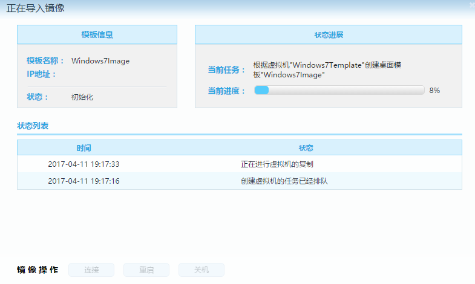

本文描述在 Deskpool for Hyper-V 平台下，安装 Windows 7 虚拟机，并制作桌面模板的过程。完成整个文档的操作需要1-2个小时。

如果您仅仅需要一个Deskpool的桌面模板，用于测试Deskpool的功能，建议您根据参考《Deskpool快速部署指导书》，完成Deskpool的安装，以及演示环境的搭建。演示环境内包含有供测试的Windows的模板。

### 准备工作：

1、Windows 7 的安装光盘 ISO文件。  
2、服务器已经完成虚拟化系统的安装，以及Deskpool的初始配置。  

### 步聚一、创建Windows 虚拟机： 

1、启动Hyper-V 管理器，创建一个新的虚拟机 Windows7Template，选择 Windows 7的ISO作为可启动的安装盘。

  

注意修改虚拟磁盘的空间。建议设置成30-60GB。 

 

选择 Windows 7的ISO映像文件。

 

### 步聚二、完成 Windows 7 的系统安装。
### 步聚三、安装Hyper-V 集成服务。

注意：
  
1）Windows Server 2016、Hyper-V Server 2016、Windows 10 的Hyper-V集成服务的发行模式发生了变化。不再随 Hyper-V发布，而是通过 Windows Update 发布。   
2）Windows 7 支持 Windows Server 2016的集成服务还没有推出，也许不会推出了。推荐使用 Windows Server 2012R2中的集成服务，在 vmguest.iso 文件中。    
3）建议对 Windows Server 2012R2、Hyper-V Server 2012R2 进行Update。 Update会更新 集成服务到较新的版本，然后进行安装。    
  如果虚拟化平台是 Windows 2012R2或者 Hyper-V Server 2012R2， 在Hyper-V Manager中，连接到虚拟机，在操作中选择 ”插入集成服务安装盘“。 

 

如果是 Windows 10 或者 2016，没有该菜单，请从Windows Server 2012R2获取 vmguest.iso ，然后选择“媒体”“DVD驱动器”“插入磁盘”，选择 vmguest.iso 

 

进入Windows，执行 DVD驱动器中的 Hyper-V 集成服务。

4、启用 Administrator 账户，并设置密码。

5、以Administrator登陆，安装 RDP 加速包，并运行模板检查工具。
   
为了方便模板制作， 有一个模板设置工具的脚本（ VdiTemplateTool.vbs ），可以自动完成上述的要求的检查和修改。  
VdiTemplateTool 可以从 Deskpool 系统的页面下载。 比如 Deskpool 的地址为 192.168.5.10， 下载的地址为 https://192.168.5.10/downloads

运行 RDP性能优化包。

运行模板设置工具。

如果模板检查工具检查结果为通过。则虚拟机就准备好了，可以用于制作Deskpool模板。

### 步聚四、创建Deskpool桌面模板： 
1、登陆 Deskpool，系统处于“创建模板”状态。  

2、选择 Windows7Template 虚拟机，系统提示虚拟机可以被导入。命名 模板名称为： Windows7Image
  

然后输入 Windows 虚拟机的管理员账户，完成验证。
 
  

系统开始复制虚拟机，并自动安装 Agent。
   
 

3、编辑桌面模板，安装所需的应用程序。 

在当前的操作计算机上，通过 mstsc -v ipaddress ，可以访问当前的模板虚拟机，完成应用程序的安装。
  

以下信息只是一个 CheckList。请逐一确认。然后按下一步，开始准备模板。

   

4、准备模板，选择“专用和公用模板”，使得模板能够用于 专用桌面池 和 公用桌面池。

   

5、测试和保存模板

模板准备完成后，系统会自动创建一个测试桌面。  你可以连接该桌面测试一下模板是否正常。然后选择保存模板。  
如果创建的测试桌面不正确，或者还需要对模板进行修改，可以选择“上一步”，重新编辑模板。

  

保存模板后，系统进入“创建桌面池” 向导环节。

  