 **安装前准备** 

1.一台物理服务器，配置为 :CPU i5 以上，内存 ≥16GB，硬盘为SSD或者RAID。

2.安装了Windows Server 2012R2 或者 Windows Server 2016 或者 Windows Server 2019

3.一台交换机或者路由器，和三台服务器连接起来。

4.三台服务器，依次命名为server1,server2,server3,并且参照快速部署文档配置成功server1。

5.安装了Hyper-V服务角色，配置虚拟交换机名称为vswitch

6.服务器可以访问互联网，并且下载速度不低于5MB/s。

7.安装集群之前熟悉配置表。

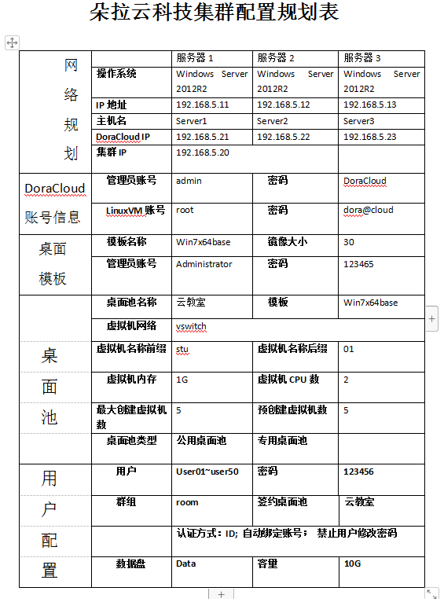

---
 **

### 步骤1：按照快速部署文档配置命名server1的服务器.
** 

提前处理好配置规划问题，这里我们把物理服务器ip设置为：192.168.5.11

DoraCloud的ip设置为：192.168.5.21

1.如图所示，设置server1的物理服务器ip。

2.如图所示，安装DoraCloud的过程中设置ip。

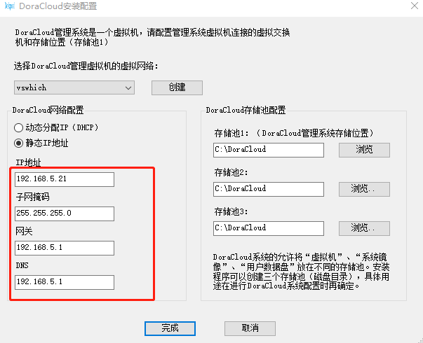

3.按照快速部署文档配置server1的服务器。

DoraCloud快速部署文档地址：https://docs.doracloud.cn/docs/getting-started/quickstart/

 **

### 步骤2：把server2服务器加入server1服务器的集群.
** 

1.如图所示，设置server2的物理服务器ip。

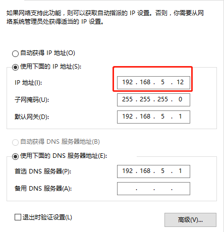

2.如图所示，安装DoraCloud的过程中设置ip。

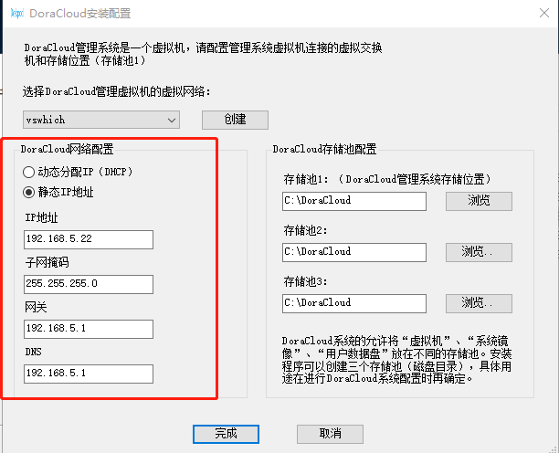

3.DoraCloud安装后，我们刚才设置的地址为192.168.5.22，在浏览器访问这个地址。
进入DoraCloud管理页面。

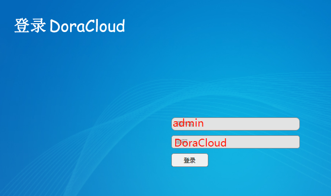

4.登陆DoraCloud管理系统后，系统会启动配置向导，如下图所示。 DoraCloud的配置大致包括四个步骤：系统初始化、创建模板、创建桌面池、创建群组和用户。选择【开始】，进入系统初始化配置。

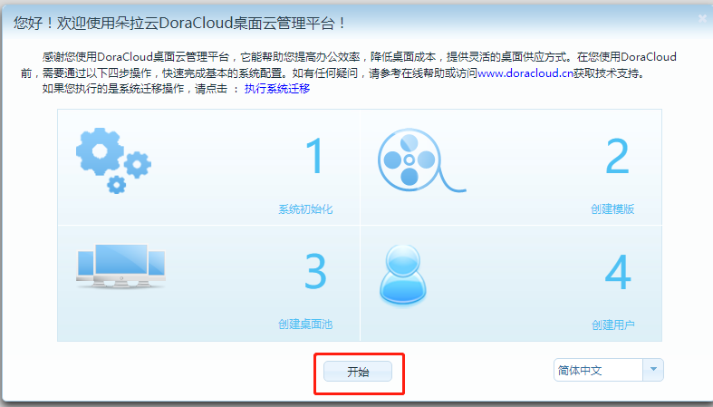

5.配置虚拟化。
DoraCloud系统会自动检测到所在服务器的配置，并与之建立连接。

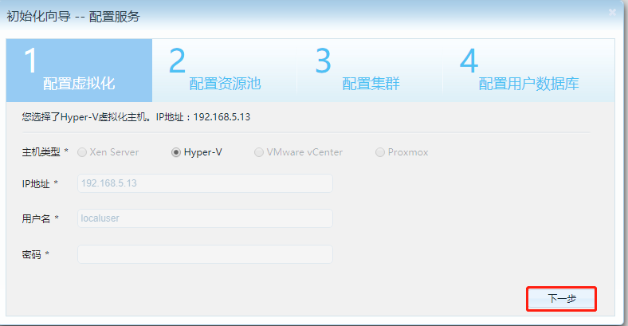

6.配置资源池。 包括桌面存储池、数据盘存储池、镜像存储池。其中桌面存存储池、镜像存储池最好使用SSD介质的存储，或者高速的RAID磁盘阵列。 网络资源池是 DoraCloud默认所在的网络。

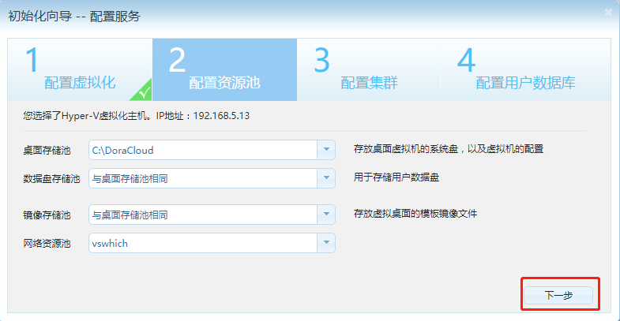

7.配置集群，选择加入到已有的DoraCloud集群

集群地址就是配置server1的DoraCloud的ip

用户名：admin

密码：DoraCloud

输入完成点击下一步，系统就会自动加载完成加入集群。 server1服务器保持开启状态。

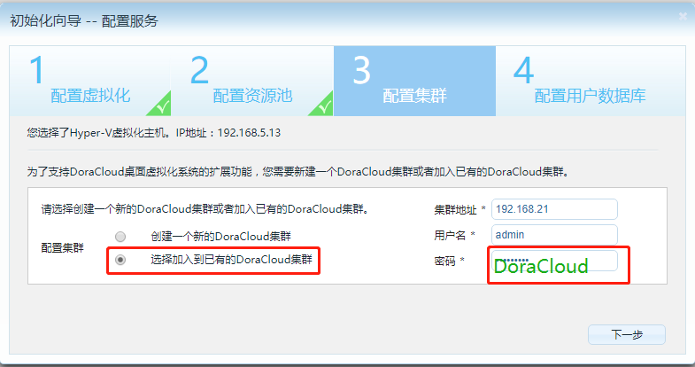

8.加载完成以后点击服务器就会看到加入集群已经成功，服务器列表展示server1，server2。

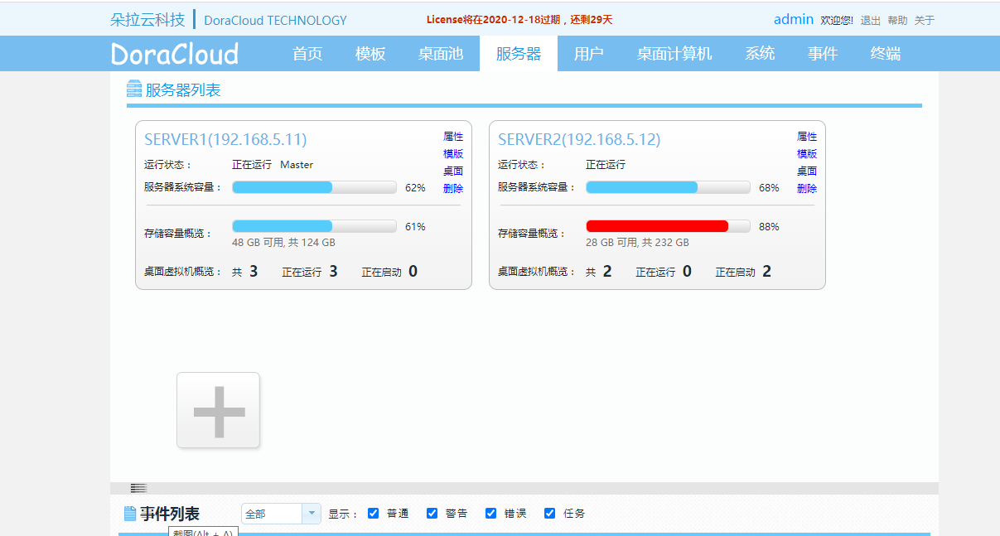

 **

### 步骤3：把server3服务器加入server1服务器的集群.
** 

1.如图所示，设置server3的物理服务器ip。

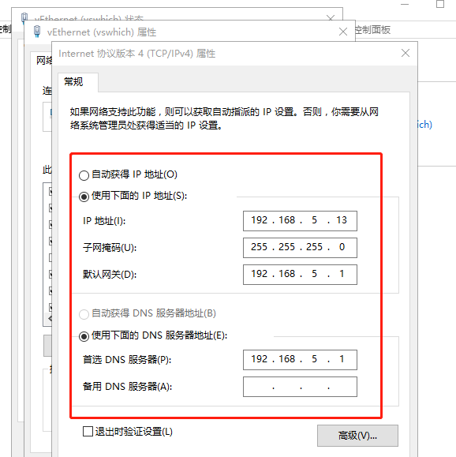

2.如图所示，安装DoraCloud的过程中设置ip。

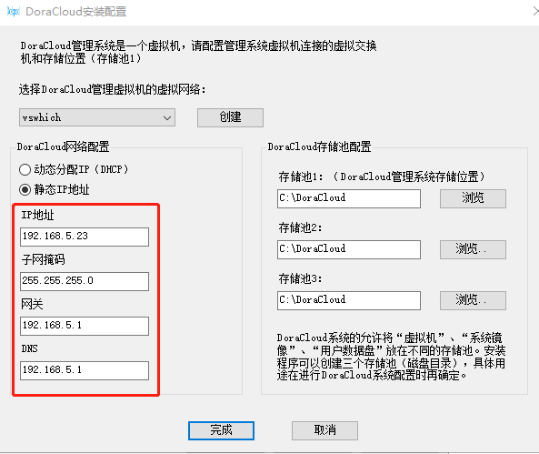

 **3.按照刚才server2加入server1的方式把server3也加入server1** 

4.加载完成以后点击服务器就会看到加入集群已经成功，服务器列表展示server1，server2,server3。

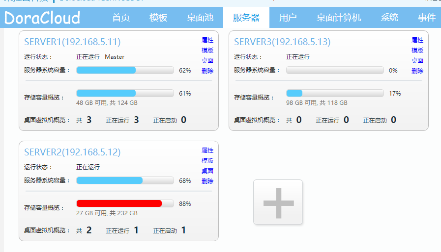

### 注意：集群常用设置以及常见问题.

1.在系统【管理界面】找到【集群管理】，设置一个浮动ip。

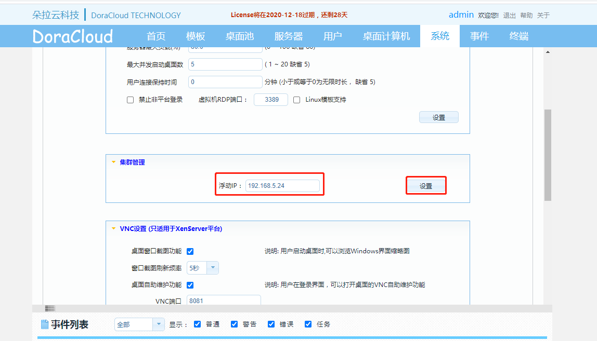

2.更改服务器最大负载的原因，就是能充分利用服务器的现有资源来进行创建虚拟机。

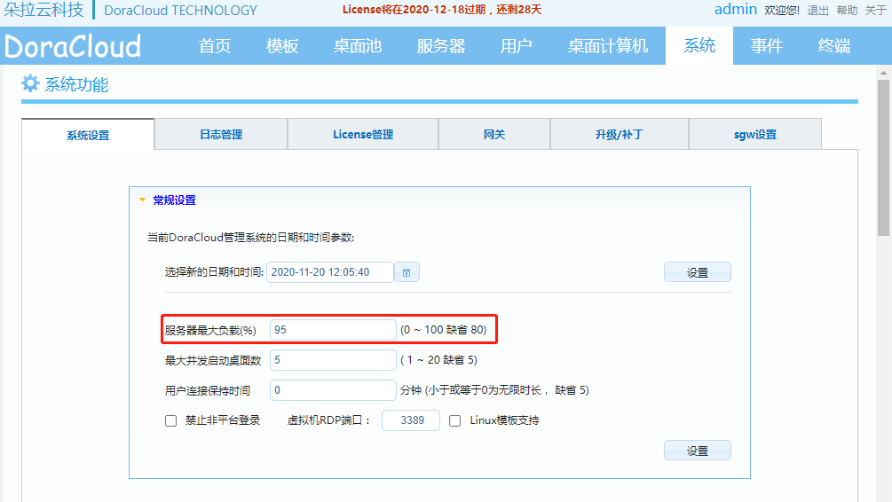

