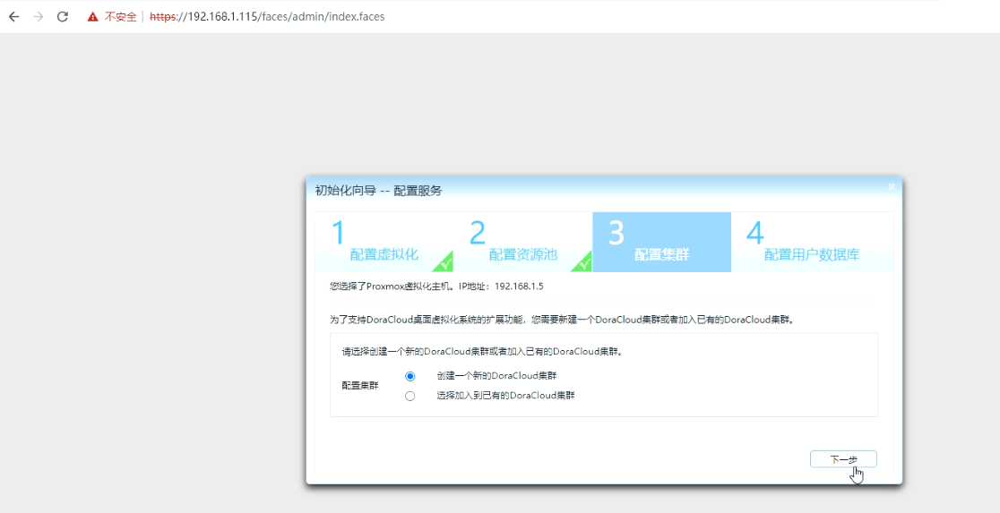

 **安装前准备** 

1.2台物理服务器，配置为 :CPU i5 以上，内存 ≥16GB，硬盘为SSD或者RAID。

2.安装了proxmox 7.4

3.1台交换机或者路由器，2台服务器连接起来。

4.服务器可以访问互联网，并且下载速度不低于5MB/s。

5.安装集群之前熟悉配置表。


### 步骤1：所有服务器都修改存储方式
 

1.从Proxmox Web界面，删除 local-lvm


2.通过命令删除 lvm，新建lvm，并创建文件系统
```
#一键复制，粘贴后回车执行

umount /dev/pve/data

lvremove /dev/pve/data -y

vgdisplay pve | grep Free | awk '{print "lvcreate -l " $5 " -n data pve -y"}' |bash

mkfs.ext4 /dev/pve/data
mkdir /mnt/data
mount /dev/pve/data /mnt/data

echo "/dev/pve/data /mnt/data ext4 defaults 0 0" >> /etc/fstab
```

3.在Proxmox 将注册目录为存储
在Proxmox后台，选择 DataCenter->存储->添加， ID填写 data， 目录填写 /mnt/data。 即可添加名为  Data 的存储。


### 步骤2：集群ssh免密登录

1.修改默认主机名

1.1修改服务器1的主机名，服务器2同理
```
hostnamectl set-hostname  pve1
```

1.2编辑服务器1的/etc/hosts，并添加服务器2的iP和主机名，服务器2同理
```
127.0.0.1 localhost.localdomain localhost
192.168.1.5 pve1.pc pve1  #pve改为pve1

# The following lines are desirable for IPv6 capable hosts

::1     ip6-localhost ip6-loopback
fe00::0 ip6-localnet
ff00::0 ip6-mcastprefix
ff02::1 ip6-allnodes
ff02::2 ip6-allrouters
ff02::3 ip6-allhosts

192.168.1.6 pve2  #添加服务器2的iP和主机名
```

2.ssh免密配置

2.1服务器1生成密钥，服务器2同理
```
#只输入yes和回车
ssh-keygen
```
2.2复制密钥到其他服务器，服务器2同理
```
ssh-copy-id  pve2
```

2.3ssh登陆其他服务器，测试
```
ssh pve2
```

### 步骤3：服务器1部署Doracloud

1.pve的shell执行联网一键安装脚本
```
cd /var/lib/vz/dump; wget -qO- https://dl.doracloud.cn/dpinstall.pl --referer https://doracloud.cn | perl

```
在这个页面不要做别的操作，直到安装完成


安装完成


2.登录上面的地址，配置DoraCloud管理系统





3.等待1分钟，登录新ip的管理系统


4.设置集群IP

在系统【管理界面】找到【集群管理】，设置一个浮动ip


### 步骤4：服务器2部署DoraCloud，并加入服务器1集群

1.加集群

1.1服务器2部署DoraCloud基本上一样，只是需要选择加入集群


1.2注意


1.3这里选择加入集群


2.配置第二个DoraCloud的ip


### 步骤5：下载，同步模板
1.从仓库拉取需要的模板


2.等待两台服务器模板同步完成


### 步骤6：创建桌面池


### 步骤7：创建用户组和用户

1.创建用户组


2.批量创建用户


3.等待创建完成


### 步骤8：终端连接使用


### 注意：集群常用设置以及常见问题.

1.集群服务器的主机名不要一样

2.模板同步完成之前不要复制，编辑模板

